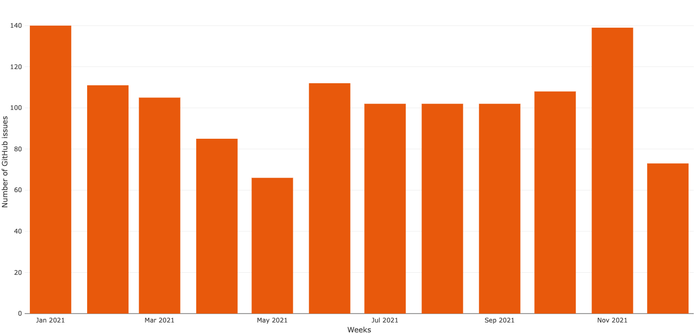
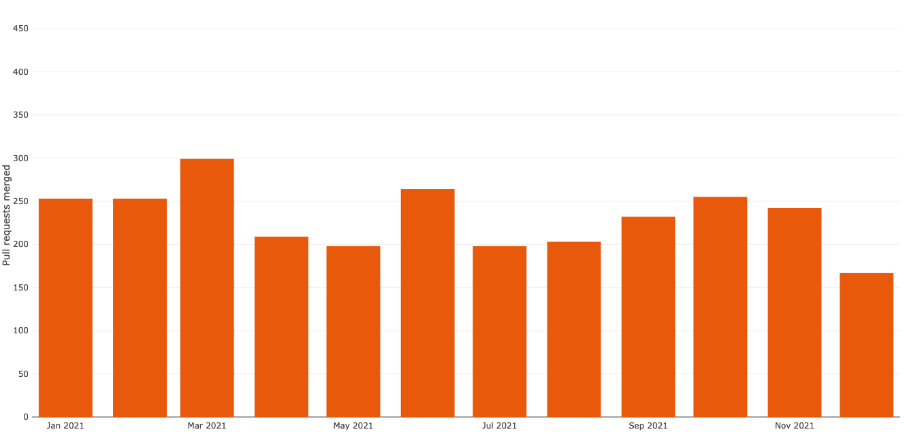
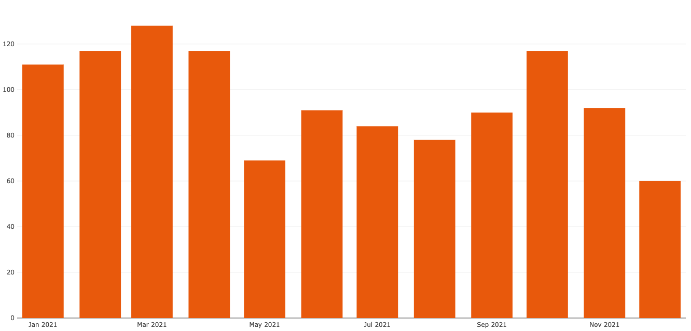
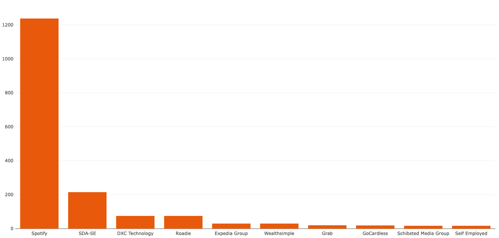
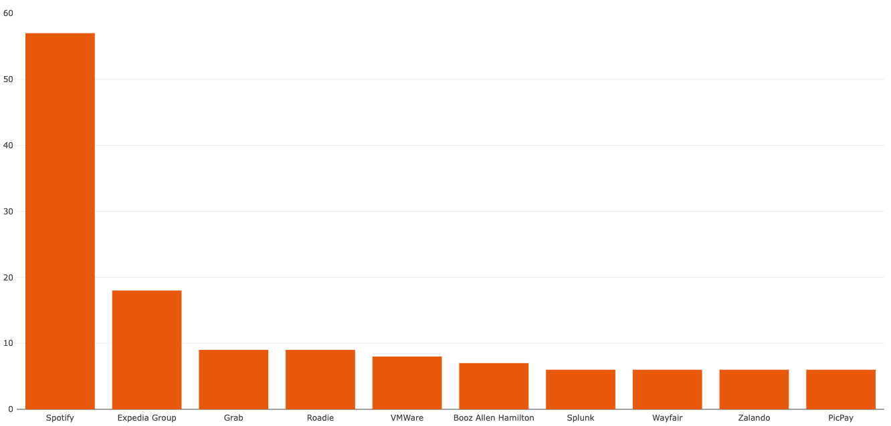

Wow. What a year 2021 has been for Backstage! The project has grown in every way imaginable.

We thought it would be fun to take a deeper look at the numbers behind Backstage in 2021. Here are 6 stats which summarise the period.

## 1,242 GitHub issues opened

Consistent usage by the 75+ public adopters and the rest of the community is producing a steady stream of new issues each month.

## 2,790 pull requests merged

Amazingly, more than twice as many pull requests were merged than issues opened. At 2,790 PRs merged, it's almost 8 PRs per day. 😳

## 41% of pull requests come from the community

While Spotify created the project, it’s not just Spotify who are contributing code to Backstage. Most months see 80+ pull requests contributed by non-Spotify employees.

Throughout 2021, approximately 1,154 merged pull requests were authored by non-Spotify contributors.

## 233+ companies contributing pull requests

These community pull requests come from people employed at a wide range of companies. Almost 30 different companies have contributed at least 10 pull requests each.

Spotify are clearly leading the pack, but companies like SDA SE, Roadie and DXC Technologies are playing their part. We at Roadie have contributed 79 pull requests this year.

## Expedia have 18 employees participating

Of course, code isn’t the only way to contribute to a project. Reviews, comments and even simple 👍 all contribute to the activity and the sense of participation.

Adopters like Expedia Group, Grab and Splunk had team’s worth of employees contributing to the project in 2021. Learn more about how and why Expedia are using Backstage in [our Expedia Group case study](/case-studies/expedia-group-backstage-mvp/).

## 912 unique GitHub users participated in 2021

In total in 2021, 912 unique GitHub users participated in the Backstage project, with 21 of those accounts participating more than 100 times each.

Suffice to say, this project is healthy and going from strength to strength. We can’t wait to get 2022 started!
