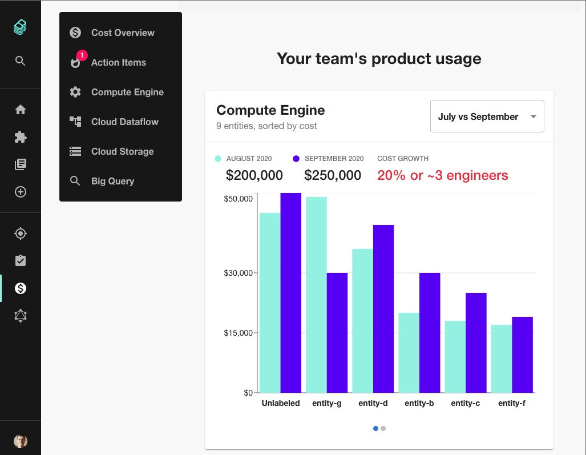
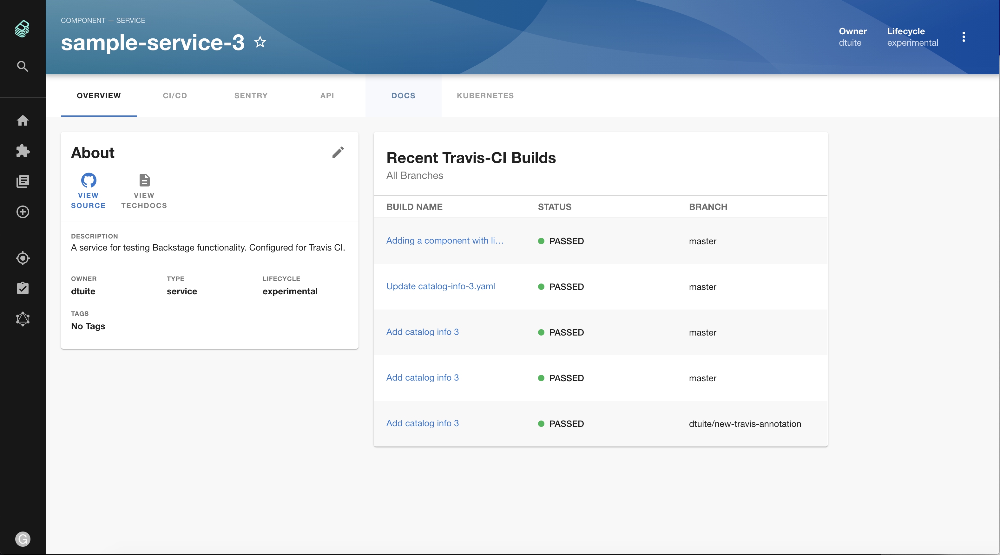

Last week, Spotify unveiled the Cost Insights plugin for Backstage. This plugin allows Backstage users to pull cloud costs into Backstage and associate them with services.

In this edition of Backstage Weekly, we’re doing a deep dive into Cost Insights to show how Backstage can help control costs and to understand what this means for the future of Backstage.

Most sensible engineering organizations are concerned with costs in some way. After all, lowering your costs means you have more money to spend on important things like marketing budgets, hipster coffee and LED-infused mechanical keyboards! ⌨️

Using Cost Insights, Spotify have made responsible cloud cost management part of the great shift-left movement. By highlighting costs to developers, putting them into perspective, and tying them to the services that developers work on, Spotify have made cost management part of the day-to-day development experience.

> We’re leaving behind the days of reducing costs via top-down requests and moving on to finding fun and rewarding ways engineers can strengthen technology while improving the company’s bottom line. [[source](https://engineering.atspotify.com/2020/09/29/managing-clouds-from-the-ground-up-cost-engineering-at-spotify/)]

Backstage plays a critical role in accomplishing this mission:

1.  To tie costs back to individual services, you first need a canonical and accurate list of the services being developed inside your company.
2.  To get cost insights to the people who can improve the numbers, you need to know which teams own which services.
3.  To make cost information visible above the noise, you need to present it in context in a developer portal which is actually used.

At Spotify, Backstage addresses all three of these needs.

> Spotify found that cloud costs are optimized organically when […] engineers see cost data in their daily work […] and the data is shown in software terms familiar to them.

As Backstage matures, I expect to see more features which connect developers to wider business concepts. Finance, security and compliance teams have historically struggled to interest developers in the vital business processes which power operations but don’t show up in VS Code. By placing buisness metrics in context and in Backstage, natural change can happen where past improvements were hard-won.

To learn more about Cost Insights, check out the official [Spotify Engineering blog post](https://engineering.atspotify.com/2020/09/29/managing-clouds-from-the-ground-up-cost-engineering-at-spotify) or the [plugin README](https://github.com/spotify/backstage/tree/master/plugins/cost-insights).

## Merged last week...

80 pull requests we merged in the last week. Here are the highlights:

[Esteban Barrios](https://github.com/ebarriosjr) (Trivago) contributed a [Google Cloud Build plugin](https://github.com/spotify/backstage/tree/master/plugins/cloudbuild). [#2515](https://github.com/spotify/backstage/pull/2515). This brings the total number of CI/CD systems supported by Backstage to 5: GitHub Actions, Google Cloud Build, CircleCI, TravisCI and Jenkins.

The scaffolder got Azure DevOps support from Mattias Frinnström (Husqvarna Group). You should now be able to quickly create services which are managed by Azure DevOps instead of GitHub or GitLab. [#2543](https://github.com/spotify/backstage/pull/2543)

If you like life on the edge, you can now consume Backstage nightly releases from NPM curtesy of [#2687](https://github.com/spotify/backstage/pull/2687).

Work has continued on the concept of users and teams. Backstage can now ingest your org structure from GitHub thanks to work from the Backstage core team. [#2669](https://github.com/spotify/backstage/pull/2669)

## Roadie news...

We’ve released new versions of our plugins in order to bring them up to date with the latest Backstage APIs.

The [GitHub Pull Requests plugin](https://github.com/RoadieHQ/backstage-plugin-github-pull-requests) has a new tab based view so you can see specific pull requests for each service in your company. You can also see statistics showing how long pull requests remain open on average.

The [Travis Plugin](https://github.com/RoadieHQ/backstage-plugin-travis-ci) now shows up under the CI/CD tab and has an overview widget showing the recent builds for each service.

Our Firebase Functions and AWS Lambda plugins have gotten similar improvements. Check them out on the the [RoadieHQ GitHub](https://github.com/RoadieHQ).
