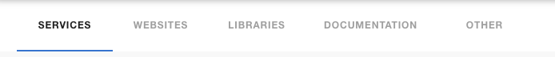
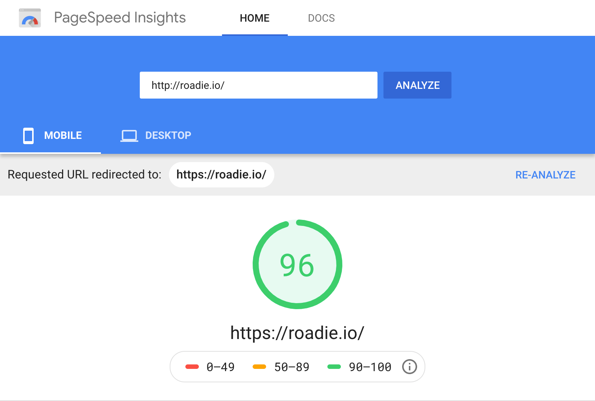
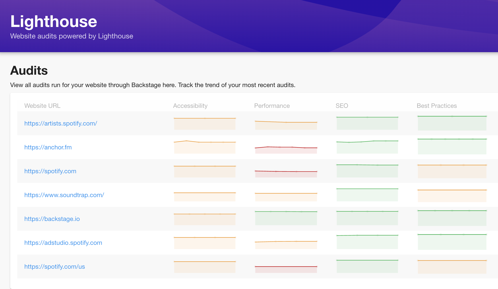
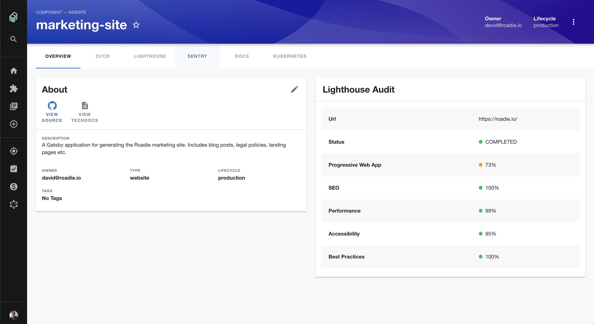

Backstage is not just a tool for handling microservices. It can also manage websites, libraries and any other software assets you might have lying around.

One of the very first Backstage plugins released was the Lighthouse plugin. Lighthouse is an open-source tool for measuring web page quality. You give it a URL and it runs tests against it to check for performance, SEO and accessibility problems.

It is traditionally used via Google’s [PageSpeed Insights website](https://developers.google.com/speed/pagespeed/insights). Enter a URL in the box, hit Analyze, and a few seconds later you will see a quality score, information about how long the page took to load, and some suggestions about how to improve it. 📊

If you’re a company which produces many landing pages or marketing websites, you would hope they all perform well on these Lighthouse tests. You would also hope that they are tested regularly to check for regressions. Unfortunately, this isn’t often the case.

You probably know what I’m going to say next… Backstage can help! 😀

Spotify have “hundreds of websites” in their internal Backstage and it periodically and automatically runs Lighthouse tests against each one and displays the results for everyone to see.

With Backstage, you can even see the history of Lighthouse runs for each website to understand if it has improved or worsened over time. Even better, because you can compare your websites against the rest of the company, you can easily tell when your results are falling behind.

Thanks to some recently merged pull requests, Backstage now puts Lighthouse test results front and center on each website your company tracks. This is a good thing for your website performance, and a good thing for the web at large.

To learn more, read the [official Backstage blog post](https://backstage.io/blog/2020/04/06/lighthouse-plugin) about the Lighthouse plugin or check out the [plugin readme](https://github.com/spotify/backstage/tree/master/plugins/lighthouse).

## Merged last week...

83 Pull Requests were merged into Backstage in the last week. Many of the big PRs were focused on internal work and refactoring, hopefully setting us up for some goodies in the future!

Here are the highlights:

Roadie’s very own Iain Billett contributed a ton of work to the Lighthouse plugin. You can see the benefits above. [#2709](https://github.com/spotify/backstage/pull/2709)

If you’ve seen previous editions of the newsletter, you’ll know that the core team have been working hard on representing people and teams inside Backstage. This week, Fredrik Adelöw added an LDAP processor to help Backstage ingest org data from that source. [#2732](https://github.com/spotify/backstage/pull/2732)

Backstage Alpha 24 was released. [#2756](https://github.com/spotify/backstage/pull/2756) If you’re upgrading, please note that the whole backend has moved under `/api`. You’ll need to update your ingresses and probably your custom config to avoid interruption.

## Other news...

<blockquote class="twitter-tweet">
Listening the <a href="https://twitter.com/changelog?ref_src=twsrc%5Etfw">@changelog</a> episode on Spotify’s “dev everything” portal, Backstage <a href="https://t.co/CD8j2JCMSf">https://t.co/CD8j2JCMSf</a>  Backstage seems to be “infra as a platform” with plugins at Spotify: everything from service ownership, deploys, API docs... impressive. I’ll be checking it out more closely.
&mdash; Gergely Orosz (@GergelyOrosz) <a href="https://twitter.com/GergelyOrosz/status/1315615504099356673?ref_src=twsrc%5Etfw">October 12, 2020</a></blockquote>

Stefan Ålund and Jim Haughwout appeared on The Changelog podcast and talked about the evolution of Backstage internally and the scale they operate at. Don’t miss the section on documentation near the end! [Here’s the link](https://changelog.com/podcast/415).

Here at Roadie we have released the [GitHub insights plugin for Backstage](https://github.com/RoadieHQ/backstage-plugin-github-insights). The contributors who partake and the languages you use are all part of the story of your software. We wanted to make it easy to put these insights on your Backstage page. Check it out, and please provide feedback in [our Discord channel](https://discord.com/invite/BUJQwK).
