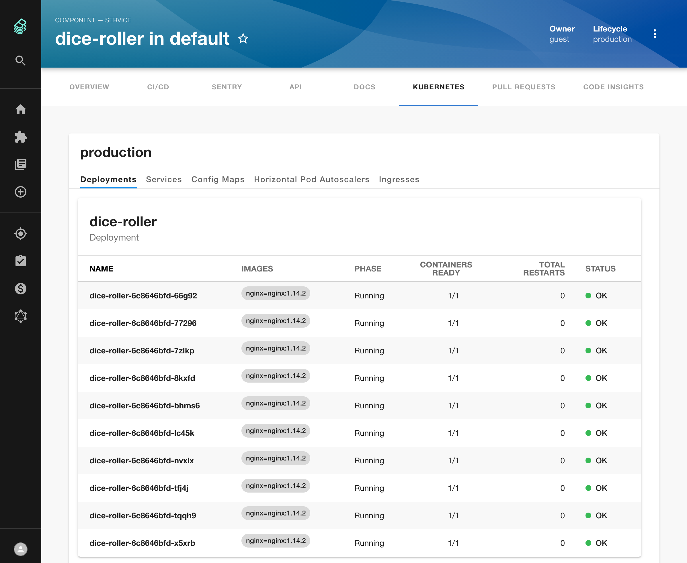
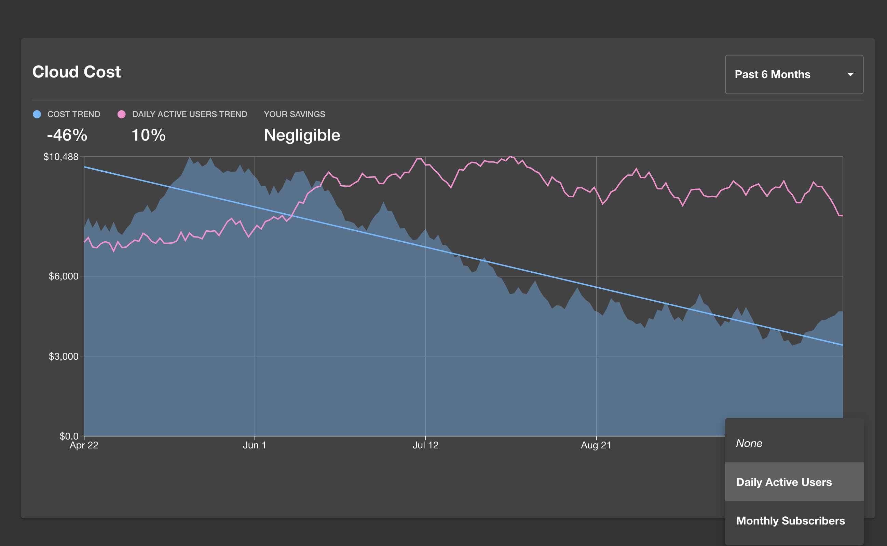

Kubernetes has been a humongous force in the infrastructure world over the last few years so it was obvious from Day 1 that Backstage would need to integrate with it in some fashion.

Thanks to some epic work by Spotify Infra Engineer, Matthew Clarke, we can glimpse what that integration will look like.

Over the past 4 weeks, Matthew has contributed 9 pull requests and almost 10,000 lines of code to Backstage to get this plugin ready.

Backstage users can now quickly check the scale and health of any Kubernetes-deployed service in their company.

The screenshot above shows that I have a production deployment of a service called dice-roller. It has 10 pods running and they’re all healthy.
Any company with a non-trivial number of services running will end up with increased operational load. It can quickly become difficult to understand what is deployed, where it’s deployed, what version it’s on and whether or not it’s healthy.

Integration between Backstage and the broad range of deployment tools out there can help tame this chaos.

It looks like Matthew is just getting revved up too 🏍. Many awesome features such as multi-cluster support and hybrid cloud support are on the proposed roadmap for this plugin. I can’t wait to see what comes next!

## Merged last week...

71 pull requests were merged this week. Here are the highlights:

Roadie engineer [Martina](https://github.com/martina-if) added 1,500 lines of Helm charts to Backstage. 😇 These charts let anyone deploy Backstage to a Kubernetes cluster in less than 5 minutes. TLS and a number of useful plugins are baked in. We’ll do a deep dive on this feature in an upcoming issue. [#2663](https://github.com/spotify/backstage/pull/2663)

The Cost Insights plugin, which we wrote about in [Issue #4 of Backstage Weekly](/blog/backstage-weekly-4-cost-insights/), got some more love. Backstage users can now compare costs against other metrics like Daily Active Users or whatever metrics your company cares most about.

Usage metrics and analytics will be important for Backstage Admins who are looking to understand how Backstage is used inside their orgs. We contributed the first step towards enabling this with a Google Analytics integration. [#2934](https://github.com/spotify/backstage/pull/2934)
