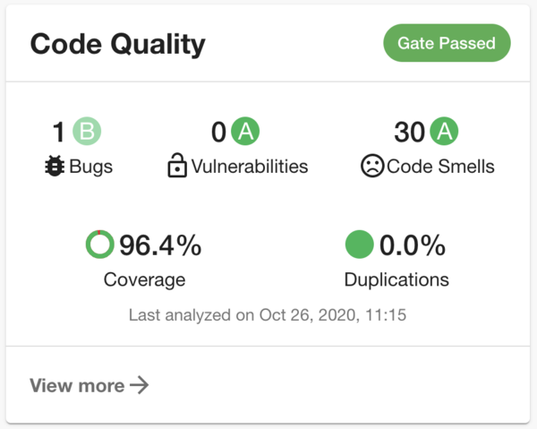
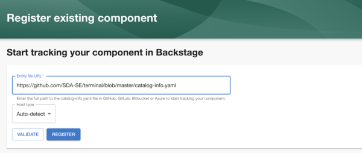

Backstage continues to take big strides towards becoming a community controlled CNCF sandbox project. This week, the project joined peers like Helm, Envoy Proxy and Kubernetes in adopting an open governance model.

> The [open governance](https://github.com/opengovernance/opengovernance.dev) of a project determines who has influence and control beyond what is legally required in an open source license.

Practically speaking, this makes it easy to see who maintains Backstage, what their responsibilities are and why they deserve those responsibilities.

Anyone can become a maintainer. To become a maintainer, you need to demonstrate commitment to the project, the ability to write good code and collaborate effectively with the Backstage team. There is also now a clear nomination process for new maintainers.
To learn more, check out the [GOVERNANCE](https://github.com/backstage/backstage/blob/master/GOVERNANCE.md) file in the backstage repo.

## Thoughtworks Technology Radar

Backstage recently claimed a spot on the Assess ring of the Thoughtworks Technology Radar.

In the Technology Radar Vol. 23, linked below, Cassie Shum, Head of Cloud Partnerships at Thoughtworks, mentioned that many of their clients are trying to standardize the tools and technologies they use and introduce lean governance to their organizations. They believe that increasing consistency can streamline development and reduce the time to market for new services. Cassie sees Backstage as a way to do that because it makes “discoverability a first-class citizen”.

<iframe width="560" height="315" src="https://www.youtube.com/embed/CUTSnAutoAM?start=1176" frameborder="0" allow="accelerometer; autoplay; clipboard-write; encrypted-media; gyroscope; picture-in-picture" allowfullscreen></iframe>

## Merged last week...

58 pull requests were merged last week. Here are the highlights.

### SonarCloud plugin

In a great demonstration of collaboration, a SonarCloud/SonarQube plugin was added to Backstage this week by Dominik Henneke of SDA-SE. [#3160](https://github.com/backstage/backstage/pull/3160)

A SonarCloud plugin was originally [requested by Julien Lind](https://github.com/backstage/backstage/issues/3063) at Decathlon on the 23rd of October. SDA-SE responded that they had already built this internally. Then they open sourced it within 7 days for everyone else in the Backstage community to use. The power of open source is right there for everyone to see!

### Component validation

The SonarCloud plugin isn’t the only thing that SDA-SE have been working on with respect to Backstage. Oliver Sand added a way to validate component metadata files before adding them into the catalog [#3013](https://github.com/spotify/backstage/pull/3013). I can imagine this concept being expanded to include validation steps in CI/CD steps in the future.

### Alpha 26 released

Last but not least, Backstage version Alpha 26 was released this week. It contains one important breaking change to the way configuration is loaded.

It used to be that the `NODE_ENV` and `APP_ENV` environment variables would control which configuration files were loaded. This has now been changed so that configuration files must be explicitly passed in using the `--config` flag.

Your app-config.yaml will still be loaded by default, but if you were using an app-config.development.yaml or other specific file, you will need to change the way you run Backstage.

That’s all for this week. Get upgrading and good luck! 🚀
