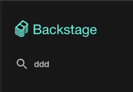
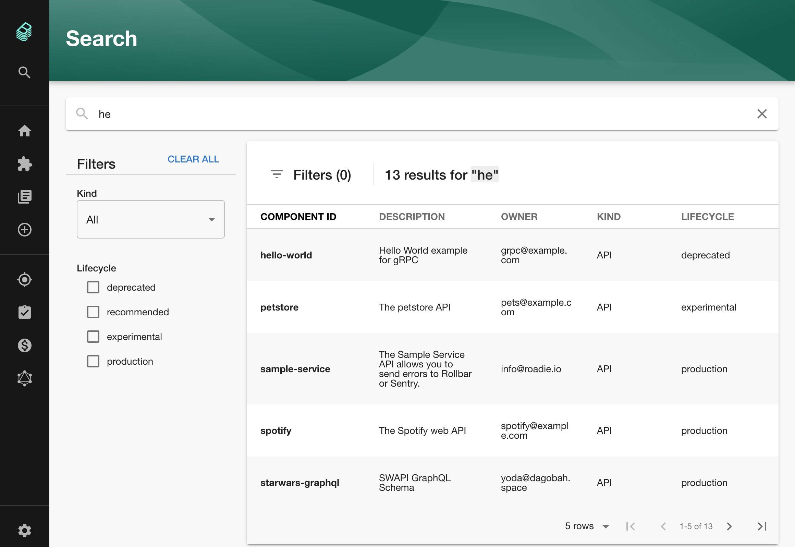
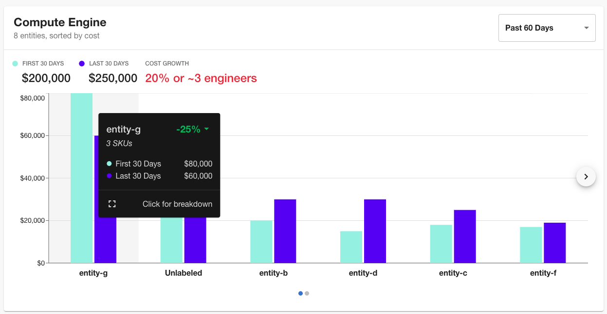

It's been a quiet week in the Backstage world with only 23 pull requests merged instead of the usual 70 to 100 📉 . Of course, that doesn't mean that nothing good was happening...

The core team are gearing up for some important changes to the way frontend plugins are integrated into Backstage. While far from finalized, these changes could unlock a number of powerful features such as:

1. Plugins which provide sub-components which can be displayed in other parts of the page.
2. An API for deciding when and where plugins show up in Backstage.
3. Lazy loading of plugins.
4. Increased stability and backwards compatibility between Backstage core and plugin versions.

The first discussions kicked off back in July in [#1536](https://github.com/backstage/backstage/issues/1536). There is a lot of work to do but it's great to see this take shape.

## 🔍 The search plugin is almost ready

Given that Backstage is a discovery tool, you might be surprised to learn that it has no search function. To date, the sole function of the search box in the sidebar has been to hint at good things to come!

Well, all that is about to change. Spotify engineer Emma Indal has been bringing search to life and what she has so far looks great. Here's a sneak preview!

In its current incarnation, search supports:

1. Searching across all "kinds" of entities (libraries, components etc) or narrowing your search to just one kind.
2. Searching based on the lifecycle of the entity (production vs. deprecated etc.)
3. Searching based on the name and description.

This is all frontend for the moment. Internally in Spotify, [search is backed off to an Elasticsearch cluster](https://github.com/backstage/backstage/issues/1499#issuecomment-655373427) so that documentation and everything else can be fed into the search results. We hope to do the same thing for Roadie Backstage once it's viable.

If you'd like to help out, go give Emma some positive feedback on [#3086](https://github.com/backstage/backstage/pull/3086). 👍

## Merged last week...

As mentioned, 23 pull requests were merged this week. Here are the highlights...

### Tooltips for Cost Insights

Ryan Vazquez added tooltips to a bunch of functions in the cost insights plugin. Hovering a particular product shows how usage is up or down and you can click to get a cost breakdown. [#3268](https://github.com/backstage/backstage/pull/3268)

### Buildkite plugin

At Roadie we developed and published a Buildkite plugin. [Buildkite](https://buildkite.com/) is a platform for running CI/CD on your own infra. The plugin is already integrated into the Backstage sample app. If you use that, you'll get access just by upgrading.

That’s all for this week. Get upgrading and good luck! 🚀
