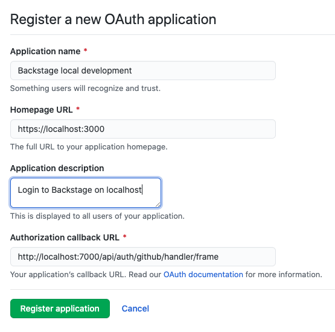
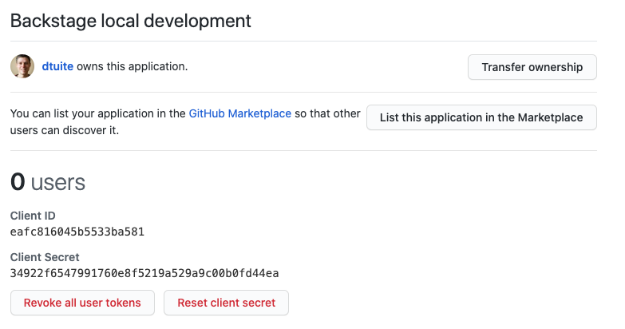

GitHub is one of the most popular Backstage authentication mechanisms going. There's a good reason for this, Backstage ultimately needs to pull service catalog information from YAML files, those YAML files usually live in git, and the git repos usually live on GitHub.

Setting up GitHub autententication can be a little tricky, but this post will tell you everything you need to know.

There are basically two steps:

1. Create an OAuth application on GitHub,
2. Pass the identity information from this application to Backstage.

Let's get into it.

## Create an OAuth application on GitHub

To create an OAuth app for local development, visit [your OAuth Apps settings page on GitHub](https://github.com/settings/developers). Click the "New OAuth App" button and you'll see a form you have to fill out.

Enter the following values:

<dl>
  <dt>Application name</dt>
  <dd class="typography-mono">Backstage local development</dd>
  <dt>Homepage URL</dt>
  <dd class="typography-mono">http://localhost:3000</dd>
  <dt>Application description</dt>
  <dd class="typography-mono">Login to Backstage on localhost</dd>
  <dt>Authorization callback URL</dt>
  <dd class="typography-mono">http://localhost:7000/api/auth/github/handler/frame</dd>
</dl>

Your form should now look something like this:



The tricky thing with this, is that the homepage URL should point to the Backstage Frontend, because that's what your users will consider to be "Backstage", but the Authorization callback URL must point to the Backstage Backend.

When GitHub authenticates a user, it will call out to the application Backend, with some authentication parameters included in the URL query string. Backstage will check these parameters and then server-side render a confirmation page for the user.

Once you submit that form, GitHub provides you with a Client ID and Client Secret for your OAuth application.



Note these down, you'll need them in the next step.

## Tell Backstage about your OAuth application

Go back to the command line where you run the Backstage backend and pass the Client ID and Client Secret into Backstage when you start it up.

```shell
# starting in the root of your Backstage repo
» cd packages/backend
» env AUTH_GITHUB_CLIENT_ID=eafc816045b5533ba581 AUTH_GITHUB_CLIENT_SECRET=34922f6547991760e8f5219a529a9c00b0fd44ea yarn start
```

That's all there is to it. When Backstage starts up and opens on http://localhost:3000, you'll be able to login via GitHub.

<div style="position: relative; padding-bottom: 81.44796380090497%; height: 0;"><iframe src="https://www.loom.com/embed/02fe760023a1497bb5b0b6b18c335a70" frameborder="0" webkitallowfullscreen mozallowfullscreen allowfullscreen style="position: absolute; top: 0; left: 0; width: 100%; height: 100%;"></iframe></div>

# Further reading

[The authentication docs for Backstage](https://github.com/spotify/backstage/tree/master/docs/auth) can be found in the `docs/auth` directory, within the repo.

They are rather engineering focussed and not the easiest to follow if you're just trying to authenticate with GitHub.
