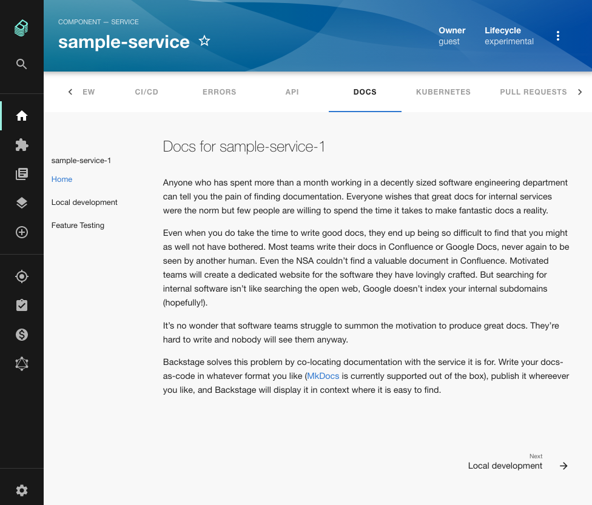

TechDocs is the core Backstage feature which transforms markdown documentation into HTML and displays it inside Backstage where your engineering teams can find it.

There are two ways to set up TechDocs in Backstage, the Basic approach and the Recommended approache. But how do they work and which should you use?

Read on to find out.

## Prerequisites

1. Docker installed and running locally on your machine.
2. The `git` version control system and a GitHub account.

## Basic TechDocs

First let's see what the basic experience gets us and how it works. 

Use `git` to clone the main Backstage repo. We have used [this point in the history](https://github.com/backstage/backstage/tree/1570824aa8d1c2509e098d60636636b482b08ddf) but most versions should work. Run `yarn install`, `yarn tsc` and `yarn build` to prepare the codebase and then start it with `yarn dev`.

Backstage should shortly be running on [http://localhost:3000](http://localhost:3000). Sign in as a guest, add [this sample-service](https://github.com/RoadieHQ/sample-service/blob/main/catalog-info-docs-only.yaml) to your Backstage catalog and navigate to its docs tab. 

Once the loading process completes, you should see some docs. Simple!



Let's take a look at what actually happened under the hood.

## How basic TechDocs works

Docs were generated and displayed because Backstage detected the `backstage.io/techdocs-ref` annotation contained in the `catalog-info.yaml` file of our sample-service. This tells Backstage that there are docs available which it should show to the user.

There are three actors involved in building the docs: the preparer, the generator and the publisher.

The preparer cloned the sample service repository into a temp directory on our local machine so the docs can be accessed.

The generator then downloaded the `spotify/techdocs` image from Docker Hub. This image contains Python, a few dependencies and a Python library called [mkdocs-techdocs-core](https://github.com/backstage/mkdocs-techdocs-core). The generator ran this library against the docs directory of the sample-service in order to convert the markdown files located there into HTML, CSS and JS files.

The mkdocs-techdocs-core library is a wrapper around two other libraries, [MkDocs](https://www.mkdocs.org/) and [Material for MkDocs](https://squidfunk.github.io/mkdocs-material/).

1. MkDocs is a static-site generator which takes a directory and some config and uses it to create a documentation website containing HTML, CSS and JS.
2. Material for MkDocs is a MkDocs theme which emulates the Material UI design pattern.

So MkDocs is generating a static website and Material for MkDocs is styling it. What's next?

Once the documentation site has been stamped out into a temp directory, it must be moved somewhere where Backstage can access it.

The publisher is responsible for this step and by default it chooses to move the documentation to `plugins/techdocs-backend/static/docs/default/Component/sample-service-1/` . If you open this directory you will find a sensible structure containing HTML, JS and CSS files. You should notice a clear similarity between these files and the docs you see in Backstage.

Now that the files are on the filesystem, the TechDocs frontend can simply request them and insert them into the browser's DOM as a shadow-DOM. That's how they end up in the page where you can see them.

## Limitations of basic TechDocs

This basic architecture is easy to get started with but it has a number of downsides:

1. Docker must be available in the place where you want to generate the docs. This may not be viable if Backstage is running in an environment like a Kubernetes pod. You can use the MkDocs binary instead, but then you end up with non-core Backstage dependencies in your Dockerfile.
2. It's slow on the first request because TechDocs must generate the docs and place them in the filesystem.
3. When running multiple Backstage backends, TechDocs may generate and store the docs once for each backend. This leads to extra slowness for the end users.
4. Backstage is pulling down the entire source code of the component to the local filesystem to generate the docs. This may not match your security expectations.

For these reasons, the TechDocs team recommends a CI driven architecture for generating and storing docs.

The idea is that a process, like a GitHub action or other CI build, runs every time there is a change to the markdown files which contain our documentation. This process uses the mkdocs-techdocs-core library to convert the markdown files to a static website just like before. However, instead of writing the resulting HTML, CSS and JS files to the local filesystem, it pushes them to an object store like an AWS S3 bucket. From here, Backstage can request them when needed and render them in the browser for the user.

## Converting to the recommended architecture

To convert our basic setup to the recommended architecture, we need to make a few changes. We're using AWS in this example but Google Cloud Platform, Azure and a host of other platforms are supported. We're also using GitHub Actions but CircleCI and others shoud work too.

We need the following things:

1. An AWS S3 bucket to store our docs, and credentials to authenticate uploading and downloading.
2. A process to convert markdown docs to HTML, CSS and JS and to push the resulting files to our bucket.
3. Configuration to tell Backstage to pull the docs from S3 instead of generating them with Docker.

Follow [the official AWS documentation](https://docs.aws.amazon.com/AmazonS3/latest/userguide/create-bucket-overview.html) to create an AWS S3 bucket. Aquire an Access Key ID and Secret Access Key which will authenticate requests to your bucket. You will also need to note the region your bucket lives in.

Add a GitHub Action to your component to do the markdown to HTML conversion and push to S3. The official Backstage docs have a [really good example of the code required](https://backstage.io/docs/features/techdocs/configuring-ci-cd#example-github-actions-ci-and-aws-s3). Don't forget to create secrets in your GitHub repo to store the bucket name and AWS credentials you created earlier.

Edit the `app-config.yaml` file in your Backstage repo.

1. Change `techdocs.builder` to `external` to tell Backstage to stop generating docs locally.
2. Change `techdocs.publisher.type` to `awsS3`.
3. Set `techdocs.publisher.awsS3.bucketName` to the name of your bucket.

The techdocs section of your `app-config.yaml` should now look like this:

```bash
techdocs:
  builder: 'external' # Alternatives - 'external'
  generators:
    techdocs: 'docker' # Alternatives - 'local'
  publisher:
    type: 'awsS3' # Alternatives - 'googleGcs' or 'awsS3' or 'azureBlobStorage' or 'openStackSwift'. Read documentation for using alternatives.
    awsS3:
      bucketName: 'demo.roadie.so'
```

Restart backstage, with the AWS credentials present in the environment variables:

```bash
env AWS_ACCESS_KEY_ID=xxx AWS_SECRET_ACCESS_KEY=yyy AWS_REGION=ppp yarn dev
```

From now on, when you merge a change to the default branch of your GitHub repo, a GitHub action will run to generate and publish docs to S3. From there, Backstage will request them and show them to the user.

## Conclusion

Converting your TechDocs from the basic to the recommended setup brings a number of advantages and it only takes a few minutes to switch over one repo.
