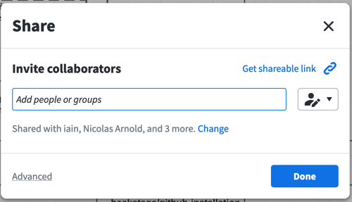
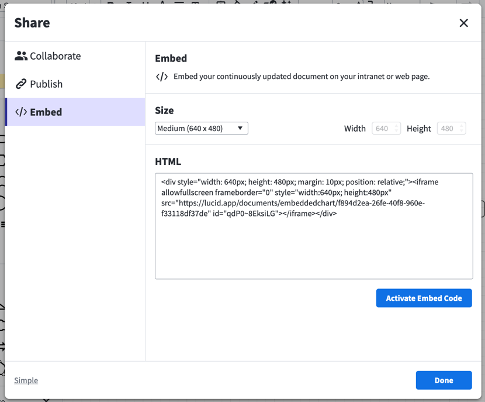
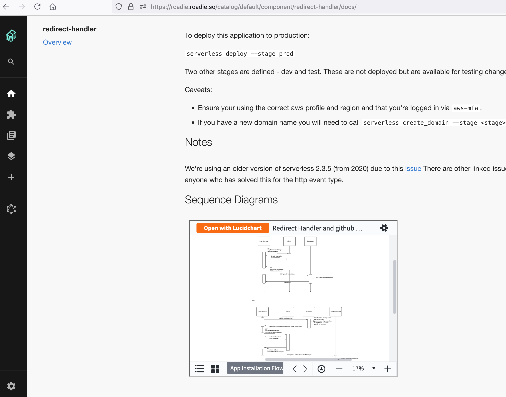

TechDocs is the core Backstage feature which transforms markdown documentation into HTML and displays it inside Backstage where your engineering teams can find it.

You can easily embed diagrams from lucid charts and other external sources in techdocs. Start by exporting the generated iframe from the external application. For example if you are using lucid charts you can click the Share button in the top right.

This will show a dialog as follows.

Click advanced and then click embed.

You can choose to adjust the size of the embedded diagrams.

Copy the html snippet and click the "Activate Embedded Code" button.

Now copy the code snippet into your techdocs files as it is and you will get diagrams in your techdocs that update when the diagrams are changed in lucid chart.

