Backstage's service catalog serves as a metadata store for useful information about the software assets being used and developed in your organization. 

It can also group software in ways which makes logical sense to the humans who build and use the software. Grouping software makes it easier to understand the overall architecture and can highlight previously unseen dependencies. 

A more understandable architecture is easier to onboard engineers onto and faster to repair when problems occur.

To see how different types of software asset are represented in Backstage, we're going to model part of the architecture you might find in a hypothetical ride-sharing company. We'll also see how Backstage models the relationships between software and how it can diagram the network of dependencies.

Here's how our hypothetical architecture looks. We have two backend services. One of them, Passenger Backend, is depends on two important libraries, the Core Queueing Library and the Core Auth Module. The second backend service, Trips Counter, calls the API of the Passenger Backend.

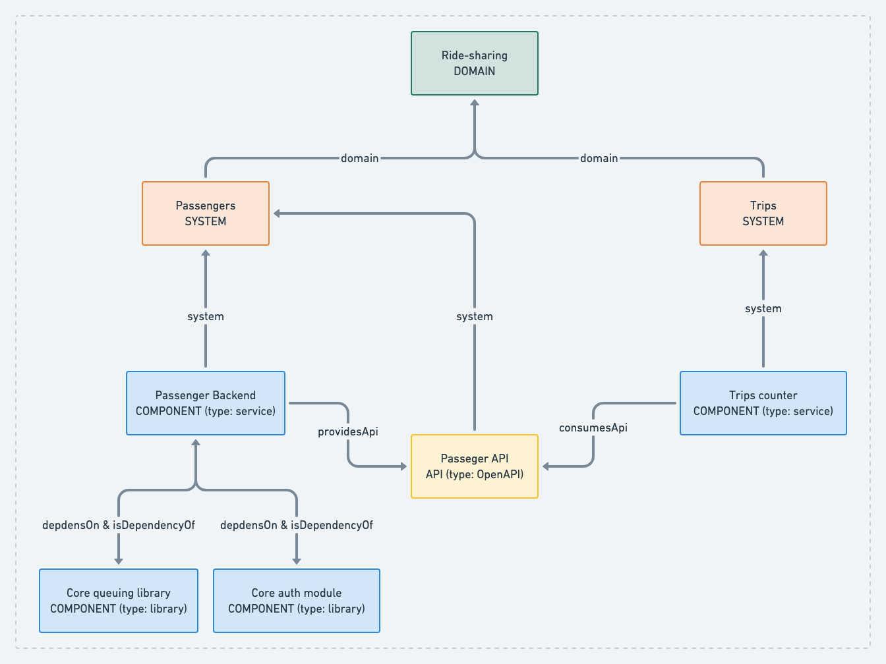

This model doesn't demonstrate all of the modeling capabilities that Backstage has to offer. We have omitted Resources, which typically represent shared infrastructure, like a Kubernetes cluster. We have also omitted the sub-component relationship because it has a very niche use-case in the fat-client world.

We have also ignored the other fundamental pillar of modeling in Backstage — humans and the teams they group themselves in. Backstage provides `User` and `Group` concepts for this purpose. They are outside the scope of this document.

## Modeling components, the basics

Let's start with a simple concept like a typical backend service, the Passenger Backend. This could be a NodeJS or Go application perhaps. It probably has some API endpoints, some business logic, a connection to a database and a bunch of libraries installed into it.


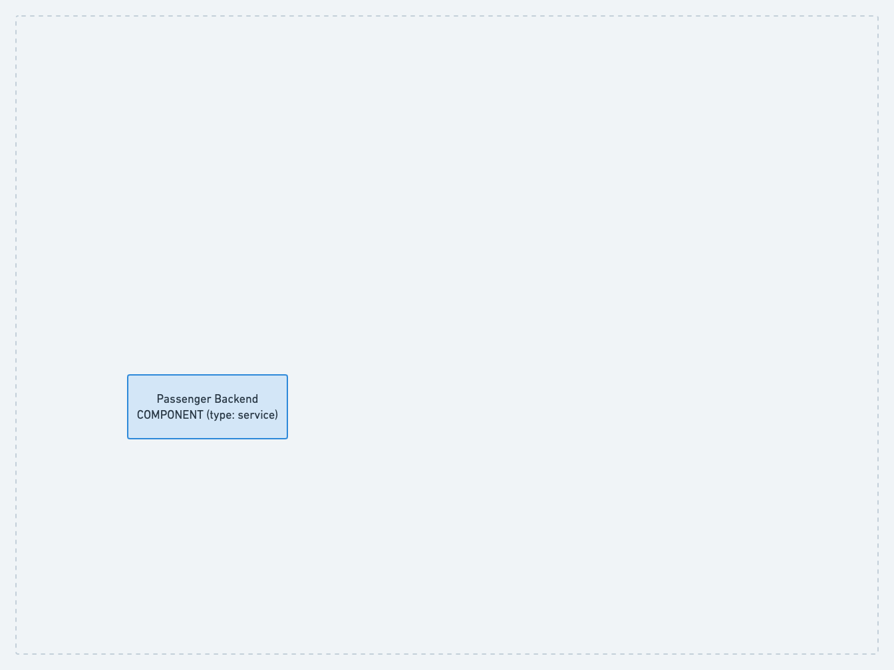

Backstage represents services like this using three properties, the `kind`, `type` and `name`.

```yaml
kind: Component
type: service
name: passenger-backend
```

Components are one of the fundamental building blocks in Backstage. A component is a single logical unit of code which is owned by a person or group of people. Assuming you don't use mono-repos, it might correlate to a single GitHub or Gitlab repository. It has a type which indicates how it might be used. To represent a backend service like our Passenger Backend, we use the type `service`.

A good rule of thumb is to draw the boundaries between pieces of software by considering their ownership. If a codebase, or a part of a codebase, is owned by a team, that's probably a component you want to model by itself.

## Adding libraries

Components can be composed of other components. For example, our Passenger Backend has two important libraries installed into it. The Core Queuing Library is used to pass jobs over a shared queuing service and the Core Auth Module is used to authenticate incoming requests.

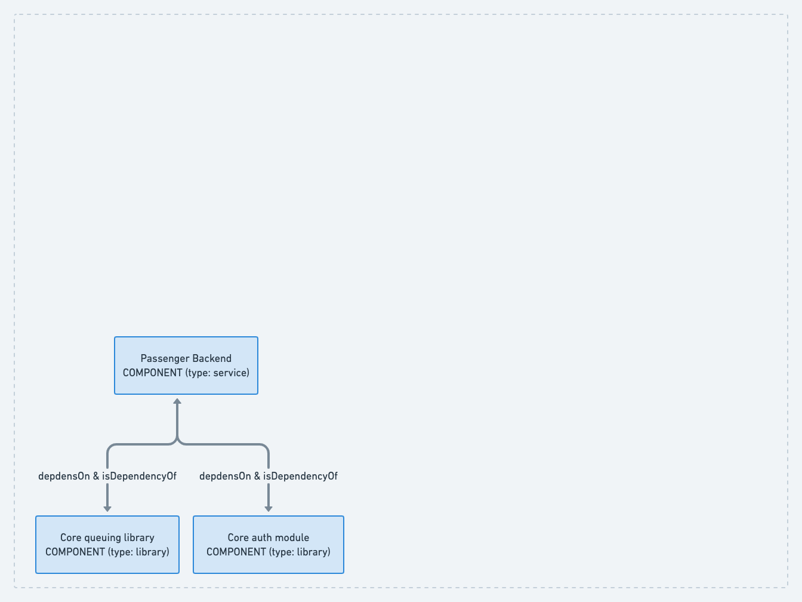

The Core Queueing Library is represented as a library component.

```yaml
kind: Component
type: library
name: core-queuing-library
```

The relationship between the the Core Queuing Library and the Passenger Backend is defined by a property on Passenger Backend.

```yaml
kind: Component
type: library
name: passenger-backend
dependsOn:
  - passenger-backend
```

Once that relationship is defined, we can show it off in Backstage by adding the `EntityDependsOnComponentsCard` to the interface.

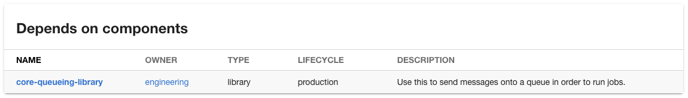

You typically wouldn't attempt to represent all dependencies of a service like this. Some services will have hundreds of libraries they depend on, and trying to account for all of them will introduce too much fragility into the model. 

However, it might be appropriate to indicate a dependency on important libraries which are developed in-house and are found in lots of other components across the company.

It's important to realize that saying that the Passenger Backend depends on the Core Queuing Library doesn't give Backstage enough information to establish an inverse relationship. To do that, we have to indicate that the Core Queuing Library is a dependency of the Passenger Backend service.

```yaml
kind: Component
type: library
name: core-queuing-library
isDependencyOf:
  - passenger-backend
```

With this change in place, we can add the `EntityDependencyOfComponentsCard` to the Core Queuing Library page in Backstage and we will see the following:

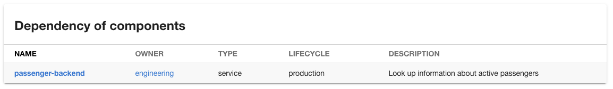

## Representing an API

The Passenger Backend service exposes a RESTful HTTP API so that other software in the company can communicate with it. They may use this API to look up the current location of a passenger for example.

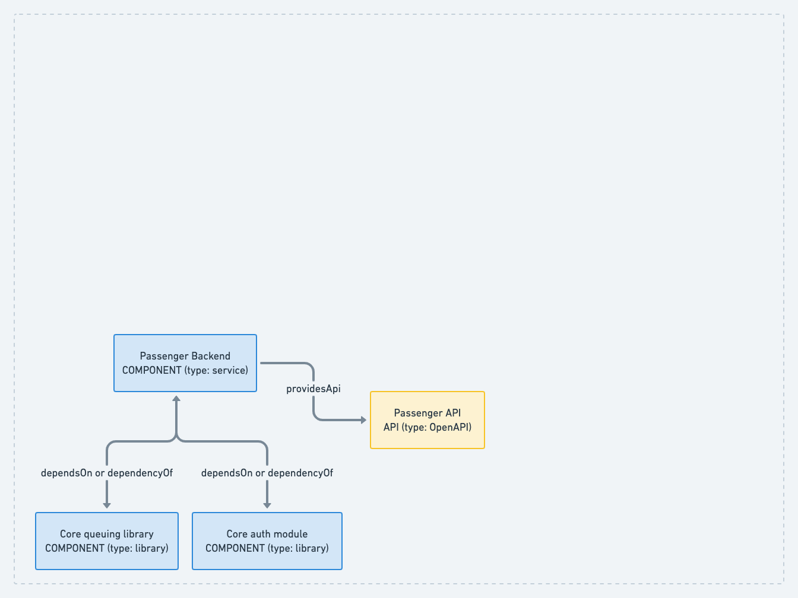

APIs are represented in Backstage using the same three properties as components.

```yaml
kind: API
type: openapi
name: passenger-api
```

The `type` specifies the specification language you are using to describe your API. We've specified OpenAPI here but others like GraphQL and gPRC are supported.

Once we have defined the API, we can indicate that the Passenger Backend service exposes it.

```yaml
kind: Component
type: service
name: passenger-backend
providesApi:
  - passenger-api
```

Once we have indicated this relationship, we can show it off in the Backstage UI by adding the `EntityProvidedApisCard`. We would typically add this card to a tab on the Passenger Backend component so that people can look that component up in the catalog in order to read its API definition.

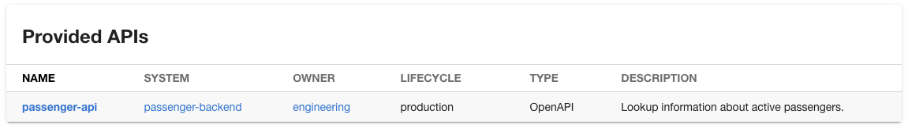

## Combining things into systems

Together, the Passenger Backend and Passenger API make up a logical system. They are a group of entities with a well defined purpose, providing and managing information on passengers.

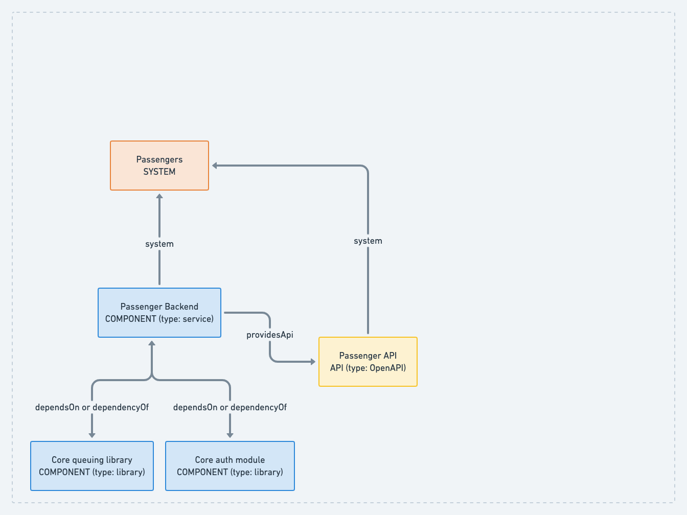

To represent them as a logical group in Backstage, we can define a system. Systems don't have types, they are just systems.

```yaml
kind: System
name: passengers
```

We can declare that the Passenger API and the Passenger Backend are part of the system by adding the system property to their definitions.

```yaml
kind: Component
type: service
name: passenger-backend
system: passengers
providesApi:
  - passenger-api
```

```yaml
kind: API
type: openapi
name: passengers
system: passenger-backend
```

Once the system exists in Backstage, it will get it's own page in the UI where we can represent its relationships. For example we can add the `EntityHasApisCard` to see the APIs which are part of this system.

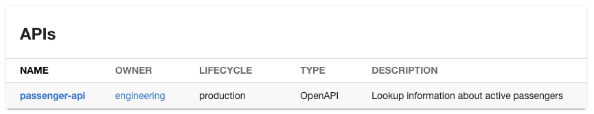

Similarly, we can add the EntityHasComponentsCard to see the components which are part of the system.

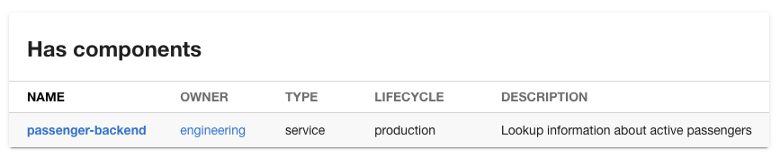

It's important to note that the Core Queueing Library and the Core Auth Module are not considered to be part of the Passengers system. This is because they are shared libraries which are used in a large number of components throughout the org. The are probably owned and developed by a different organization, within our ride-sharing company.

Now that we have defined a system, Backstage can diagram it for us. When we add the `EntitySystemDiagramCard`, we see something like the following:

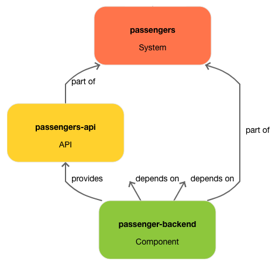

## Consuming APIs

Of course, it takes more than just a Passengers system to make a ride-sharing company hum. Those passengers need to go on trips, and we need to count the trips to see how rich we're going to get. Let's add the Trips system into Backstage, give it a Component and connect it up to the Passenger API.

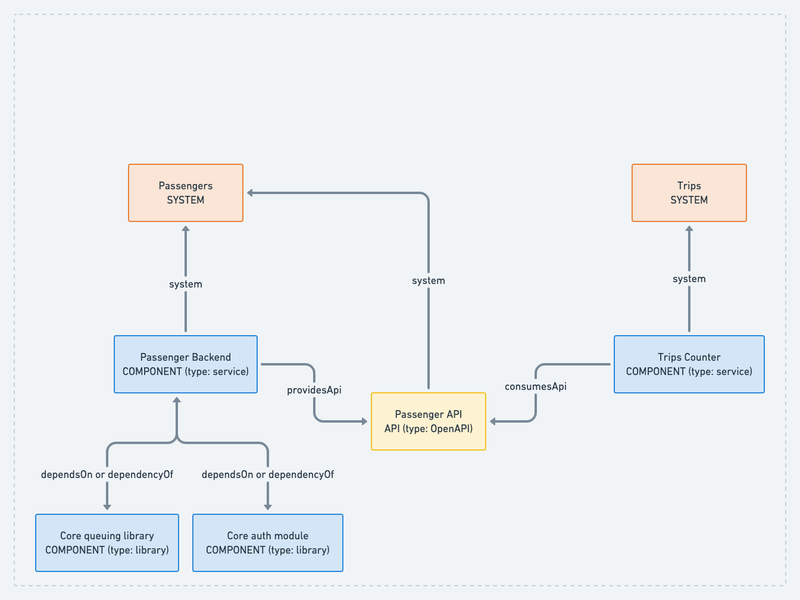

The key properties required to represent this in Backstage are as follows:

```yaml
kind: System
name: trips
---
kind: Component
type: service
name: trips-backend
consumesApis:
  - passengers-api
```

When we look up the Passengers API in Backstage, we can now see that the trips-backend is a downstream dependency.

For complex systems, it would be quite onerous to track and compile these dependencies manually. We are hopeful that the community will develop  integrations into technologies like API gateways and service meshes so that dependencies can be inferred and represented in Backstage automatically.

## Business domains

After some time, upper management decides that our ride sharing company should branch out into food delivery. To achieve this vision, they establish a new arm of the company.

To differentiate the systems we have created to move passengers around from those required to move takeout around, we can create a Domain in Backstage. Domains represent collections of systems which make up a coherent business unit.


## Conclusion

With some simple labels like `kind`, `type` and `name` and a handful of relationships like `dependsOn`, `providesApi` and `consumesApi`, complex software architectures can be accurately modeled in Backstage.

Of course, it's up to you to decide how granularly you want to represent your software. It's totally fine to add components to Backstage and to choose not to group them into systems or domains.  APIs are probably the second most useful concept to include since they indicate the interfaces between components.

To learn more about this topic, please refer to the [Backstage documentation on entities](https://backstage.io/docs/features/software-catalog/descriptor-format) and [well-known relations](https://backstage.io/docs/features/software-catalog/well-known-relations).
