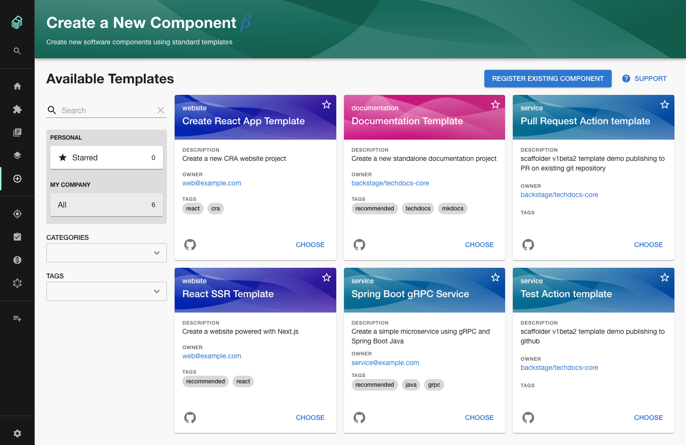

## Introduction

At Roadie, security is of the utmost importance. We think deeply about the security of every feature we roll out. This has sometimes slowed us down, or meant that we've had to run without some features or plugins available. For example, we've written at length about steps we take to [properly authenticate GitHub apps access](/blog/avoid-leaking-github-org-data/).

When we first launched hosted Backstage, and collaborated with external pen-testers to ensure it was secure, we took a look at the Backstage scaffolder feature and realized that it could be used to run arbitrary code within our network. To ensure our customers security, we made the hard decision to launch Roadie Backstage with the scaffolder disabled. This cost us some customers over the past 6 months, but it was worth it for security.

After months of hard work, we are proud to launch scaffolder support with a completely re-designed and hardened architecture. This new architecture ensures that scaffolder tasks are run in an isolated and ephemeral environment which keeps customer data secure.

The scaffolder is available on all Roadie Backstage environments today. [Start a free trial here](/free-trial/) and then check out [our docs for the scaffolder](/docs/getting-started/scaffolding-components/).

## What is the scaffolder?

Imagine you're an engineer looking to create a new microservice. You want to get started as quickly as possible, with minimal boilerplate and red-tape to jump through. At the same time, engineering organizations benefit from having consistency in production, and often put gates in place to enforce it.

Instead of creating blockers for engineering teams, Spotify use the scaffolder and quickly create new microservices, while helping to ensure that production remains mostly consistent.

Engineers can choose a pre-defined software template, fill out a few form fields to provide values like the name of the GitHub repo that the new service will occupy, and click a button to run the template and create a the new service.

By making it easier to start new projects, your engineers get to the good part of coding features faster. And your organization’s best practices are built into the templates, encouraging standards and reducing complexity in your tech ecosystem.

## The scaffolder on Roadie

We audited the open source scaffolder actions one by one and found that the Backstage Scaffolder was running them on the API backend process of Backstage. Scaffolder tasks technically had access to the same resources available to the API backend. 

Tasks that copied files or accessed network resources might are a little risky even when running Backstage inside your corporate firewall. On a SaaS platform like Roadie, they are unacceptable.

To isolate our scaffolder jobs, we run them in a separate process in a private network on AWS ECS. A single container task is spun up for each execution and destroyed once it completes. 

The container can only access to its own Backstage database and the public internet. The container does not have access to the network services available to the API backend process and it cannot do things like copy files from the local API backend services file system.

We already support the most frequently used scaffolder actions on Roadie. You can fetch pre-defined templates, use them to create GitHub repositories and write to the Backstage catalog. 

You can even send HTTP requests to the public internet, using [an open source library we created](/backstage/plugins/scaffolder-http-requests/), so that newly templated microservices can automatically register with your SaaS tools like Circle CI or PagerDuty. 

The full list of supported scaffolder actions is available inside your Roadie Backstage instance at `https://[sub-domain].roadie.so/create/actions`.

## Next steps

To try out the scaffolder, you can use one of the [pre-defined templates we have published](https://github.com/RoadieHQ/software-templates), or use [the official Backstage documentation](https://backstage.io/docs/features/software-templates/writing-templates) to write your own.

We're going to continue working on the scaffolder to make it faster, more featured and more secure. We're already thinking about features such as custom container support and fully custom scaffolder actions. 

If there's something you'd like to see, please reach out on [our public Discord channel](https://discord.gg/W3qEMhmx4f).
