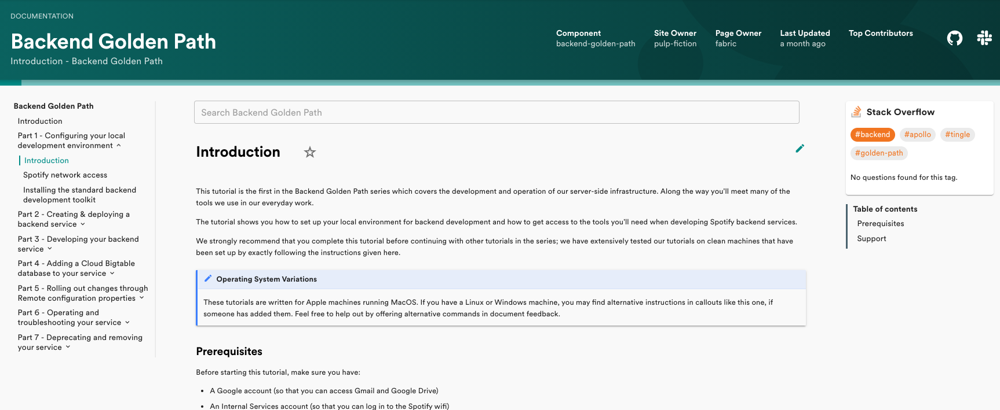

Everyone wishes that great docs for internal services were the norm, but few people are willing to spend the time to make these docs a reality.

Even if you do write good docs, they get lost in the ether of Confluence or Google Drive, never to be seen again by another human.

Motivated teams create dedicated websites for the software they have lovingly crafted. But searching for internal software isn’t like searching the open web. Google doesn’t index internal websites (hopefully!)

It’s no wonder that software teams struggle to find the motivation to produce great docs.

This is the problem that Backstage has begun to address this week, with the release of the Backstage TechDocs plugin.

> Internally, [at Spotify] we call it TechDocs. It’s the most used plugin at Spotify by far — accounting for about 20% of our Backstage traffic (even though it is just one of 130+ plugins). Its popularity is evidence of something simple: We made documentation so easy to create, find, and use — people actually use it.

Here’s the headlines:

- Your services automatically get a docs site when they are created with Backstage.
- The docs live with your code and are updated using your regular workflow so they stay up to date more easily.
- Docs are easily found via the Backstage service catalog.
- Search is built in so you can easily find what you need.

The impact of this doesn’t stop at happier engineers. By making documentation easier to find and consume, organisations see less duplication across their services. That means a more efficient and productive engineering organisation.

Read the [official announcement on the Backstage website](https://backstage.io/blog/2020/09/08/announcing-tech-docs) or check out this video to see how it can be used.

<iframe width="560" height="315" src="https://www.youtube.com/embed/mOLCgdPw1iA" frameborder="0" allow="accelerometer; autoplay; clipboard-write; encrypted-media; gyroscope; picture-in-picture" allowfullscreen></iframe>

Merged last week...

95 pull requests have been merged to Backstage in the last week. Here are the highlights…

1.  Installing plugins into Backstage now requires a bit less code. [#2285](https://github.com/spotify/backstage/pull/2285) moves the heavy lifting into plugins themselves, where it can be handled by plugin authors. [The docs are here](https://github.com/spotify/backstage/blob/master/docs/api/utility-apis.md).
2.  [Andrew Thauer](https://github.com/andrewthauer) gave his Rollbar plugin some love. [#2301](https://github.com/spotify/backstage/pull/2301) moves the plugin into the Service Catalog.
3.  In recognition of their awesome and consistent contributions to Backstage, Andrew Thauer (Wealthsimple) and Oliver Sand (SDA-SE) were given write access to the repository this week. The newly added OWNERS.md file tracks this change. [#2400](https://github.com/spotify/backstage/pull/2400)
4.  The Circle CI plugin was integrated into the service catalog and completely refactored to freshen it up. [#2282](https://github.com/spotify/backstage/pull/2282)
