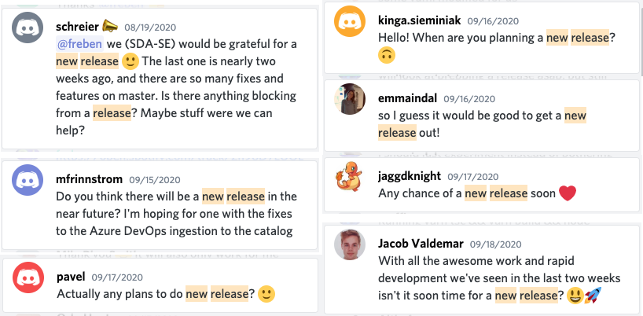
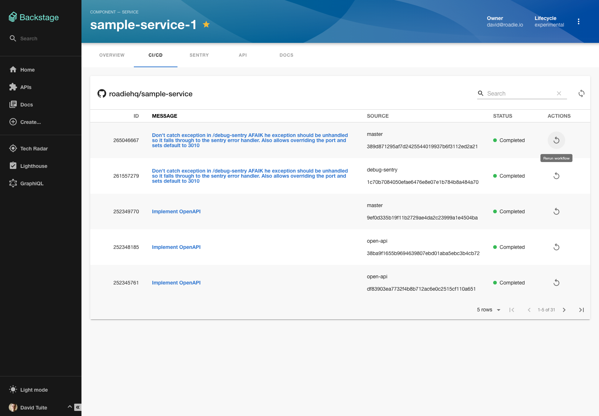
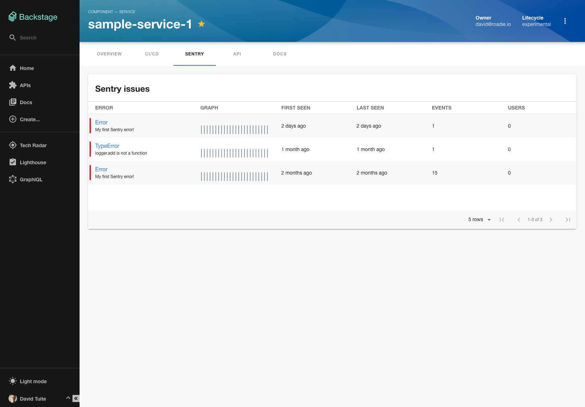
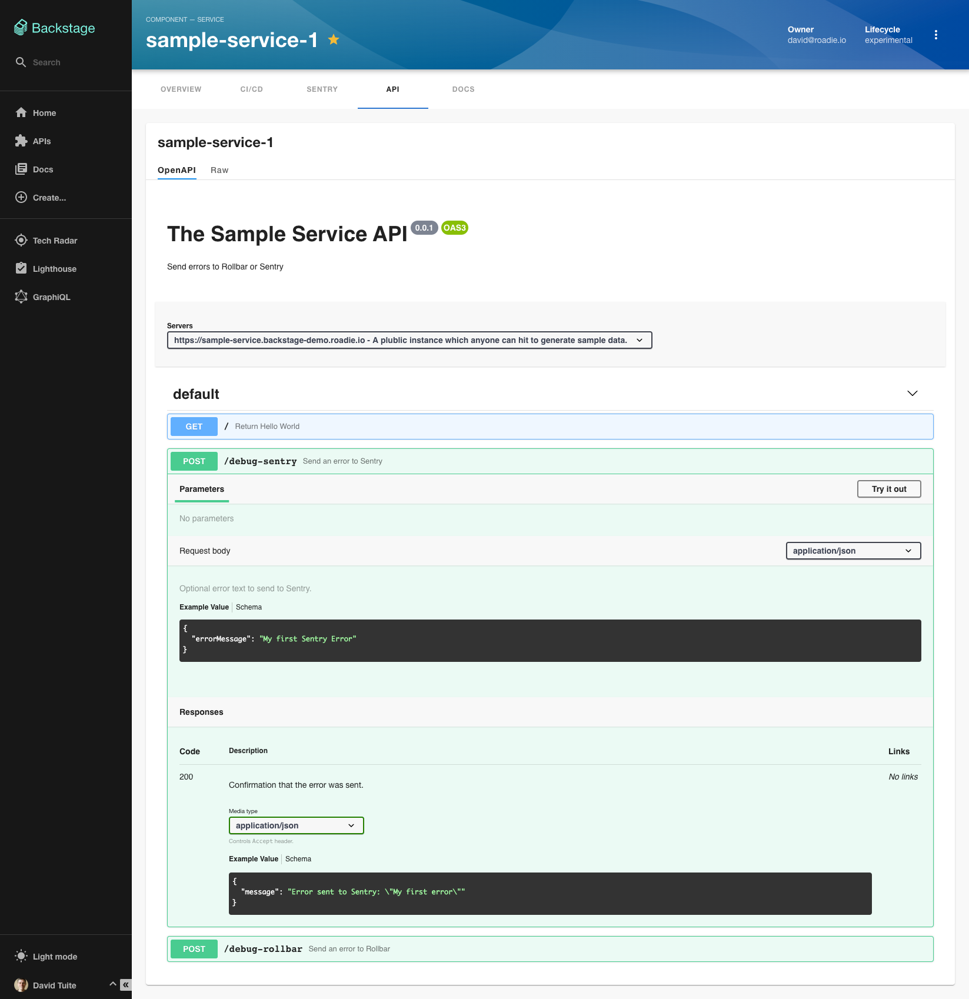

A hotly anticipated Backstage alpha 22 was released last week.

A “single pane of glass” view for services is a core part of the vision for Backstage. Instead of hopping between disparate tools, engineers and operators should be able to quickly search a catalog to find all the info they need.

Alpha 22 is important because it reveals some of this core power.

You can now go from viewing all the services your company runs on the service catalog...

…to viewing the latest builds for a specific service…

… to viewing its production errors from Sentry…

… or full API docs if you were thinking about integrating with it…

These features are still in the early stages of development, and they’re certainly rough around the edges, but the framework is there and it’s starting to become real.

I’m excited!

## Merged last week...

59 pull requests have been merged to Backstage in the last week. It’s worth noting that the 3 largest pull requests were contributed by the community, rather than the Backstage core team. Backstage is getting some serious love.

Here are the highlights…

1.  Andrew Thauer (Wealthsimple) added support for GraphQL API types. [#2088](https://github.com/spotify/backstage/pull/2088)
2.  [Björn Marschollek](https://github.com/muffix) (Personio HR, ex. Skyscanner) added support for GitLab in the scaffolder. GitLab users can now template new services via the Backstage interface. [#2426](https://github.com/spotify/backstage/pull/2426)
3.  Jesse Johnson (Booz Allen) is a documentation hero ♥️ who added 700 lines of [quickstart tutorials](https://backstage.io/docs/tutorials/quickstart-app-auth) to the Backstage website. [#2435](https://github.com/spotify/backstage/pull/2435)
