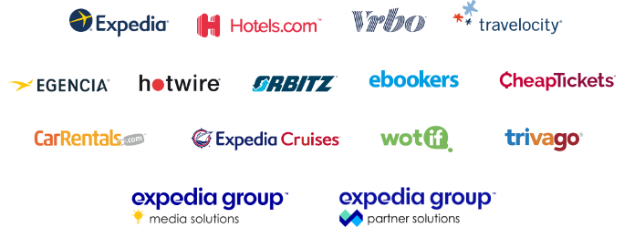

Expedia Group recently rolled out Backstage company wide to more than 5,000 developers as their designated internal service catalog, API catalog, documentation library and developer portal.

I sat down with engineering manager Erik Lindgren and product manager Mike Turner to hear Expedia’s reasons for choosing Backstage and the lessons they have learned so far.

[Erik][erik linkedin] is a Senior Engineering Manager leading the Developer Experience (DX) Team at Expedia group. He previously worked in infrastructure and platform roles, building out self-service platform capabilities for [Hotelsa.com][hotels dot com].

[Mike][mike linkedin] is a 22 year veteran of the software industry and currently works as a Senior Manager of Product Management.

Expedia Group is a global travel company which has grown via acquisitions over its 20 year history. Currently more than 15 brands are part of the group.

## Becoming a platform company

In 2019, Expedia decided to consolidate the functionality offered by their many brands and become a holistic travel platform company. As part of this restructuring effort, Expedia recognised the importance of:

 1. Improving DX across the company in order to improve productivity and decrease costs.
 2. Externalising consistent, discoverable and easy to use APIs to their business partners and the wider Expedia developer community, in order to support and grow revenue from integrators.

Over the years, acquisition had resulted in Expedia having many applications and APIs with duplicated  functionality. The duplication meant that external developers who wanted to integrate with Expedia’s travel APIs are faced with multiple options, each with their own experience, feature set and developer hubs. Duplication also required internal developers to work with many different tech stacks and tools, even when working within a single business domain such as flight search.

Expedia's holistic platform vision included a single set of uniform APIs and an AWS-like developer console experience where business partners and the wider  development community could browse and utilize the full suite of tools on offer.

## Start internal, then expose

With this goal in mind, Expedia decided to begin their standardisation journey internally, knowing that they can expose the result externally when they have achieved unification.

A unified internal portal is a compelling minimum viable product (MVP) because it can eschew functionality like a centralized content management system, account and identity management, and other features which are required in an external facing system.

## Measure, then move

They started by establishing a baseline for two important metrics. How much stuff do we have? And what are the top pain points for the people building this stuff?

A painstaking search established that Expedia's internal technological landscape consisted of approximately 20k microservices, 400 unique developer tools, 3000 APIs and more than 1000 bespoke libraries.

They sent out biannual surveys to the entire development org asking them what their top pain points were. Documentation discoverability and freshness was the number one problem mentioned in the feedback they received.

The thousands of internal tools and APIs meant that documentation was impossible to find and moving between teams or using new tools required spinning up on an entirely new tech stacks and set of processes. Engineers believed that this negatively impacted their productivity.

## Culture and executive support matters

While this search was ongoing, Expedia simultaneously embarked on a deep cultural change internally. Expedia had grown up with a culture of optionality where engineering teams could pick their own stacks and had many degrees of freedom in how they worked.
In this environment, an ambitious team delivering a unified development experience would have had to go org by org and team by team in order to sell themselves and get adoption.

However, since 2019, with the platform company goal in mind, brand walls have been broken down internally at Expedia and have given way to top down initiatives aimed at unifying the different functions that exist across the group.

This cultural change means that the Expedia culture which exists today is much more bought into the idea of standardization and deduplication.

## Their Backstage MVP

In 2020, the Developer Experience team looked at the open source landscape and chose Backstage as the foundation of their internal development portal. They saw it as a command centre for driving deduplication and DX improvement across the whole company.

Based on the feedback they had received in their internal developer surveys, they knew that integrating documentation into Backstage was going to be critical to their success, so they decided to focus their efforts on that problem space.

They outlined a short list of features to include in their MVP:

1. TechDocs, so that developers could publish documentation in Backstage where others could find it.
2. A service catalog so that documentation could be associated with the services it referred to. Luckily, they already had an internal service registry in place which they could use to bootstrap the Backstage catalog.
3. A custom plugin for security analysis and vulnerability scanning.
4. A custom plugin for displaying DORA metrics for each service in Backstage.
5. Application templating via the scaffolder.

The Developer Experience team built out an MVP in 2020 and launched Backstage company-wide in February 2021.

Despite launching 2 months ago, they already see a reinforcing feedback loop where regular usage of internal documentation helps highlight errors in the documentation and leads to their correction. This, in turn, leads to better documentation and growth in usage.

They are measuring a number of concrete KPIs to establish their level of success with Backstage.

1. Raw user load. How many internal developers are using the platform and how often.
2. The number of APIs tracked. While they did have an existing registry which could provide a list of components in Expedia Group, no such list of APIs existed. This list is being built up from scratch in Backstage as developers use the tool.
3. Change in the time to first and tenth commit. By extracting the time that an engineer joins the company or switches team, and matching that against their commit history, Mike and Erik are measuring the decrease in the time to 10th commit during onboarding.

They expect to see a 6x return on investment for this project, with a payback period of 40 days. These projections ensured they had an easy time getting support from senior leadership at the company.

## The future of Backstage at Expedia

Improving DX is only the first of Expedia’s goals for Backstage. Deduplication and unification of APIs is next on the list.

To drive this initiative, Expedia will use Backstage to generate a production readiness score, and security and compliance scores, for each application and API in the catalog. This will allow them to highlight mature applications and tools which can best serve their individual use cases. 

[erik linkedin]: https://www.linkedin.com/in/lindgrens/
[mike linkedin]: https://www.linkedin.com/in/michaeljturner2013/
[hotels dot com]: https://www.hotels.com/
