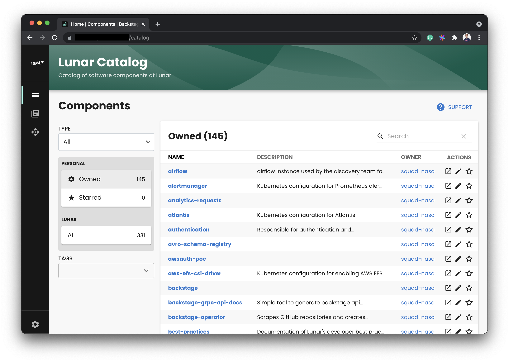
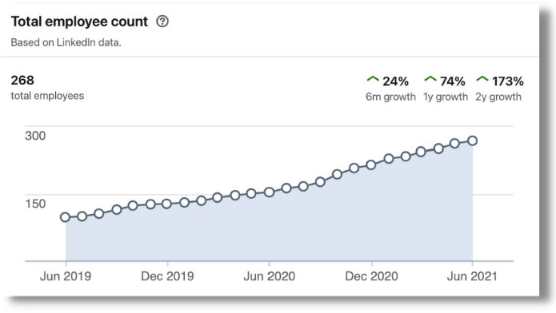
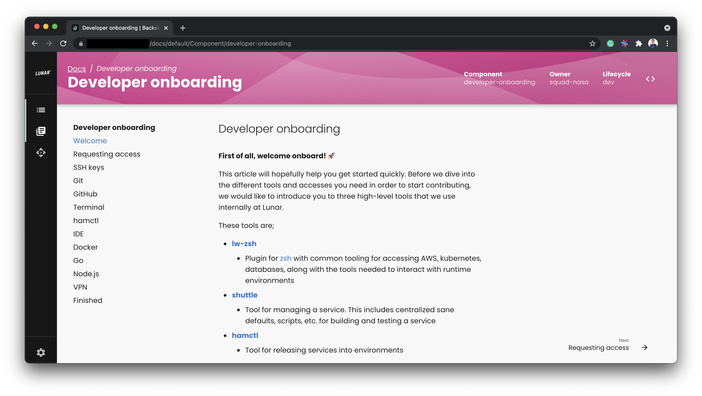

Lunar is a Nordic challenger bank who raised a $40 million dollar Series C in October 2020 and looked to Backstage to help them rapidly onboard the engineers they planned to hire on the back of this fundraising event.

I met with Lead Platform Architect and CNCF ambassador [Kasper Nissen][kasper] and Web Architect [Bjørn Sørensen][bjorn] to learn why they’re adopting Backstage at Lunar and the benefits they have experienced.

Lunar deploys their microservices architecture on AWS based kubernetes. They had about 40 engineers in total when they started adopting Backstage in late 2020 and have grown to between 50 and 60 engineers today.

## Growing pains

One of the challenges that comes with being a successful early stage startup is scaling and onboarding new engineers at a rapid pace. When Lunar raised their Series C in late 2020, they quickly put together plans to double the engineering team over the next 12 months.

They knew that relying on tribal knowledge wouldn’t cut it when growing this rapidly, especially given the remote working style that the global pandemic had hoisted upon the company. It takes time to get new engineers up to speed with the internal tooling and architecture, and educating them can put a drain on existing teams.

Around the time of the fundraise, and just like much bigger [Backstage adopter Expedia Group][expedia-case-study], Lunar had done an internal developer survey to learn the top challenges their engineers were facing. The lack of a service catalog was the top problem highlighted. Lunar engineers found it difficult to understand what other services existed at the company and what they could do.

The results of this survey, coupled with a pre-existing desire to get developer documentation out of Confluence and onto something with markdown support, meant that Lunar’s engineering leaders knew they had to do something to increase the level of shared context in the engineering team.

## Going Backstage

Since adopting Backstage 9 months ago, Kasper and Bjørn say the service catalog has brought huge relief to their teams. Understanding team dynamics is much easier now and the benefits of the service catalog feature alone would have made Backstage worth the implementation effort. 

Backstage has helped their internal deployment platform become truly self-service and has reduced the support load on the team who maintain it. All new Lunar engineers go through an orientation program where they learn about Lunar’s platform and how to use it. These days, this program is just a trip around Backstage. New hires can sometimes create their first new service within an hour of beginning the platform orientation.

Despite having almost 60 engineers on staff, Lunar have found the need to write only one bespoke Backstage plugin — a UI which helps engineers discover RabbitMQ messages which are experiencing delivery problems. In what can only be described as a win for the Backstage community, everything else they use is open-source and community contributed. 

In addition to the [GitHub Insights][insights-plugin] and [GitHub Pull Requests Backstage plugins][pull-requests-plugin] created by Roadie, Lunar are users of the Snyk plugin for highlighting security vulnerabilities, the Jenkins plugin for inspecting builds and the ToDos plugin which was extracted from Spotify.

Lunar are also heavy users of Backstage’s ability to host API specifications written in OpenAPI and gRPC. Collecting API specs together in Backstage, where they are easily discoverable, has helped their mobile app developers move more quickly and confidently. Given the mobile app is Lunar’s primary product, increased mobile development pace brings huge wins for the company.

## Next steps

The experience the team has garnered from running Backstage internally has grown their confidence to the point where they have selected Backstage for an upcoming external developer portal they plan to launch later this year. They have found they can re-use many of the same features from the internal plugin, TechDocs, API specs etc. 

They are also planning their second bespoke plugin, which they hope to open-source. Lunar are heavy users of GitOps and would like to build a plugin for highlighting drift between what should be deployed and what actually exists in production. If this work happens, it will build upon their existing open-source [Release Manager project][release-manager].

In terms of upcoming Backstage features, the teams at Lunar are most excited about full-text search across technical documentation hosted in Backstage. They have more than 500 GitHub repositories and a component search function will be vital for discovery. Full-text TechDocs search will be delivered when Backstage search goes generally available later this year.

[kasper]: https://www.linkedin.com/in/kaspernissen/
[bjorn]: https://www.linkedin.com/in/bj%C3%B8rn-s%C3%B8rensen/
[expedia-case-study]: /case-studies/expedia-group-backstage-mvp/
[insights-plugin]: /backstage/plugins/github-insights/
[pull-requests-plugin]: /backstage/plugins/github-pull-requests/
[release-manager]: https://github.com/lunarway/release-manager
