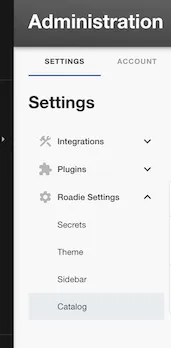
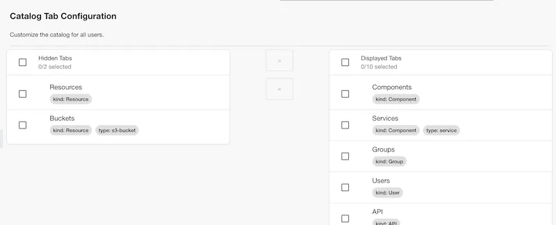

Admins can easily customise the tabs in the Catalog page to better fit your organisation's catalog data.

In Roadie, navigate to the Administration Settings page and in the Roadie Settings section select `Catalog`.

Here you can add new custom tabs that use filters to make a specific collection of catalog entities easy to access.

An example might be surfacing databases as a new tab, so you could create a new tab with the following filter assuming you have already added a database type to the correct entities:
e.g.
`{ kind: 'Resource', type: 'database' }`

You can then decide on the ordering of tabs and hide or show tabs.

NB: Consideration should be made around the number of tabs you want to expose to all users as having too many may actually make things harder to find. Catalog tab pages have extensive filtering options already which should mean that things are easy to search for withing a top level category, so you don't need a tab for everything. It is recommended to create tabs only for to top level domain objects or specific, organisation-wide categories.
