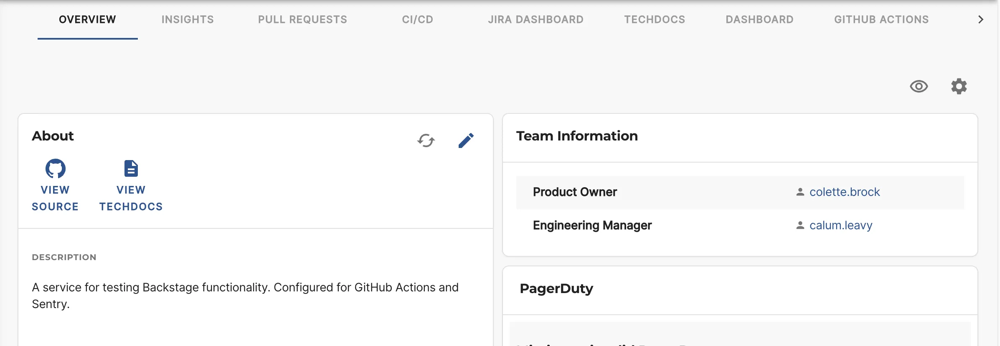
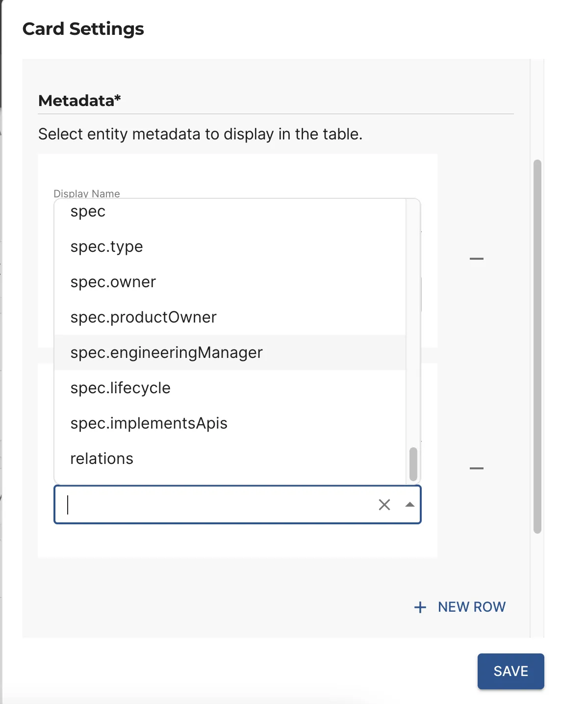
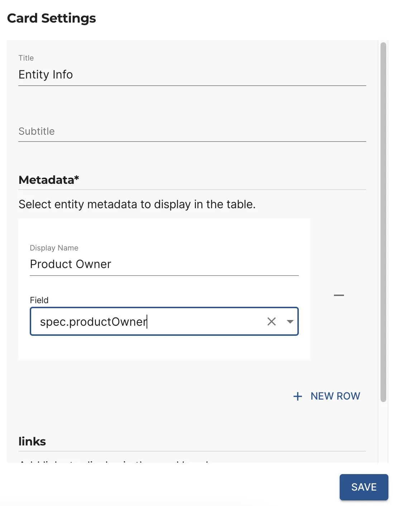

## Introduction

Roadie provides a card `EntityMetadataCard` which can be used to display any entity field in the catalog UI. This is particularly
useful where the entity spec contains custom fields.

## Configuration

- Firstly, determine which entity fields you wish to display.
- Add the `EntityMetadataCard` to a dashboard in the catalog UI. See [Instructions](../../getting-started/configure-ui#updating-dashboards)
- Click the [add props](../../details/updating-the-ui#adding-props) icon and then click "New Row" under
  metadata. Select the field you wish to display and give it a display name.
  
- Repeat for any other fields you wish to display
  then click "Save" button and save the layout by clicking the save icon on the top right.
  
