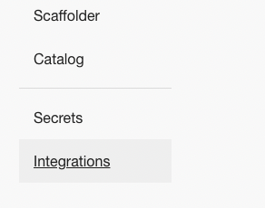
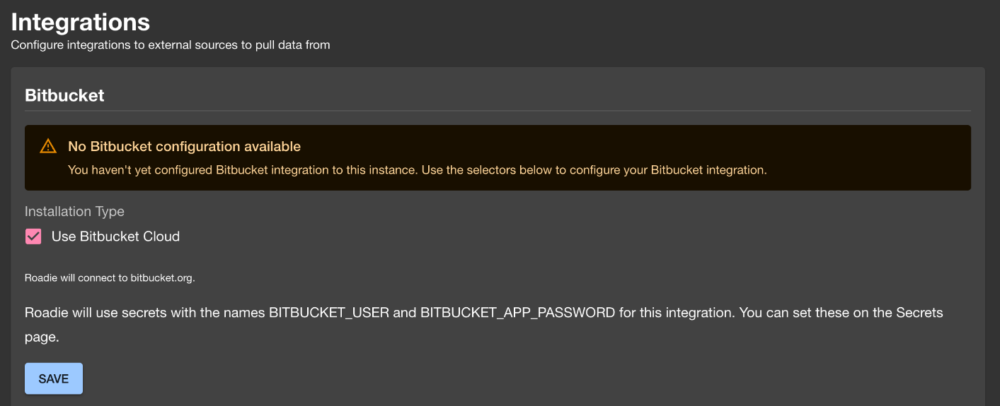

## Introduction

This tutorial will guide you through the steps required to connect Roadie to your Bitbucket repositories.

## Step 1: Save Bitbucket integration config in Roadie

By adding a Bitbucket integration you will allow Roadie to access the YAML metadata files that Backstage needs to operate.

Roadie supports Bitbucket configuration on Bitbucket Cloud. The authentication methods supported are either with Token or a Username + Application Password authentication. Username + Application Password is the preferred authentication method since it provides more granular options to control the access to give to the integration.

1. Click the Administration link in the bottom left of the application.

2. Click the Settings tab along the top of the Administration page.

3. Click on Integrations in the left sidebar.

4. Open the Bitbucket section of the accordion

## Bitbucket Cloud configuration

You will see a warning that a bit bucket configuration is not available.

Press on the save button to enable the bitbucket cloud configuration.

⚠️ &nbsp;You may need to wait up to 2 minutes for the Bitbucket integration to become active.

### Configure autodiscovery

1. Go to the 'Configure your atuodiscovery' section.

2. Click on the '+ ADD LOCATION'

3. Put your target URL into the modal.

4. press Save
