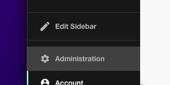
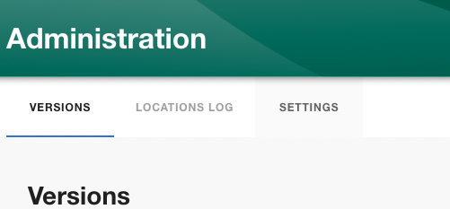
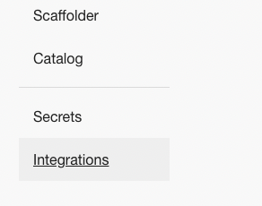

## Introduction

This tutorial will guide you through the steps required to connect Roadie to your Bitbucket Server repositories.

## Step 1: Save Bitbucket integration config in Roadie

By adding a Bitbucket integration you will allow Roadie to access the YAML metadata files that Backstage needs to operate.

Roadie supports Bitbucket configuration on self-hosted Bitbucket server. You will need a Username + Application Password authentication.

1. Click the Administration link in the bottom left of the application.

2. Click the Settings tab along the top of the Administration page.

3. Click on Integrations in the left sidebar.

4. Open the Bitbucket section of the accordion.

## Bitbucket Server configuration

1. Untick the 'Use Bitbucket Cloud' check box
   

2. Fill in your host
3. Add your api url

⚠️ &nbsp;You may need to wait up to 2 minutes for the Bitbucket integration to become active.

### Configure autodiscovery

For autodiscovery we use the OSS [BitbucketServerProvider](https://github.com/backstage/backstage/tree/master/plugins/catalog-backend-module-bitbucket-server) from the backstage repository.

Due to the strict rate limits on the bitbucket API it currently runs every 30 minutes.

1. Go to the 'Configure your autodiscovery' section below the integration section
2. Click the '+ ADD ITEM' button
3. Fill in the form.

- Host (readonly): It will be filled based on your configured integration's host.
- Path: The absolute URL to your catalog info files from the root of your repositories
- Project key (optional): A regexp to filter your projects and only ingest from projects that matches this filter
- Repo slug (optional): A regexp to filter your repositories and only ingest from repositories that matches this filter

You can read more about the configuration options in the [backstage docs](https://backstage.io/docs/integrations/bitbucketServer/discovery/#configuration)

