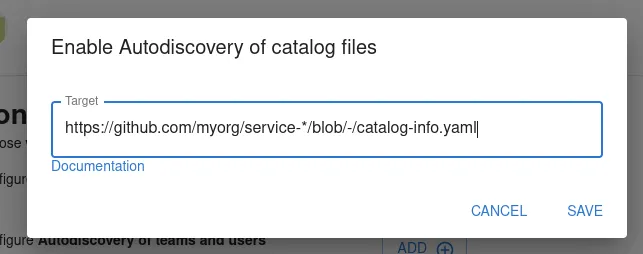
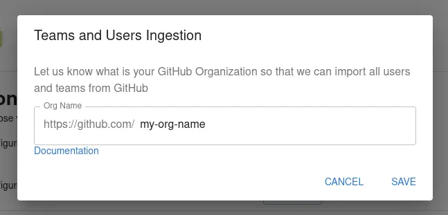
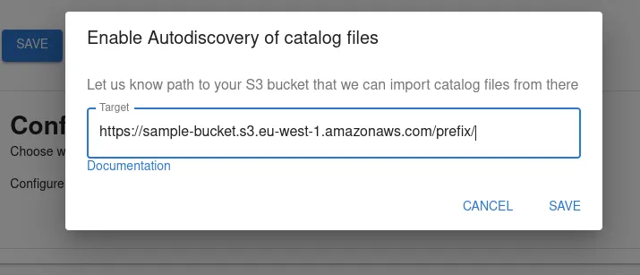
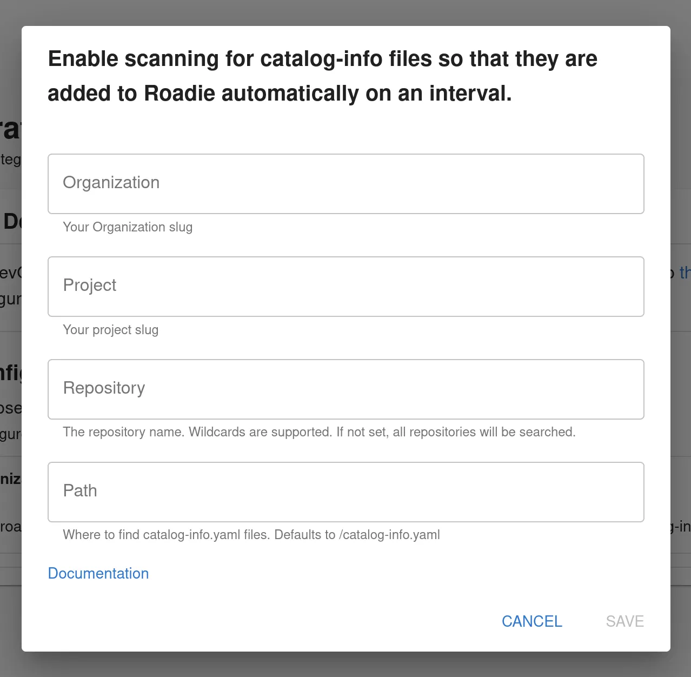
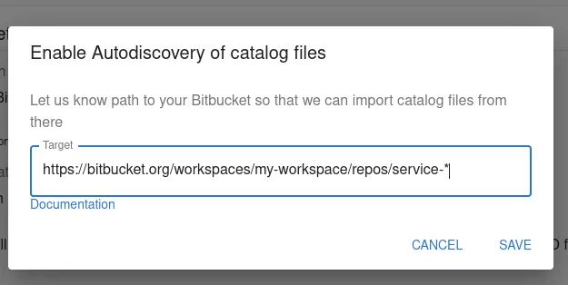
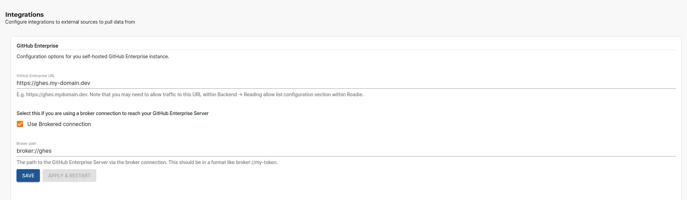
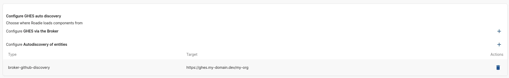
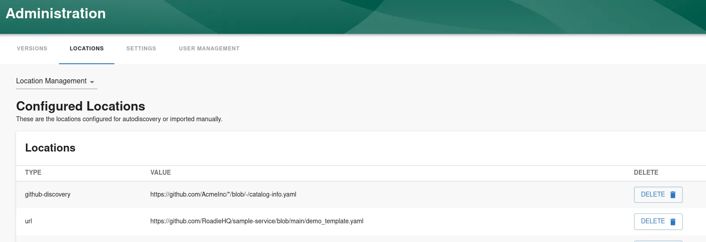

## Introduction

The Backstage catalog uses location entities to point to external sources which define entities. Roadie will update your
entities in Backstage whenever one of the repositories defined in a location is updated.

Autodiscovery is the mechanism to define patterns pointing to filenames in URLs that should be queried for entity files.

For more information about locations and troubleshooting Catalog ingestion issues you can take a look at the [catalog troubleshooting documentation](/docs/details/troubleshooting-the-catalog)

## Setting up autodiscovery

Roadie supports autodiscovery for integrations configured in the application. The configuration of an autodiscovery entry can be done at the same time as integration is configured to start automatic polling of entities. You can navigate to `https://<tenant-name>.roadie.so/administration/settings/` to find configuration options for each supported autodiscovery target

### GitHub Autodiscovery and Organization Autodiscovery

GitHub integration for Roadie provides two autodiscovery targets, entities and teams/groups.

The GitHub _autodiscovery_ integration can be configured to automatically discover catalog entities from a provided configured path pointing to GitHub.

More information about possible patterns and examples of URLs can be found from the [Backstage GitHub Discovery documentation.](https://backstage.io/docs/integrations/github/discovery#configuration)

The GitHub _organization_ integration provides the possibility to automatically import GitHub users and teams/groups from an organization. You can configure this discovery type by providing the name of the GitHub organization. Note that the GitHub app needs to be installed for that organization and needs to have permissions to access user info.

### AWS S3 Autodiscovery

AWS S3 autodiscovery can be configured to download catalog files from an S3 bucket. For this to be functionality the [integration configuration for AWS S3](/docs/integrations/aws-s3) must be done. S3 autodiscovery does not support wildcard path, it must point to a specific prefix of an S3 bucket.

### Azure DevOps

Azure DevOps autodiscovery can be configured to download catalog files from Azure DevOps SCM. For this to be functionality the [integration configuration for Azure Devops](/docs/integrations/azure-devops-provider) must be done.

### Bitbucket Autodiscovery

Bitbucket autodiscovery works similarly to GitHub discovery. It can be configured to use glob patterns to find individual files with a specific file name pattern. To get a working autodiscovery with Bitbucket, a configuration of Bitbucket Integration must be defined. Documentation on how to set up the integration can be found from [here](https://backstage.io/docs/integrations/bitbucket/discovery).

Roadie currently uses BitbucketDiscoveryProcessor for Bitbucket discovery. This expects the autodiscovery information encoded in a url. The following
describes the url format for Bitbucket Cloud (reproduced from Backstage.io):

- The base URL for Bitbucket, `https://bitbucket.org`
- The workspace name to scan (following the `workspaces/` path part), which must
  match a workspace accessible with the username of your integration.
- (Optional) The project key to scan (following the `projects/` path part),
  which accepts \* wildcard tokens. If omitted, repositories from all projects
  in the workspace are included.
- (Optional) The repository blob to scan (following the `repos/` path part),
  which accepts \* wildcard tokens. If omitted, all repositories in the
  workspace are included.
- (Optional) The `catalogPath` query argument to specify the location within
  each repository to find the catalog YAML file. This will usually be
  `/catalog-info.yaml` or a similar variation for catalog files stored in the
  root directory of each repository. If omitted, the default value
  `catalog-info.yaml` will be used.
- (Optional) The `q` query argument to be passed through to Bitbucket for
  filtering results via the API. This is the most flexible option and will
  reduce the amount of API calls if you have a large workspace.
  [See here for the specification](https://developer.atlassian.com/bitbucket/api/2/reference/meta/filtering)
  for the query argument (will be passed as the `q` query parameter).
- (Optional) The `search=true` query argument to activate the mode utilizing code search.
  - Is mutually exclusive to the `q` query argument.
  - Allows providing values at `catalogPath` for finding catalog files as allowed by the `path` filter/modifier
    [at Bitbucket Cloud's code search](https://confluence.atlassian.com/bitbucket/code-search-in-bitbucket-873876782.html#Search-Pathmodifier).
    - `catalogPath=/catalog-info.yaml`
    - `catalogPath=catalog-info.yaml` (anywhere in the repository)
    - `catalogPath=/path/catalog-info.yaml`
    - `catalogPath=path/catalog-info.yaml`
    - `catalogPath=/path/*/catalog-info.yaml`
    - `catalogPath=path/*/catalog-info.yaml`
  - Supports multiple catalog files per repository depending on the `catalogPath` value.
  - Registers `Location` entities for existing files only vs all matching repositories.

Examples:

- `https://bitbucket.org/workspaces/my-workspace/projects/my-project` will find
  all repositories in the `my-project` project in the `my-workspace` workspace.
- `https://bitbucket.org/workspaces/my-workspace/repos/service-*` will find all
  repositories starting with `service-` in the `my-workspace` workspace.
- `https://bitbucket.org/workspaces/my-workspace/projects/apis-*/repos/service-*`
  will find all repositories starting with `service-`, in all projects starting
  with `apis-` in the `my-workspace` workspace.
- `https://bitbucket.org/workspaces/my-workspace?q=project.key ~ "my-project"`
  will find all repositories in a project containing `my-project` in its key.
- `https://bitbucket.org/workspaces/my-workspace?catalogPath=my/nested/path/catalog.yaml`
  will find all repositories in the `my-workspace` workspace and use the catalog
  file at `my/nested/path/catalog.yaml`.
- `https://bitbucket.org/workspaces/my-workspace?search=true&catalogPath=/catalog.yaml`
  will find all `catalog.yaml` files located in the root of repositories in the workspace `my-workspace`.
- `https://bitbucket.org/workspaces/my-workspace?search=true&catalogPath=catalog.yaml`
  will find all `catalog.yaml` files located anywhere within repositories in the workspace `my-workspace`.
- `https://bitbucket.org/workspaces/my-workspace?search=true&catalogPath=/my/nested/path/catalog.yaml`
  will find all `catalog.yaml` files located within the directory `/my/nested/path/` within
  repositories in the workspace `my-workspace`.
- `https://bitbucket.org/workspaces/my-workspace?search=true&catalogPath=my/nested/path/catalog.yaml`
  will find all `catalog.yaml` files located within the directory `my/nested/path/` located anywhere within
  repositories in the workspace `my-workspace`.
- `https://bitbucket.org/workspaces/my-workspace?search=true&catalogPath=/my/*/path/catalog.yaml`
  will find all `catalog.yaml` files located within a directory `path/` located within any (recursive) directory
  within the directory `my/` in the root of repositories in the workspace `my-workspace`
  (`/my/nested/path/catalog.yaml`, `/my/very/nested/path/catalog.yaml`, ...).
- `https://bitbucket.org/workspaces/my-workspace/projects/apis-*/repos/service-*?search=true&catalogPath=catalog.yaml`
  will find all `catalog.yaml` files located anywhere within repositories starting with `service-`
  in projects starting with `api-` in the workspace `my-workspace`.

The format is slightly different for Bitbucket server. The url is composed of four parts (From Backstage.io):

- The base instance URL, `https://bitbucket.mycompany.com` in this case
- The project key to scan, which accepts \* wildcard tokens. This can simply be
  `*` to scan repositories from all projects. This example only scans for
  repositories in the `my-project` project.
- The repository blob to scan, which accepts \* wildcard tokens. This can simply
  be `*` to scan all repositories in the project. This example only looks for
  repositories prefixed with `service-`.
- The path within each repository to find the catalog YAML file. This will
  usually be `/catalog-info.yaml` or a similar variation for catalog files
  stored in the root directory of each repository. If omitted, the default value
  `catalog-info.yaml` will be used. E.g. given that `my-project`and `service-a`
  exists, `https://bitbucket.mycompany.com/projects/my-project/repos/service-*/`
  will result in:
  `https://bitbucket.mycompany.com/projects/my-project/repos/service-a/catalog-info.yaml`.

### GitHub Enterprise Server Autodiscovery

The GitHub autodiscovery integration can be configured to automatically discover catalog entities from a provided configured path pointing to GitHub.

#### GHES Broker Autodiscovery

You can also connect to your GitHub Enterprise server via the broker connection.

To enable autodiscovery of entities via the broker, you can add entries to the autodiscovery section of the settings page.
Click the + sign next to the `Configure GHES via the Broker` to open the input dialog to configure the GHES target URL via the broker.
Within the opened dialog you can add the URL of your GitHub organization or repository directly, as it is referenced in the main configuration section. If the broker connection is configured, these URLs will be automatically translated to use the broker protocol. Note that this configuration only affects the GHES when it is configured via a broker and won't affect discovery if broker configuration is not present.

Once you have added the information about your GHES instance and organization, you can see your existing configured target URLs in the list below
.

The autodiscovery kicks in shortly after the save action and automatically refreshes discovered entities periodically

## Managing Locations

A list of all configured locations is located in URL `https://<tenant-name>.roadie.so/administration/locations/management`.

The list contains an entry for all locations added as an autodiscovery configuration within each integration, as well as locations imported using the Catalog Import functionality within `https://<tenant-name>.roadie.so/import/entity`.

Note that deleting a location via the administration UI (either at the location management page or at the individual integration page) does not automatically remove individual entities that have been found from that location. If the desired effect is to remove all items from a particular location, it is better to find that location via the catalog and[ unregister it from there.](/docs/details/unregister-components)

## Further reading

1. The [official Integrations documentation](https://backstage.io/docs/integrations/).
