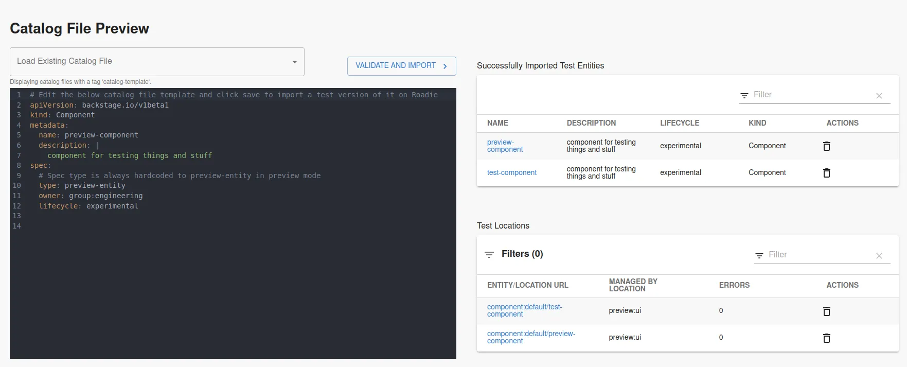

## Introduction

Currently, previewing changes to a `catalog-info.yaml` files is not well-supported in Backstage. Modifications to entities always override the full state of an existing entity within the catalog.

However, you can still do testing and previews if needed by essentially creating a new component manually. Roadie provides two different ways of doing this.

### Using your version control system or other supported catalog-info.yaml file location

You can use the normal entity discovery and importing options to test/preview your entities. This happens by creating a branch and a modifying the namespace of the entity definition file to differentiate it from the real entities, and then delete it after.

The steps are the following:

1. Add a namespace of 'preview' (or whatever you want) to the `catalog-info.yaml` file you want to test (if you don't, you will get a conflict with the existing component)

```yaml

---
kind: Location
metadata:
  name: <repo-name>
  namespace: preview
```

2. Go to `/import/entity` in Roadie Backstage
3. Import the catalog-info file URL from a branch on your version control, i.e. `https://github.com/<your-github-org>/<your-repo>/blob/<your-branch-name>/catalog-info.yaml`
4. View your branch based component, and make updates to the branch file to see changes pulled in automatically.
5. [Delete the component](/docs/catalog/unregister-components/) when you are finished.

### Using the entity preview page

An alternative way to test and preview entity definitions is to use the Roadie entity preview page. You can navigate to this page by going to `Import > Entity Preview`.



> Note that the entity preview page does not go through _all_ the processing steps as actual registration of an entity. To test API docs and other preprocessed data, it might still be necessary to test via registering the actual entity.

Within the entity preview page you can write you catalog manifest files directly on the UI to test and preview how they would behave when imported from a more permanent location.

On the right-hand side of the page you are able to see two tables.

The higher table lists out validated preview entities that have been successfully imported to the catalog. You can navigate to the entity pages of these entities to modify and preview that annotations, references and other important context related items within the catalog manifest work as expected.

The lower table lists out individual locations imported using the preview user interface. Within this table you have visibility of all preview locations that have been added to the system, whether or not the entities within those locations have been imported successfully. The table lists out possible errors that a location has encountered when entities from it have failed to be imported. You can see a more detailed view of these entities by clicking the name of the location on the list.

#### Catalog templates

The catalog preview view supports creating and using templates from the wider catalog. You can select existing entity manifest files that have a tag `catalog-template`. The catalog template tagged entities can be either preview templates or actual entities from more permanent locations.

#### Things to note

All preview entities are imported with a type `preview-entity`. This is always used as a type for these entities, regardless what it is set when importing the preview entity.

The preview functionality imports actual entities to the catalog. These entities will be visible on the catalog and APIs pages. If you want to keep your catalog listings clean, you should frequently delete preview catalog items listed on the catalog preview page.
