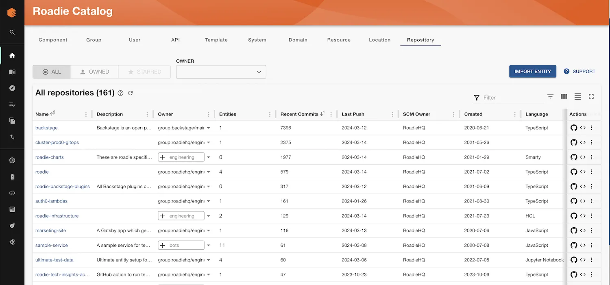
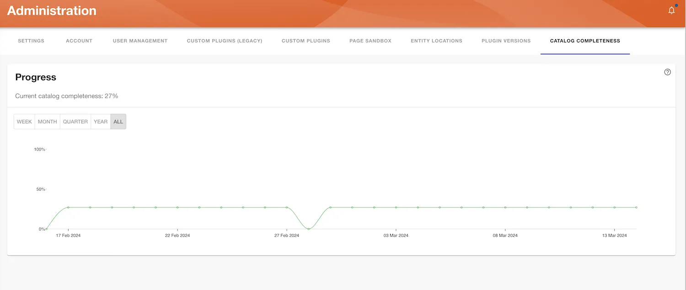

Repositories are modelled in the Roadie Backstage catalog using the Repository Kind.

### Catalog Completeness

<div role="alert">
  <div class="docs-cta__warning_title">Beta Feature</div>
  <div  class="docs-cta__warning_message">
    <p>The Catalog Completeness feature is currently in beta. Please reach out to Roadie Support to request this is enabled.
    </p>
  </div>
</div>
Repositories allow us to effectively measure the completeness of your catalog - that is, whether all the software in your organisation is represented by entities in the catalog.

Once your Repositories are added, Admins will be able to see a graph of catalog completeness in the Administration section of Roadie.

If you are a Tech Insights user, you will also find built-in completeness Scorecards, Checks and a Data Source to use to build your own Checks and Scorecards from the same data.



### Autodiscovery

They will be automatically ingested for you from any GitHub integrations you have set up in Roadie.

By default in Roadie this data will be populated for you and refreshed every 12 hours or whenever a change is made to a repository assuming you have [GitHub Autodiscovery](/docs/catalog/location-management/#setting-up-autodiscovery) set up for your GitHub organisations.

### Ingesting from non-GitHub Sources

You can use the [Roadie Entity Push API](/docs/api/authorization/) to add repositories from other SCMs other than GitHub via a script.

This would look something like the following:

```bash
curl https://api.roadie.so/api/catalog/roadie-entities/sets/1 \
  -X POST \
  -H 'Accept: application/json' \
  -H "Authorization: bearer ${ROADIE_API_TOKEN}" \
  -d '{"apiVersion":"roadie.io/v1","kind":"Repository","metadata":{"name":"test1","description":"A description of the repository","scmOwner":"RoadieHQ","defaultBranch":"main","visibility":"private","language":"TypeScript","securityAndAnalysis":{"secretScanning":"disabled","secretScanningPushProtection":"disabled","secretScanningValidityChecks":"disabled","dependabotSecurityUpdates":"enabled"},"lastPush":"2024-01-04","createdAt":"2022-01-21","potentialOwners":["group:default/somegroup"],"isFork":"false","commits":{"lastWeek":0,"lastMonth":12,"lastThreeMonths":12,"lastSixMonths":14,"lastYear":23}},"spec":{"hasPart":["component:default/authx"]}}'
```

### Schema

Repositories follow a unique schema that has a lot of metadata fields designed to help identify what repositories are active or important, who owns the repository, and what entities are connected to it.

NB: They use a new `apiVersion` of `roadie.io/v1` and `Kind` of `Repository`.

```json
{
  "$schema": "http://json-schema.org/draft-07/schema",
  "$id": "RepositoryEntityV1",
  "description": "A repository represents an SCM repository and its related entities.",
  "examples": [
    {
      "apiVersion": "roadie.io/v1",
      "kind": "Repository",
      "metadata": {
        "name": "authx",
        "description": "An authentication library for verifying the identity of a caller",
        "scmOwner": "RoadieHQ",
        "defaultBranch": "main",
        "visibility": "private",
        "language": "TypeScript",
        "securityAndAnalysis": {
          "secretScanning": "disabled",
          "secretScanningPushProtection": "disabled",
          "secretScanningValidityChecks": "disabled",
          "dependabotSecurityUpdates": "enabled"
        },
        "lastPush": "2024-01-04",
        "createdAt": "2022-01-21",
        "potentialOwners": ["group:default/engineering", "group:default/infrastructure"],
        "isFork": "false",
        "commits": {
          "lastWeek": 0,
          "lastMonth": 12,
          "lastThreeMonths": 12,
          "lastSixMonths": 14,
          "lastYear": 23
        }
      },
      "spec": {
        "owner": "group:default/engineering",
        "hasPart": ["component:default/authx"]
      }
    }
  ],
  "allOf": [
    {
      "$ref": "Entity"
    },
    {
      "type": "object",
      "required": ["spec"],
      "properties": {
        "apiVersion": {
          "enum": ["roadie.io/v1"]
        },
        "kind": {
          "enum": ["Repository"]
        },
        "spec": {
          "type": "object",
          "required": [],
          "properties": {
            "owner": {
              "type": "string",
              "description": "An entity reference to the owner of the repository.",
              "examples": ["artist-relations-team", "user:john.johnson"],
              "minLength": 1
            },
            "hasPart": {
              "type": "array",
              "description": "An array of references to other entities that the repository houses.",
              "items": {
                "type": "string",
                "minLength": 1
              }
            },
            "system": {
              "type": "string",
              "description": "An entity reference to the system that the repository belongs to.",
              "minLength": 1
            }
          }
        }
      }
    }
  ]
}
```

### Ownership

Roadie will suggest ownership using a `metadata.proposedOwners` field and let you set an owner in a few clicks in the catalog table. Assigning ownership to Repository entities will become valuable to you if
you want to use these in Tech Insights or to understand catalog completeness in your organisation.

NB: The proposed owners field population is currently only available for GitHub ingested repositories. It generates a list of teams by looking first at participation data,
identifying the teams in GitHub that have the highest access level to the repository and matching those to Groups in the catalog. If none are found it will look at most frequent contributors
and try to associate them with a User and then Groups in the catalog that User is part of. It will then select the Groups that have no child Groups themselves.
