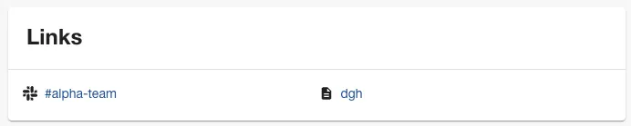
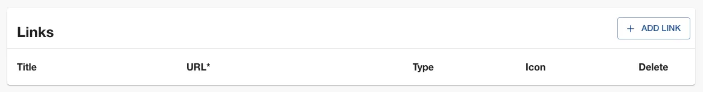
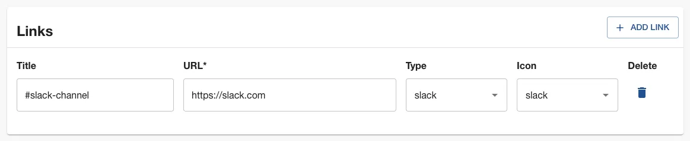
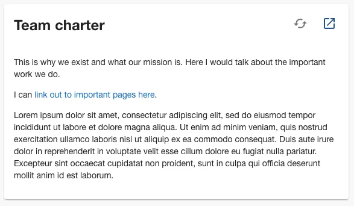

Roadie’s Decorator features allow you to enrich your Group entities right inside Roadie. You don’t need to make changes to any YAML files.

This is useful for quickly adding links, annotations, and text content to your team pages.

## Prerequisites

1. Ensure an admin has added the `EntityLinksCard` and `MarkdownCard` to the layout for Group pages. Without this, we can add links to the Group, but they won’t show up in the interface. These cards will be hidden automatically when they have no content to render.

## Adding links (including Slack)

With decorators, you can easily display links to Slack, Confluence, or any other URL on your team page.



### Steps

1. Click the three dots in the top right corner of your team page. Choose Decorate Entity.
2. Click the ADD LINK button.

   

3. Fill out the 4 fields with sensible values.

   

4. Click SAVE
5. After a second or two, you should see your link show up on your team page.

## Displaying markdown on your team page

Decorators can help you add a Team Charter, or any other markdown content to your team page.



### Steps

1. Add the `MarkdownCard` card to the layout for Group pages on Roadie. You may need to ask a Roadie Backstage admin to do this for you.
2. Create a markdown file on GitHub, or a source control system of your choice. Add some content that you wish to be displayed on Roadie.
3. Copy the URL of the markdown file. On GitHub, it should look like this:

   ```
   https://github.com/RoadieHQ/sample-service/blob/main/team-charter.md
   ```

4. Click the three dots in the top right corner of your entity page. Choose Decorate Entity.
5. In annotations, add the `roadie.io/markdown-content` annotation. Paste the copied URL into the field labeled Value.
6. Click SAVE
7. After a second or two, you should see your link show up on your team page.

## Next steps

Decorators can be used with any Kind of Entity on Roadie. Try decorating your Components with annotations.
