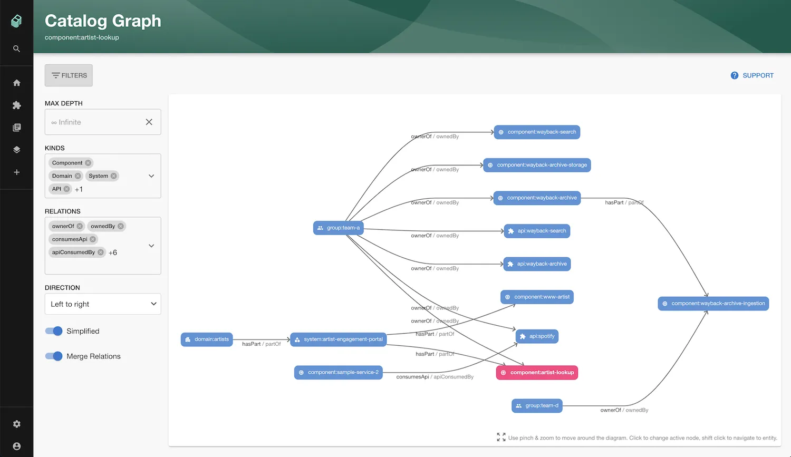

Adding relationships to your catalog entities can provide a lot of value for an organisation. 

Relationships can be added manually through YAML files or in some cases they can be built automatically for you such as when importing Groups and Users from an [IdP](/docs/integrations/okta) or [AWS resources](/docs/integrations/aws-resources). 

Backstage provides a [limited set of possible relationships](https://backstage.io/docs/features/software-catalog/well-known-relations/) between different entity kinds which Roadie has expanded to give you more flexibility. 

### Viewing Relationships

Relationships can be visualised through plugins like the [Catalog Graph plugin](/docs/integrations/catalog-graph) or through cards on an entity Overview page like `EntityRelationsCard` which can be easily added by a Roadie admin [using our UI editor](/docs/details/updating-the-ui).

The `EntityRelationsCard` can show all relations if the `all` relationship option is selected, or only specific relationship types.

### Available input relationships:

The following relationships are available to add to your YAML to describe relationships between entities in your catalog. This is not an exhaustive list of all relationships in the catalog, but rather a list of keys that you can use in your input YAML.

You only need to define one side of a relationship for it to appear on both sides in the catalog. 

| YAML Key            | Description | Value Type   | Value Kinds | Applicable Kinds                                      |
|---------------------|-------------|--------------|-------------|-------------------------------------------------------|
| spec.owner          | -           | string       | Any         | Component,API,Resource,System,Domain,Product,Template |
| spec.system         | -           | string       | Any         | Component,API,Resource,Product                        |
| spec.dependsOn      | -           | string array | Any         | Component,Resource,API,System,Domain,Product          |
| spec.dependencyOf   | -           | string array | Any         | Component,Resource,API,System,Domain,Product          |
| spec.providesApis   | -           | string array | Any         | Component                                             |
| spec.apiProvidedBy  | -           | string array | Any         | API                                                   |
| spec.consumesApis   | -           | string array | Any         | Component,Product                                     |
| spec.subcomponentOf | -           | string array | Any         | Component                                             |
| spec.memberOf       | -           | string array | Any         | User                                                  |
| spec.parent         | -           | string       | Any         | Group                                                 |
| spec.parentOf       | -           | string array | Any         | System,Domain,Product                                 |
| spec.children       | -           | string array | Any         | Group                                                 |
| spec.childOf        | -           | string array | Any         | System,Domain,Product                                 |
| spec.members        | -           | string array | Any         | Group                                                 |
| spec.subdomainOf    | -           | string array | Any         | Domain                                                |
| spec.domain         | -           | string array | Any         | System                                                |
| spec.hasPart        | -           | string array | Any         | Component,Resource,System,Domain,Product              |
| spec.partOf         | -           | string array | Any         | Component,Resource,API,System,Domain,Product          |
| spec.managedBy      | -           | string array | Any         | User,Group,Product                                    |
| spec.manages        | -           | string array | Any         | User                                                  |

These relationship names can be used as you see fit to describe your organisation. Backstage provides some [suggestions on usage](https://backstage.io/docs/features/software-catalog/well-known-relations/) but this is in fact arbitrary and only limited by the Applicable Kinds in the above table.

If you require additional flexibility in relationships between entity kinds that is not supported in the above table, you can request this to be added via the Roadie support channels. 

### Further reading

You can find a thorough guide to modelling relationships or dependencies between entities in Roadie Backstage in this [blog post](https://roadie.io/blog/modelling-software-backstage/).

