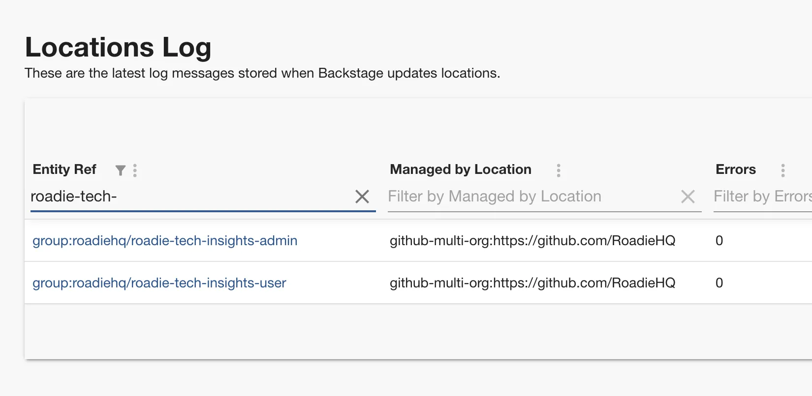

## Debug what's happened to an entity

The Backstage catalog maps entities you add to the place where they were added from using "Location" entities to point to the external sources. Roadie will generally
update your entities in Backstage whenever one of the repositories defined in a location is updated.

Location entities are generally considered internal to the workings of Backstage and not part of your catalog (though you may
need to create locations directly in some use cases).

The locations log provides information on the scheduling of the catalog refresh cycle and surfaces any errors.

### Searching for an entity

You can search for an entity using the filter input (Top right of the table). The filter operates on the `Entity ref`
column and you can search for the `spec.target` field of Location entities. The values in this column are [entity refs](https://backstage.io/docs/features/software-catalog/references#string-references) (e.g. kind:namespace/entity-name)
In practice you'll want to search on either your entity name or perhaps
the URL of a catalog info YAML file. To quickly check the full value of the truncated columns just click the arrow on the left. To view details for a particular entity click the entity link.

### Checking the refresh schedule

The `last discovery at` column above gives the time of the most recent update to the entity. It should be noted the `last discovery at` only updates when there are changes rather than on every check.

The column `next refresh`
gives the relative time the catalog will next check for updates. The table is looking for updates every 30 seconds. However updates should come through in real time also if using
GitHub.

### Viewing errors

The errors column of the locations log gives you the number of errors with that entity or location. You can sort the
table by this column by clicking on the column header to view rows with errors.

Viewing a particular entry you can view the list of errors, the raw entity data and also the processed entity (if available).
You can use this information to diagnose and fix errors with catalog info YAML files.

## Common Issues

### Entity stopped updating after moved/renamed catalog file

At times the catalog might get into an inconsistent state if a catalog manifest file that was previously present is lost from the system's perspective. Common reasons for this to happen are if the name or the location of the catalog manifest has changed after it has already been registered to the catalog.

If you end up in such a situation you have an option to remove the individual stale entity which will eventually force a hard refresh of the parent location itself. Steps to do this are the following:

1. Navigate to the offending, stale entity that has stopped from being automatically updated
2. Click the kebab menu item in the top right corner of the entity
   
3. Select Unregister Entity
4. Click Advanced Options
5. Click Delete Entity button at the bottom of the dialog
   

This will unregister the individual entity without affecting other entities or locations in the same discovery tree. The moved/renamed catalog manifest file will be then picked up on the catalog refresh loop.

### My entity still points to the old repository after renaming the repository in GitHub

If you changed the name of your repository, Backstage by default relies on GitHub's redirect approach for renamed repos.
This means it will not update the repository URL associated with your entity.

You can clean this up by [deleting the entity](/docs/catalog/unregister-components/#manually-ingested-entities) and re-importing it manually using the new URL.

### Processor BuiltinKindsEntityProcessor threw an error while validating the entity

This means that the entity definition in your catalog YAML file is not valid. You can solve this by reading the cause
(e.g. `caused by TypeError: /spec/type should be string - type: string`) and looking at the `unprocessed entity` tab
in the location definition card and making a PR to fix the YAML file. In this case below `spec.type` has been set to `null`
but this is not valid.

### Unable to read URL, NotFoundError

This error can often be ignored. When the GitHub discovery processor is enabled it creates a location for every
repo in the organisation even if the catalog file doesn't exist. You can check if this is the case by navigating to
the URL in the title to see if the catalog file location really exists. If it does exist and you're getting this error
contact support.

