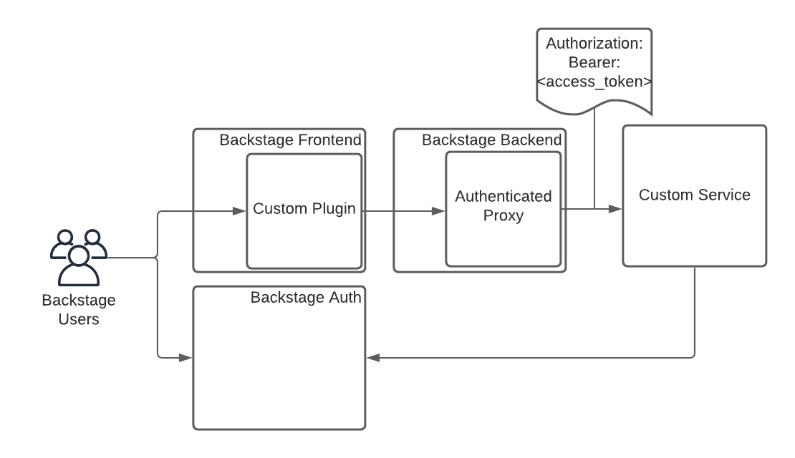

## Introduction

Roadie provides a custom proxy service that can be configured to proxy through an access token minted by our own authentication system that can be validated by your third party service.

This gives a custom plugin a way to interact with your own service. That service can authenticate the incoming requests from Roadie.



## Step 1. Create an authenticated proxy configuration in Roadie

You can navigate to /administration/settings/authenticatedProxy. Click add item to add a new proxy.


Enter a Path (e.g. `/my-api`) and a target API (e.g. `https://my-api.com/api`) as follows:


Click save and Apply and Restart and wait for the restart. It can take up to about two minutes for the change to be applied.

## Step 2 Calling the API from Backstage

You can call this API from the Backstage window context in a browser via a Custom Backstage plugin:

```javascript
fetch('/api/authenticated-proxy/my-api')
```

## Step 3 Authenticating the Request from the service

The API configured in the Authenticated proxy target will recieve a token in the authorization bearer containing an access token. This token can be sent to the roadie Authentication system to retrieve an id representing the logged in Backstage user.

```bash
curl --request GET \
  --url 'https://auth.roadie.io/userinfo' \
  --header 'Authorization: Bearer {ACCESS_TOKEN}' \
  --header 'Content-Type: application/json'
```

This will return the identity as follows:

```json
{
  "sub": "248289761003",
  "name": "John Doe",
  ...
  "updated_at": "1556845729"
}
```
