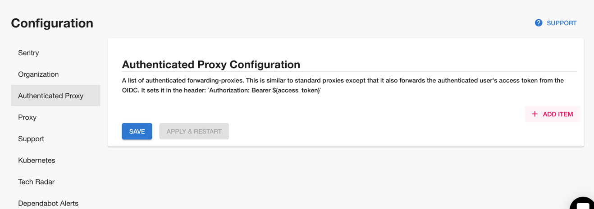
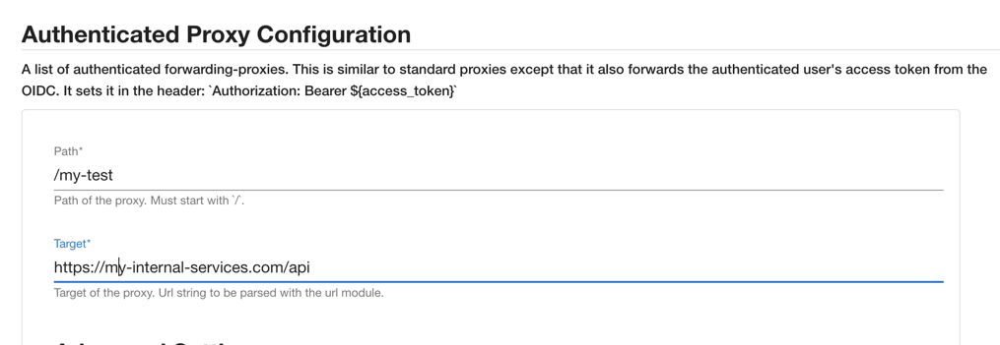

## Introduction

Roadie provides a custom proxy service that can be configured to proxy through an access token minted by our own authentication system that can be validated by your third party service.


## Step 1. Create an authenticated proxy configuration in Roadie

You can navigate to h<gatsbyhack>tt</gatsbyhack>ps://your-company.roadie.so/administration/settings/authenticatedProxy. Click add item to add a new proxy.



Enter a Path and a target API as follows:



Click save and Apply and Restart.


## Step 2
You can call this API from the Backstage window context in a browser via a Custom Backstage plugin:

```javascript
fetch('/api/authenticated-proxy/my-test')
```

## Step 3

Your service will recieve a token in the authorization bearer containing an access token. This token can be sent to the roadie Authentication system to retrieve an id representing the logged in Backstage user.

```bash
curl --request GET \
  --url 'https://auth.roadie.io/userinfo' \
  --header 'Authorization: Bearer {ACCESS_TOKEN}' \
  --header 'Content-Type: application/json'
```

This will return the identity as follows:

```json
{
  "sub": "248289761003",
  "name": "Brian Fletcher",
  ...
  "updated_at": "1556845729"
}
```