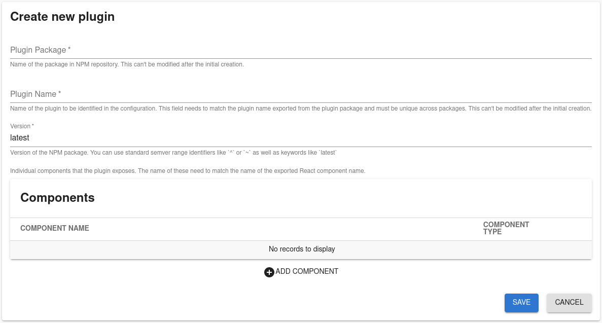

## Introduction

Roadie supports all standard Backstage frontend plugin types that can be built using instructions defined in [Backstage documentation][backstage-plugin-documentation]. Your plugins can be published via npm or yarn, like publishing a normal package. We will provide you functionality to automatically add custom plugins from repositories to your Roadie instance. 

If you you would like to use our private hosted repository for your Roadie plugins, complete with automatic update workflow, you can follow instructions on [setting up private secure Artifactory for Roadie plugins.](/docs/custom-plugins/artifactory/)

## Prerequisites

Contact us to have the custom plugins feature enabled for your Roadie instance.

## Configuring a plugin for your Roadie instance

### Step 1. Create plugin definition in Roadie

You can navigate to h<gatsbyhack>tt</gatsbyhack>ps://your-company.roadie.so/administration/custom-plugins where you will find a collection of cards detailing custom plugins configured for the Roadie instance. 

### Form

You can create a new custom plugin definition by clicking "Add New Plugin" floating button. 

The required values are as follows:

##### Package name
Package field corresponds to the name of the NPM package. This can be a public NPM package hosted in npmjs.com or a private package securely hosted in Roadie Artifactory. If the package is hosted in Roadie Artifactory, the name of the package needs to start with `@<your-company>-roadie/`.

##### Plugin name
The name of the plugin. This field can be arbitrarily chosen and will be used as an identifier when adding components from the plugin to Roadie as Cards, Tabs or Pages.

##### Plugin version
Semantic versioning definition for the plugin to use. This can be defined with standard NPM semantic versioning range identifiers like `^` or `~`, as well as keywords like `latest`.

##### Components
List of components that the plugin exposes. These are defined as a type and name pair. The type is one of Card, Content or Page. The name needs to match the component name in code that is exported from the plugin package.

### Step 2. Installing

Custom plugins are installed within the application from an external workflow. This can be triggered in a number of ways:
1. By calling a webhook from your CI pipeline,
2. By calling a webhook manually
3. Automatically when a new NPM package is published to private, secure Roadie Artifactory.

## Additional information

### Plugin Statuses
Each plugin exposes a status field indicating if they are available to be used within the Roadie instance. The statuses are as follows:

##### Added
Newly added plugin configuration. The new configuration will be installed when the installation workflow is triggered, as described in Step 2 above.

##### Updated
Updated plugin configuration. An older version of the plugin is still available to be used in the application and updates to version or components will be added during the next application installation cycle.

##### Installed successfully
Backstage application installation cycle has started and has successfully updated the application code. The plugin and components will be available to use when the next version of your Roadie instance is rolled out.

##### Installation failed
Application installation cycle has tried to install this plugin but was unable to find the plugin package from NPM or private secure Roadie Artifactory.

### Notifications and logs

Build notifications are sent onto a Slack channel where you can see the time that the build took, as well as possible versions of the plugins that have been installed to your Roadie instance. 

## Conclusion

After a successful installation you will be able to add components from your custom plugin into the Roadie instance. Components can be added as Cards, Tabs or Pages into component pages or to the sidebar.

[backstage-plugin-documentation]: https://backstage.io/docs/plugins/create-a-plugin
