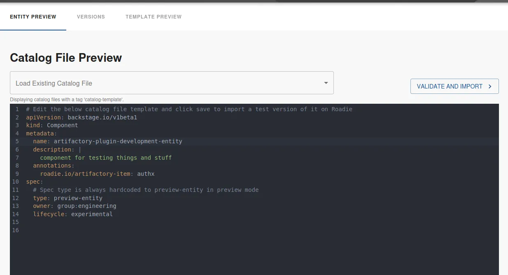
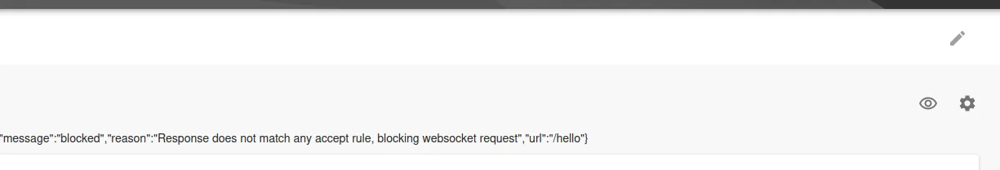
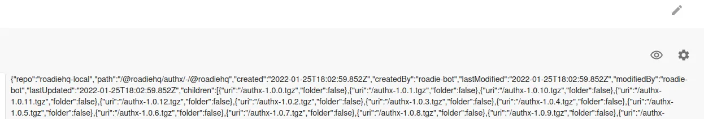
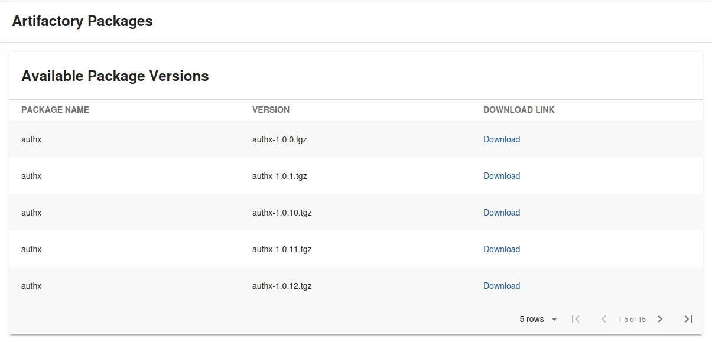

Roadie provides secure connectivity from your Roadie instance bundled plugins as well as your self-built custom plugins to your internal infrastructure. To have a closer look how this functionality is constructed and what the underlying architecture is, you can take a look at [Roadie Broker documentation.](/docs/integrations/broker/).

## Prerequisites

### Broker connection is initialized

To connect to your internal infrastructure via the broker you also need to have a working set up of a broker connection within Roadie. The simplest way to get started and start iterating on your plugin integration is to use [the Broker CLI directly](/docs/integrations/broker/#snyk-broker-cli-application). This gives you the ability to iterate on the needed `accept.json` configuration file and keep a closer eye on the connections flowing between Roadie and your broker client.

### Initial repositories are present in tenant

For this tutorial we are assuming that you have the skeleton repositories and the processes to develop your plugins already warmed up and ready to go. If that is not the case, take a look at [the various examples how to get started](/docs/custom-plugins/getting-started/).

## Making first requests from Roadie through the broker

The easiest way to test that the broker connection is working is to do some experimental development on our plugin to get the first requests going. We'll modify one of our `Card` type plugin components to look like the following:

```tsx
import React from 'react';
import { Progress, ResponseErrorPanel } from '@backstage/core-components';
import useAsync from 'react-use/lib/useAsync';
import { discoveryApiRef, errorApiRef, useApi } from '@backstage/core-plugin-api';

export const ExampleFetchComponent = () => {
  const discoveryApi = useApi(discoveryApiRef);
  const errorApi = useApi(errorApiRef);

  const { value, loading, error } = useAsync(async (): Promise<any> => {
    const proxyUrl = await discoveryApi.getBaseUrl('proxy');
    const brokerUrl = `${proxyUrl}/broker/artifactory-plugin/hello`;
    const response = await fetch(brokerUrl);
    try {
      const responseData = await response.json();
      console.log(responseData);
      return responseData;
    } catch (e: unknown) {
      errorApi.post({
        message: 'Failed to get response via broker from Artifactory',
        name: 'Data retrieval error',
        stack: e.stack,
      });
    }
  }, []);

  if (loading) {
    return <Progress />;
  } else if (error) {
    return <ResponseErrorPanel error={error} />;
  }

  return <>{JSON.stringify(value)}</>;
};
```

Within this simple component we are using the built-in `useApi` hook to identify two different APIs to use within our plugin, namely `discoveryApi` and `errorApi`. DiscoveryApi gives us the ability to discover needed Roadie endpoints, the job of the errorApi is to display errors. Take a closer looks at what APIs are available and their usage examples in the [available APIs page](/docs/custom-plugins/available-apis/).

In this case the important bits from the above code snippet can be found from within the `useAsync` hook. We are using the `discoveryApi` to identify a Roadie endpoint called `proxy`, and we are enhancing that proxyUrl with a suffix `broker` as well as the broker token we defined as an environment variable when we started our Broker client.

Using that constructed URL, we fire off a fetch request and cross our fingers. It should hit our broker client endpoint running on our local machine once the plugin is running on our Roadie instance.

We'll spin up a development server of the plugin bundle and register the plugin and its components to our Roadie instance. If you don't know how to do this, take a look at our [examples how to get started](/docs/custom-plugins/getting-started/#4-develop-your-plugin).

Because we are still experimenting, it is better to register our `Card` component to a preview entity. This way we don't bother other users with a potentially broken plugin while we are still working on it. Navigate to `Tools` -> `Preview Entities` and construct a new entity that has the annotation that you are expecting to use with the plugin. In our case I have decided to call the annotation `roadie.io/artifactory-item`.



After we have created the preview entity, we can add our `Card` component to its dashboard.
The plugin is already starting to make requests through the proxy, to the broker, using our hardcoded `artifactory-plugin` broker token. We are seeing traffic flowing through on our Broker Client side in our terminal, and we get a response that we are displaying to the screen. We have confirmed that the broker connection is working.



Unfortunately the response says something like `blocked` and looks errorenous. That means that it is time to modify our Broker accept configuration to match the actual URLs we want to reach.

## Configuring the broker to reach our wanted endpoints

Since our plugin is attempting to retrieve information from JFrog Artifactory, we need to configure our broker client to successfully be able to route traffic to the correct destination. This happens by modifying the `accept.json` file to match what we want. We are attempting to retrieve version numbers of our released package, so we have a URL in mind that we eventually want to construct. That URL is `https://<our-artifactory-url>/artifactory/api/storage/roadiehq-local/%40roadiehq/authx/-/%40roadiehq`.

We know that the pattern for all of our packages follows the same structure, and the variable within this demo is the `authx`, indicating the package name. So we can modify our broker configuration to direct traffic to the correct place using this URL in our `accept.json` file.

While doing that we will also add authentication headers placeholders to the Broker client configuration file, allowing us to authenticate against Artifactory. Note that these authentication credentials are stored on the client side, they are never visible to Roadie instance or its users.

Our modified `accept.json` file looks like the following:

```json
{
  "private": [
    {
      "//": "Show listing of my packages versions",
      "method": "GET",
      "path": "/:package/-/%40roadiehq",
      "origin": "https://<our-artifactory-url>/artifactory/api/storage/roadiehq-local/%40roadiehq/",
      "auth": {
        "scheme": "basic",
        "username": "${USERNAME}",
        "password": "${PASSWORD}"
      }
    }
  ],
  "public": [
    {
      "//": "Get broker connection status",
      "method": "GET",
      "path": "/healthcheck"
    }
  ]
}
```

We have modified the path to accept a wildcard called `:package`, modified the origin to point to our Artifactory URL, and added an authentication scheme that matches Artifactory REST API expected method.

Note that URL defined as the origin doesn't quite add up to the final URL we are after. Eventually we want to construct the URL using the origin from our `accept.json`, and the annotation we have defined in the entity. For now we have now added a hardcoded ending to the `path`, ideally an alternative approach to construct a more suitable and easily findable URL would be used. For demo purposes, we can go with this.

With this `accept.json` ready to go, we can set up two additional environment variables `USERNAME` and `PASSWORD` and spin up our broker client again.

## Modifying our plugin to conform the new URL pattern

Now we should be having a Broker client correctly directing our traffic to our Artifactory server, so we can focus on plugin development. First thing to do is to match the URL we are using with the URL defined in the `path` property of our `accept.json` Broker client configuration file.

We will _hardcode_ the wanted package in there to see if we get a successful response working for us. The new modified constructed URL in the plugin now reads:

```ts
const brokerUrl = `${proxyUrl}/broker/artifactory-plugin/authx/-/%40roadiehq`;
```

When we reload our preview entity page on our Roadie instance, we can see that the connection is now able to flow all the way through to our Artifactory instance and it responds with a data structure we can work with.



Of course we don't want hardcoded values within our plugin code, it would defeat the purpose of a generic Roadie plugin. To get the annotation value we previously stored in our preview-entity, we can use the built-in `useEntity` hook. This hook provides us the current entity and all related metadata of it.
Near the top of our React component we add few lines to retrieve our wanted annotation:

```tsx
const { entity } = useEntity();
const artifactoryPackageName = entity?.metadata?.annotations?.['roadie.io/artifactory-item'];
```

And finally we modify our URL we want to fetch data from to use our retrieved annotation value:

```ts
const brokerUrl = `${proxyUrl}/broker/artifactory-plugin/${artifactoryPackageName}/-/%40roadiehq`;
```

## Displaying versions of our package on Roadie

The response type from Artifactory follows a pattern we can use and construct a table of items from.
We'll start by typing out the shape of the response, or at least relevant parts of it. These types can be generated automatically or manually. Some online sites like `https://app.quicktype.io` may be of help when constructing these types.

Our final type definition looks like the following:

```ts
export interface ArtifactoryStorageResponse {
  repo: string;
  path: string;
  created: Date;
  createdBy: string;
  lastModified: Date;
  modifiedBy: string;
  lastUpdated: Date;
  children: Child[];
  uri: string;
}

export interface Child {
  uri: string;
  folder: boolean;
}
```

We copy this type definition to our plugin component as well as modify our `fetch` response to match that type. With these modifications we can easily get help from TypeScript to extract the correct values from the response, in order to display them prettily on the screen for the user.

## Making the plugin pretty and useful

The next steps we want to take is to identify the values we want to display on the screen. For this demo we choose to show the name of the package (though it will be redundant), the version of the downloadable item, and a download link so our Roadie users can click a link and download the artifact. We want to display all of this information in a table.

We can construct a definition of this table row to see what information we want to see there. The type we come up looks like the following:

```ts
type PackageVersionEntry = {
  name: string;
  version: string;
  link: string;
};
```

After we have defined our type, we modify our `useAsync` hook to respond with a data structure that matches our wanted type. We are mapping over the response and molding it to match the type we defined above. This mapped response will be the one we are going to display on the table.

```tsx
const {
  value: packageVersions = [],
  loading,
  error,
} = useAsync(async (): Promise<PackageVersionEntry[]> => {
  if (!artifactoryPackageName) {
    return [];
  }
  const proxyUrl = await discoveryApi.getBaseUrl('proxy');
  const brokerUrl = `${proxyUrl}/broker/artifactory-plugin/${artifactoryPackageName}/-/%40roadiehq`;
  const response = await fetch(brokerUrl);
  try {
    const responseData = (await response.json()) as ArtifactoryStorageResponse;
    return responseData.children.map((child) => ({
      name: artifactoryPackageName,
      version: child.uri.substring(1),
      link: `${responseData.uri}${child.uri}`,
    }));
  } catch (e: any) {
    errorApi.post({
      message: 'Failed to get response via broker from Artifactory',
      name: 'Data retrieval error',
      stack: e.stack,
    });
  }
  return [];
}, [artifactoryPackageName]);
```

And finally we configure our Table (we will use a table component from `@backstage/core-components`) to display all this information in a pretty format. First we'll define the columns we need:

```tsx
const columns: TableColumn<PackageVersionEntry>[] = [
  { title: 'Package Name', field: 'name' },
  { title: 'Version', field: 'version' },
  {
    title: 'Download Link',
    field: 'link',
    render: (row) => {
      // We modify the link to drop `/api/storage` from the path which automatically redirects us to a downloadable item
      const downloadLink = row.link.replace('/api/storage', '');
      return <Link to={downloadLink}>Download</Link>;
    },
  },
];
```

And inject both the columns and our `packageVersions` data into the table component.

```tsx
<Table
  title="Available Package Versions"
  options={{ search: false, paging: true, pageSize: 5 }}
  columns={columns}
  data={packageVersions}
/>
```

With that we have a `Card` type custom Roadie plugin, which uses a secure broker connection to retrieve data from an Artifactory instance which is hosted in our private network:


The final code for React component in all its glory we ended up with looks like the following:

<details>

<summary>Expand to show code</summary>

```tsx
import React from 'react';
import {
  InfoCard,
  Link,
  Progress,
  ResponseErrorPanel,
  Table,
  TableColumn,
} from '@backstage/core-components';
import useAsync from 'react-use/lib/useAsync';
import { discoveryApiRef, errorApiRef, useApi } from '@backstage/core-plugin-api';
import { Grid } from '@material-ui/core';
import { useEntity } from '@backstage/plugin-catalog-react';

interface ArtifactoryStorageResponse {
  repo: string;
  path: string;
  created: Date;
  createdBy: string;
  lastModified: Date;
  modifiedBy: string;
  lastUpdated: Date;
  children: Child[];
  uri: string;
}

interface Child {
  uri: string;
  folder: boolean;
}

type PackageVersionEntry = {
  name: string;
  version: string;
  link: string;
};

export const ExampleFetchComponent = () => {
  const discoveryApi = useApi(discoveryApiRef);
  const errorApi = useApi(errorApiRef);
  const { entity } = useEntity();
  const artifactoryPackageName = entity?.metadata?.annotations?.['roadie.io/artifactory-item'];
  const {
    value: packageVersions = [],
    loading,
    error,
  } = useAsync(async (): Promise<PackageVersionEntry[]> => {
    if (!artifactoryPackageName) {
      return [];
    }
    const proxyUrl = await discoveryApi.getBaseUrl('proxy');
    const brokerUrl = `${proxyUrl}/broker/artifactory-plugin/${artifactoryPackageName}/-/%40roadiehq`;
    const response = await fetch(brokerUrl);
    try {
      const responseData = (await response.json()) as ArtifactoryStorageResponse;
      return responseData.children.map((child) => ({
        name: artifactoryPackageName,
        version: child.uri.substring(1),
        link: `${responseData.uri}${child.uri}`,
      }));
    } catch (e: any) {
      errorApi.post({
        message: 'Failed to get response via broker from Artifactory',
        name: 'Data retrieval error',
        stack: e.stack,
      });
    }
    return [];
  }, [artifactoryPackageName]);

  const columns: TableColumn<PackageVersionEntry>[] = [
    { title: 'Package Name', field: 'name' },
    { title: 'Version', field: 'version' },
    {
      title: 'Download Link',
      field: 'link',
      render: (row) => {
        // We modify the link to drop `/api/storage` from the path which automatically redirects us to a downloadable item
        const downloadLink = row.link.replace('/api/storage', '');
        return <Link to={downloadLink}>Download</Link>;
      },
    },
  ];

  if (loading) {
    return <Progress />;
  } else if (error) {
    return <ResponseErrorPanel error={error} />;
  }

  return (
    <Grid container spacing={3} direction="column">
      <Grid item>
        <InfoCard title="Artifactory Packages">
          <Table
            title="Available Package Versions"
            options={{ search: false, paging: true, pageSize: 5 }}
            columns={columns}
            data={packageVersions}
          />
        </InfoCard>
      </Grid>
    </Grid>
  );
};
```

</details>

## Next steps

We have constructed a custom plugin for Roadie which uses a secure channel to talk with internal infrastructure. The moving pieces we have produced are a broker client configuration and a Roadie custom plugin. Both of these need to be deployed to a more permanent location, we wouldn't want to keep our personal laptop to be running all the time just to serve these items.

To deploy a custom plugin, it is recommended to take a look at the deployment documentation in here: [Deploying Custom Plugins](/docs/custom-plugins/deploying/)

To deploy a broker client to be run on your internal infrastructure, likely the easiest way is to take a look at the existing Dockerfiles that Roadie provides for other plugin integrations [in here](https://github.com/RoadieHQ/roadie-agent/tree/main/dockerfiles) and model your own file based on those. Alternatively, the broker client in the end is just a `node.js` command line application, so any VPS with node.js installed can easily run it natively.
