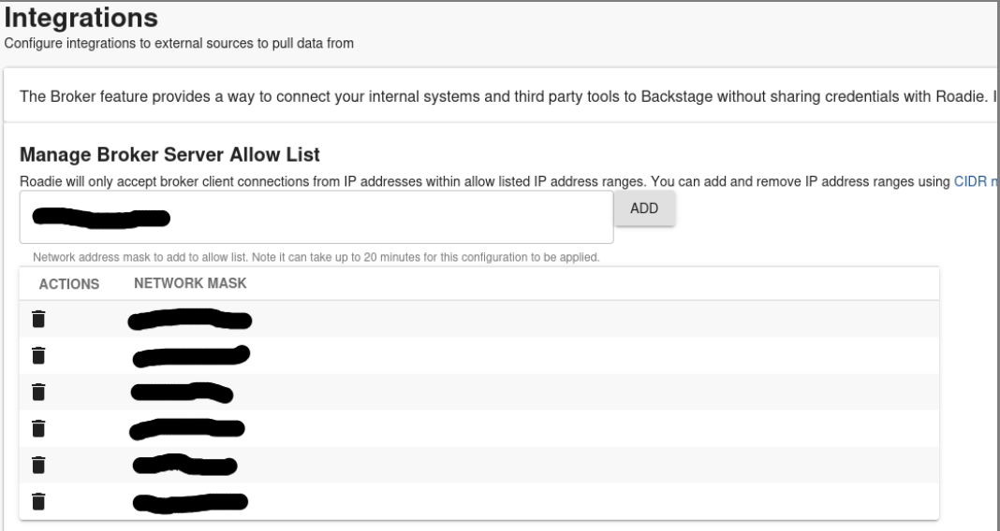
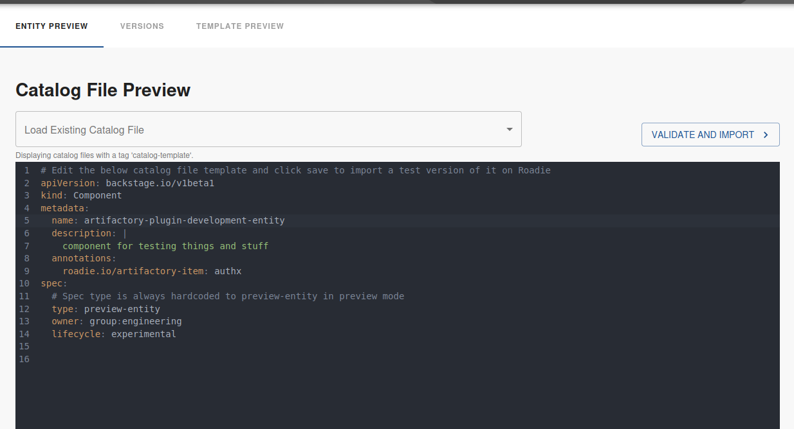
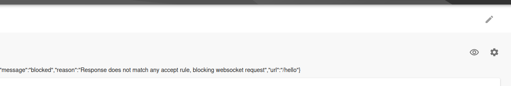
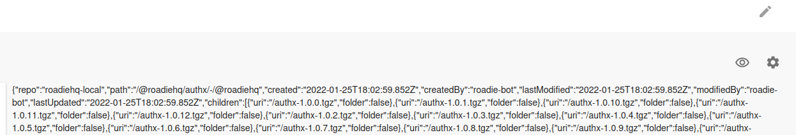

Roadie provides secure connectivity from your Roadie instance bundled plugins as well as your self-built custom plugins to your internal infrastructure. To have a closer look how this functionality is constructed and what the underlying architecture is, you can take a look at [Roadie Broker documentation.](/docs/integrations/broker/).


#### Prerequisites

For this tutorial we are assuming that you have the skeleton repositories and the processes to develop your plugins already warmed up and ready to go. If that is not the case, take a look at [the various examples how to get started](/docs/custom-plugins/examples/).

To connect to your internal infrastructure via the broker you also need to have a working set up of a broker connection within Roadie. The simplest way to get started and start iterating on your plugin integration is to use [the Broker CLI directly](https://deploy-preview-1069--roadie.netlify.app/docs/integrations/broker/#snyk-broker-cli-application). This gives you the ability to iterate on the needed `accept.json` configuration file and keep a closer eye on the connections flowing between Roadie and your broker client.


## Initializing the broker connection

For this example we are going to use a simple GET method to list package versions from our internal JFrog Artifactory. 
I have configured my Roadie instance, in this case `roadie-preview`, to accept broker connections from my IP address so I can initialize a connection between the instance and my broker client. 



After I have confirmed the modifications, I can start my broker client, targeting my Roadie instance. First I will install broker globally:
`npm install --global snyk-broker`

And the run it by giving it few environment variables, namely my wanted broker token and the URL of my Roadie instance:
```bash
BROKER_TOKEN=artifactory-plugin \
BROKER_SERVER_URL=https://roadie-preview.broker.roadie.so \
PREFLIGHT_CHECKS_ENABLED=false \
broker --disableBodyVarsSubstitution --disableHeaderVarsSubstitution
```
After the connection has been initialized, I see a log message like:
```
"msg":"successfully established a websocket connection to the broker server"
```

We also need to configure an `accept.json` file that the Broker client can use. The file defines routes that our Broker Client accepts, and where to forward them. For the first development cycle, we will keep it simple and accept everything:

```json
{
  "private": [
    {
      "//": "Show results of my plugins API",
      "method": "GET",
      "path": "/api",
      "origin": "${MY_PLUGIN_REST_ENDPOINT}"
    }
  ],
  "public": [
    {
      "//": "Get broker connection status",
      "method": "GET",
      "path": "/healthcheck"
    }
  ]
}
```

To use the `accept.json` file, we'll set up one more environment variable, called `ACCEPT`, and modify our command to run the broker client a little bit. The new command is:

```bash
ACCEPT=accept.json \
BROKER_TOKEN=artifactory-plugin \
BROKER_SERVER_URL=https://roadie-preview.broker.roadie.so \
PREFLIGHT_CHECKS_ENABLED=false \
broker --disableBodyVarsSubstitution --disableHeaderVarsSubstitution
```


## Making first requests from Roadie through the broker

The easiest way to test that the broker connection is working is to do some experimental development on our plugin to get the first requests going. We'll modify one of our `Card` type plugin components to look like the following:

```tsx
import React from "react";
import { Progress, ResponseErrorPanel } from "@backstage/core-components";
import useAsync from "react-use/lib/useAsync";
import {
    discoveryApiRef,
    errorApiRef,
    useApi,
} from "@backstage/core-plugin-api";

export const ExampleFetchComponent = () => {
    const discoveryApi = useApi(discoveryApiRef);
    const errorApi = useApi(errorApiRef);

    const { value, loading, error } = useAsync(async (): Promise<any> => {
        const proxyUrl = await discoveryApi.getBaseUrl("proxy");
        const brokerUrl = `${proxyUrl}/broker/artifactory-plugin/hello`;
        const response = await fetch(brokerUrl);
        try {
            const responseData = await response.json();
            console.log(responseData);
            return responseData;
        } catch (e: unknown) {
            errorApi.post({
                message: "Failed to get response via broker from Artifactory",
                name: "Data retrieval error",
                stack: e.stack,
            });
        }
    }, []);

    if (loading) {
        return <Progress />;
    } else if (error) {
        return <ResponseErrorPanel error={error} />;
    }

    return <>{JSON.stringify(value)}</>;
};
```

We'll spin up a development server of my plugin bundle and register the plugin and it's components to our Roadie instance. If you don't know how to do this, take a look at our [examples how to get started](/docs/custom-plugins/examples/#4-develop-your-plugin). 


Because we are still experimenting, it is better to register our `Card` component to a preview entity. This way we don't bother other users with a potentially broken plugin while we are still working on it. Navigate to `Tools` -> `Preview Entities` and construct a new entity that has the annotation that you are expecting to use with the plugin. In our case I have decided to call the annotation `roadie.io/artifactory-item`.




After we have created the preview entity, we can add our `Card` component to its dashboard. 
The plugin is already starting to make requests through the proxy, to the broker, using our hardcoded `artifactory-plugin` broker token. We are seeing traffic flowing through on our Broker Client side in our terminal, and we get a response that we are displaying to the screen. We have confirmed that the broker connection is working.



Unfortunately the response says some like `blocked` and look errorenous. That means that it is time to modify our Broker accept configuration to match the actual URLs we want to reach. 


## Configuring the broker to reach our wanted endpoints

Since our plugin is attempting to retrieve information from JFrog Artifactory, we need to configure our broker client to successfully be able to route traffic to the correct destination. This happens by modifying the `accept.json` file to match what we want. We are attempting to retrieve version numbers of our released package, so we have a URL in mind that we eventually want to construct. That URL is `https://<our-artifactory-url>/artifactory/api/storage/roadiehq-local/%40roadiehq/authx/-/%40roadiehq`. 

We know that the pattern for all of our packages follows the same structure, and the variable within this demo is the `authx`, indicating the package name. So we can modify our broker configuration to direct traffic to the correct place with the following `accept.json` file.

While doing that we will also add authentication headers reference to the Broker client configuration file, allowing us to authenticate against Artifactory. Note that these authentication credentials are stored on the client side, they are never visible to Roadie instance or its users.

Our modified `accept.json` file looks like the following:

```json
{
  "private": [
    {
      "//": "Show listing of my packages versions",
      "method": "GET",
      "path": "/:package/-/%40roadiehq",
      "origin": "https://<our-artifactory-url>/artifactory/api/storage/roadiehq-local/%40roadiehq/",
      "auth": {
        "scheme": "basic",
        "username": "${USERNAME}",
        "password": "${PASSWORD}"
      }
    }
  ],
  "public": [
    {
      "//": "Get broker connection status",
      "method": "GET",
      "path": "/healthcheck"
    }
  ]
}
```

We have modified the path to accept a wildcard called `:package`, modified the origin to point to our Artifactory URL, and added an authentication scheme that matches Artifactory REST API expected method.

Note that URL defined as the origin doesn't quite add up to the final URL we are after. Eventually we want to construct the URL from the origin URL defined in here, and the annotation we have defined in the entity. We have now added a hardcoded ending to the `path` we are expecting, ideally an alternative approach to construct a more suitable and easily findable URL would be used. For demo purposes, we can go with this.

With this `accept.json` ready to go, we can set up two additional environment variables `USERNAME` and `PASSWORD` and spin up our broker client again.


## Modifying our plugin to conform new URL pattern

Now we should be having a Broker client correctly directing our traffic to our Artifactory server, so we can focus on plugin development. First thing to do is to match the URL we are using with the URL defined in the `path` property of our `accept.json` Broker client configuration file. 

We will hardcode the wanted package in there to see if we get a successful response working for us. The new modified constructed URL in the plugin now reads:
```ts
const brokerUrl = `${proxyUrl}/broker/artifactory-plugin/authx/-/%40roadiehq`;
```

When we reload our preview entity page on our Roadie instance, we can see that the connection is now able to flow all the way through to our Artifactory instance and it responds with a data structure we can work with. 



## Displaying versions of our package on Roadie

The response type from Artifactory follows a pattern we can use and construct a table of items from. 
We'll start by typing out the shape of the response, or at least relevant parts of it. These types can be generated automatically or manully. Some online sites like `https://app.quicktype.io` may be of help when constructing these types.

Our final type definition looks like the following:

```ts
export interface ArtifactoryStorageResponse {
    repo:         string;
    path:         string;
    created:      Date;
    createdBy:    string;
    lastModified: Date;
    modifiedBy:   string;
    lastUpdated:  Date;
    children:     Child[];
    uri:          string;
}

export interface Child {
    uri:    string;
    folder: boolean;
}
```

We copy this type definition to our plugin component as well as modify our `fetch` response to match that type. With these modifications we can easily get help from TypeScript to extract the correct values from the response, in order to display them prettily on the screen for the user.

The final React component in all its glory we ended up with looks like the following:

<details>

<summary>Expand to show code</summary>

```tsx
import React from "react";
import {
  InfoCard,
  Link,
  Progress,
  ResponseErrorPanel,
  Table,
  TableColumn,
} from "@backstage/core-components";
import useAsync from "react-use/lib/useAsync";
import {
  discoveryApiRef,
  errorApiRef,
  useApi,
} from "@backstage/core-plugin-api";
import { Grid, Typography } from "@material-ui/core";
import { useEntity } from "@backstage/plugin-catalog-react";

interface ArtifactoryStorageResponse {
  repo: string;
  path: string;
  created: Date;
  createdBy: string;
  lastModified: Date;
  modifiedBy: string;
  lastUpdated: Date;
  children: Child[];
  uri: string;
}

interface Child {
  uri: string;
  folder: boolean;
}

type PackageVersionEntry = {
  name: string;
  version: string;
  link: string;
};

export const ExampleFetchComponent = () => {
  const discoveryApi = useApi(discoveryApiRef);
  const errorApi = useApi(errorApiRef);
  const { entity } = useEntity();
  const artifactoryPackageName =
    entity?.metadata?.annotations?.["roadie.io/artifactory-item"];
  const {
    value: packageVersions = [],
    loading,
    error,
  } = useAsync(async (): Promise<PackageVersionEntry[]> => {
    if (!artifactoryPackageName) {
      return [];
    }
    const proxyUrl = await discoveryApi.getBaseUrl("proxy");
    const brokerUrl = `${proxyUrl}/broker/artifactory-plugin/${artifactoryPackageName}/-/%40roadiehq`;
    const response = await fetch(brokerUrl);
    try {
      const responseData =
        (await response.json()) as ArtifactoryStorageResponse;
      return responseData.children.map((child) => ({
        name: artifactoryPackageName,
        version: child.uri.substring(1),
        link: `${responseData.uri}${child.uri}`,
      }));
    } catch (e: any) {
      errorApi.post({
        message: "Failed to get response via broker from Artifactory",
        name: "Data retrieval error",
        stack: e.stack,
      });
    }
    return [];
  }, [artifactoryPackageName]);

  const columns: TableColumn[] = [
    { title: "Package Name", field: "name" },
    { title: "Version", field: "version" },
    {
      title: "Download Link",
      field: "link",
      render: (row) => <Link to={row.link}>Download</Link>,
    },
  ];

  if (loading) {
    return <Progress />;
  } else if (error) {
    return <ResponseErrorPanel error={error} />;
  }

  return (
    <Grid container spacing={3} direction="column">
      <Grid item>
        <InfoCard title="Artifactory Packages">
          <Table
            title="Available Package Versions"
            options={{ search: false, paging: true, pageSize: 5 }}
            columns={columns}
            data={packageVersions}
          />
        </InfoCard>
      </Grid>
    </Grid>
  );
};
```

</details>
