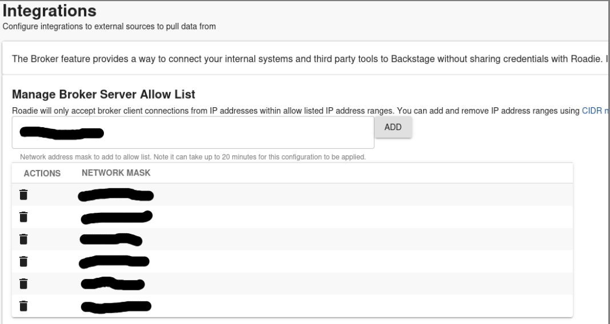

Roadie provides secure connectivity from your Roadie instance bundled plugins as well as your self-built custom plugins to your internal infrastructure. To have a closer look how this functionality is constructed and what the underlying architecture is, you can take a look at [Roadie Broker documentation.](/docs/integrations/broker/).


#### Prerequisites

For this tutorial we are assuming that you have the skeleton repositories and the processes to develop your plugins already warmed up and ready to go. If that is not the case, take a look at [the various examples how to get started](/docs/custom-plugins/examples/).

To connect to your internal infrastructure via the broker you also need to have a working set up of a broker connection within Roadie. The simplest way to get started and start iterating on your plugin integration is to use [the Broker CLI directly](https://deploy-preview-1069--roadie.netlify.app/docs/integrations/broker/#snyk-broker-cli-application). This gives you the ability to iterate on the needed `accept.json` configuration file and keep a closer eye on the connections flowing between Roadie and your broker client.


## Initializing the broker connection

For this example we are going to use a simple GET method to list package versions from our internal JFrog Artifactory. 
I have configured my Roadie instance, in this case `roadie-preview`, to accept broker connections from my IP address so I can initialize a connection between the instance and my broker client. 



After I have confirmed the modifications, I can start my broker client, targeting my Roadie instance. First I will install broker globally:
`npm install --global snyk-broker`

And the run it by giving it few environment variables, namely my wanted broker token and the URL of my Roadie instance:
```bash
BROKER_TOKEN=artifactory-plugin \
BROKER_SERVER_URL=https://roadie-preview.broker.roadie.so \
PREFLIGHT_CHECKS_ENABLED=false \
broker --disableBodyVarsSubstitution --disableHeaderVarsSubstitution
```
After the connection has been initialized, I see a log message like:
```
"msg":"successfully established a websocket connection to the broker server"
```

We also need to configure an `accept.json` file that the Broker client can use. The file defines routes that our Broker Client accepts, and where to forward them. For the first development cycle, we will keep it simple and accept everything:

```json
{
  "private": [
    {
      "//": "Show results of my plugins API",
      "method": "GET",
      "path": "/api/show",
      "origin": "${MY_PLUGIN_REST_ENDPOINT}",
      "auth": {
        "scheme": "bearer",
        "token": "${MY_PLUGIN_AUTH_TOKEN}:"
      }
    }
  ],
  "public": [
    {
      "//": "Get broker connection status",
      "method": "GET",
      "path": "/healthcheck"
    }
  ]
}

```


## Making first requests from Roadie through the broker

The easiest way to test that the broker connection is working is to do some experimental 