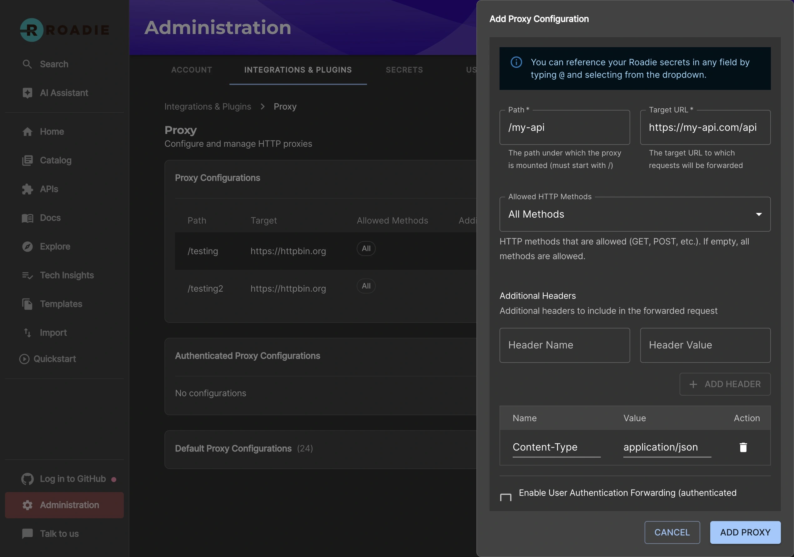

## Introduction

Roadie provides two kinds of proxy services to enable both the UI frontend plugins or scaffolder tasks to communicate with third party APIs hosted outside of Roadie's infrastructure. They handle the credentials for the third party APIs securely in the Roadie backend so that the UI plugins and scaffolder actions can make use of their features without messing with authentication.

## Standard Proxy

Roadie installs the proxy plugin in Roadie and provides administrators the ability to configure custom proxied services from within the Roadie UI.

An administrator of Roadie will configure the proxy with credentials so that when the proxy is called by a UI plugin or a Scaffolder action, the authentication header will be handled in the proxy plugin.


### Setup

#### Step 1. Configure the Proxy

You can navigate to `/administration/settings/plugins/proxy`. Click "Add Proxy" to add a new proxy.

Enter a Path (e.g. `/my-api`) and a target API (e.g. `https://my-api.com/api`)

Expand the "Advanced Settings" and click "Add Item" next to the "Headers" section. Add a header with the name "Authorization" and the value "bearer ${CUSTOMER_TOKEN_1}"


Click save and Apply and Restart.

#### Step 2 Configure the API secret

Next visit the secrets configuration page `/administration/secrets`. Click the edit icon beside `CUSTOMER_TOKEN_1` and set a value for the token and press "Save".


#### Step 3 Calling the API

You can call this API from the Roadie window context in a browser via a Custom Roadie plugin:

```javascript
fetch('/api/proxy/my-api');
```

## Authenticated Proxy

Roadie provides a custom proxy service that can be configured to proxy through an access token minted by our own authentication system that can be validated by your third party service.

This gives a custom plugin a way to interact with your own service. That service can authenticate the incoming requests from Roadie.


### Setup

#### Step 1. Configure the Proxy

You can navigate to `/administration/settings/plugins/proxy`. Click add item to add a new proxy.


Enter a Path (e.g. `/my-api`) and a target API (e.g. `https://my-api.com/api`) as follows:



Click save and Apply and Restart and wait for the restart. It can take up to about two minutes for the change to be applied.

#### Step 2 Calling the API

You can call this API from the Roadie window context in a browser via a Custom Roadie plugin:

```javascript
fetch('/api/authenticated-proxy/my-api');
```

#### Step 3 Authenticate the Request

The API configured in the Authenticated proxy target will receive a token in the authorization header containing an access token. This token can be sent to the Roadie Authentication system to retrieve an id representing the logged in Roadie user.

```bash
curl --request GET \
  --url 'https://auth.roadie.io/userinfo' \
  --header 'Authorization: Bearer {ACCESS_TOKEN}' \
  --header 'Content-Type: application/json'
```

This will return the identity as follows:

```json
{
  "sub": "248289761003",
  "name": "John Doe",
  ...
  "updated_at": "1556845729"
}
```
