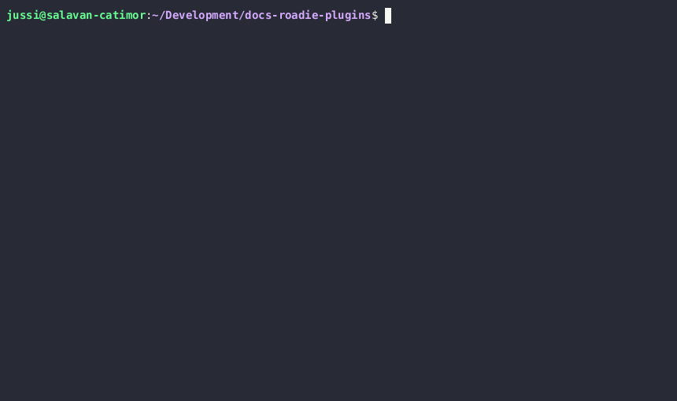

## Overview
This documentation explains how to deploy a plugin built using the Roadie CLI in development mode to a hosting solution for production usage. While the plugin code in development mode is accessible only to the person running the development server on `http://localhost`, this guide outlines steps to host and deploy the plugin as production-ready static assets. 


## Building a plugin for production

To build a Backstage plugin for production using the Roadie CLI, follow these steps:

1. Create a Backstage plugin using the Backstage CLI or any other suitable method.
2. Install the Roadie CLI using the installation instructions mentioned [in the developer documentation](/docs/custom-plugins/developing/).
3. Run the Roadie CLI build command against the plugin folder you have created, specifying the host URL where the files will be hosted.

Example:

```bash
roadie plugin:build --location ~/Development/my-roadie-plugins/my-custom-plugin-folder/ --host https://static-assets.roadie.so/<my-tenant>/myCustomPlugin
```

OR

```bash
roadie plugin:build --package @roadiehq/backstage-plugin-prometheus --host https://static-assets.roadie.so/<my-tenant>/prometheusPlugin
```

> Important! The value for 'host' that is defined during build time needs to match the actual final hosting location where the plugin assets can be found after they have been uploaded. 


### Available options for `plugin:build` command:

| Option          | Name                      | Description                                                                                                      | Example                                                                                            |
|-----------------|---------------------------|------------------------------------------------------------------------------------------------------------------|----------------------------------------------------------------------------------------------------|
| --location -l   | Location                  | (One of location or package is required) The absolute path to the folder where your plugin resides               | `-l $PWD/my-plugin` / `-l /home/myname/Development/roadie-plugins/my-plugin`                       |
| --package -p    | Package                   | (One of location or package is required) NPM Package to use to build a Roadie Plugin                             | `-p @roadiehq/backstage-plugin-prometheus`                                                         |
| --host -h       | Host                      | (Required) Fully qualified URL to the location where these files will be hosted. The Production URL              | `-h https://my-plugins.domain.com/prometheusPlugin` / `-h https://calm-parfait-833e94.netlify.app` |
| --output -o     | Output                    | The absolute path to the folder where you want to generate the Roadie compatible plugin code                     | `-o $PWD/my-plugin/dist` / `-o /home/myname/Development/roadie-plugins/my-plugin/dist`             |
| --workdir -w    | Working Dir               | Used for cases where package option is used. A directory to use to download, unpack and build                    | `-w $PWD/my-plugin/temp` / `-w /home/myname/temp/downloads`                                        |
| --withUpload -u | Enable AWS S3 upload mode | A flag to upload generated files to S3. Bucket info is defined in env variable S3_BUCKET_NAME & S3_BUCKET_PREFIX | `-u`                                                                                               |


## Deploying the plugin to Roadie

Roadie provides a hosting solution which allows you to deploy your developed plugin code to secure Roadie infrastructure. The assets produced by the build process are secured using the same access control methods as the rest of the Roadie application. To be able to do this you need to have access to upload your produced assets to the relevant S3 buckets where Roadie can receive and serve them. 

### Getting credentials

To get relevant credentials, contact Roadie via Slack or other support channels. We currently offer AWS based cross account authentication or User based authentication.

### Configurating your client

If you're using cross account authentication, you'll provide the ID of your AWS account and Roadie will supply you with a role which you can assume to push your plugin to S3. You can do this via an AWS profile like this (see ~/.aws/config):
```
[profile uploader]
role_arn = <role arn>
source_profile = <an existing profile tied to the account ID you provided>
external_id = <external id>
role_session_name = uploader
region = eu-west-1
```
Then
```bash
export AWS_PROFILE=uploader
```

If you are using a user-based authentication mechanism you will need to set the environment variables to access our S3 bucket. 
```
AWS_ACCESS_KEY_ID=
AWS_SECRET_ACCESS_KEY=
AWS_REGION=eu-west-1
```

### Deployment via the Raodie CLI

Roadie CLI has a built-in command to automatically upload the files to the correct location. This can be configured to be done for example within your CI/CD pipeline. Once the assets are uploaded, they are immediately available to be used on your Roadie instance. 

To build a plugin and deploy it to the static assets hosting solution provided by Roadie, you can run the following command:

```bash
export S3_BUCKET_NAME=roadie-static-assets
export S3_BUCKET_PREFIX=<my-tenant>
roadie plugin:build --location ~/Development/my-roadie-plugins/my-custom-plugin-folder/ --host https://static-assets.roadie.so/<my-tenant>/my_custom_plugin --withUpload
```

Where `<my-tenant>` is replaced by your tenant name and `my_custom_plugin` is replaced by the name of your plugin (this is autogenerated from the name defined in the package.json file of the plugin). 

After the plugin has been uploaded to static hosting, you can follow the documentation on [how to register individual plugins to Roadie for the next steps](/docs/custom-plugins/plugin-registration/).


#### Using the Roadie monorepo structure



#### Using the Roadie CLI


### How do I know which URL to use for the location argument?

When building the plugin for deployment, the most difficult step is usually identifying the correct value for the `--host` argument, or the correct name for the plugin path. If you are building the plugin to be hosted on Roadie, your URL takes the following format:
`https://static-assets.roadie.so/<my-tenant>/my_custom_plugin`

* Roadie's hosting solution uses a URL `static-assets.roadie.so` to expose these plugins from various origins.
* You should replace the `<my-tenant>` block with your tenant name. You can find this from your roadie URL. E.g. `https://demo.roadie.so` -> Tenant name is `demo` 
* The ending (like `my_custom_plugin` above) defines the actual root of the plugin and is named after the plugin itself.

Usually you can identify the value of the host by looking at the output when running Roadie CLI in development mode. The default setting for the produced plugin root location will be the same as the `scope` value that Roadie CLI outputs.

With Roadie CLI and the custom plugins automated deploy solution to Roadie hosted secure solution, we are generating the path that **needs** to be derived from the plugin name. The plugin name is constructed from the name it is given in the `package.json` file, with few web-safe sanitization steps added in (dashes replaced with underscores etc.). Unfortunately due to the way the bundling of these assets works, the name needs to be known beforehand and could be tricky to identify correctly.

To double check what the name could be, you can take a look at the command output where the upload location is defined (Syncing files ... to `s3://roadie-static-assets/<tenant>/plugin_name`). The **plugin_name** is the correct value that you would need to input as the path during the command run if hosting plugins on Roadie. The command can be run with the following arguments, and corresponding plugin configuration in Roadie, and that should get the plugin correctly configured:
* `roadie plugin:build --location $PWD/my-plugin-folder --host https://static-assets.roadie.so/<tenant>/plugin_name --withUpload`

Note that the plugin scope in most use cases when hosting in Roadie will be the same as the path ending needed for the run command.


If you are hosting the plugin yourself, the URL used in the location argument should match the location where the plugin is reachable from. 


## Hosting your plugin yourself

### Hosting Solutions
Roadie CLI creates bundled static assets containing JS and CSS files that can be deployed to various hosting solutions. Some popular options include:
- Netlify
- GitHub Pages
- GitLab Pages
- Static Site hosted in AWS S3 fronted by CloudFront
- Microsoft Azure Static Website hosting
- CloudFlare Pages
- Self-hosted Nginx Webserver
- Self-hosted Apache Web Server

In this documentation, we will demonstrate the deployment process using Netlify as the hosting solution.

### Deploying to Netlify
To deploy a plugin to Netlify, follow the steps below:

1. **Create a New Netlify Site with Manual Deploys**
    - Identify the production URL where the site will be hosted. For example: `https://calm-parfait-863e94.netlify.app`

2. **Build the Roadie Compatible Plugin**
    - Run the Roadie CLI build command, specifying the host URL where the files will be hosted.
    - For users of the provided scaffolder template, the command would be similar to:
      ```
      npm run build --workspace=first-plugin --host https://calm-parfait-863e94.netlify.app
      ```
    - For users using the Roadie CLI directly, the command would be something like:
      ```
      roadie plugin:build --location ~/Development/my-roadie-plugins/my-custom-plugin-folder/ --host https://calm-parfait-863e94.netlify.app
      ```

3. **Locate the Produced Output Files**
    - The output files from the build process can be found in the `out` folder within the plugin directory.

4. **Deploy to Netlify**
    - Upload the output folder to Netlify. Ensure that the file `https://calm-parfait-863e94.netlify.app/remoteEntry.js` (or equivalent for your plugin) is accessible. If so, the deployment is successful.

5. **Update Roadie Configuration**
    - Add the plugin configuration for the new URL to Roadie.
    - Start adding your components to the UI, and the plugin will now be available for use by other users.

### Security Considerations
To ensure security when deploying the plugin, avoid hardcoding URLs, secrets, or any sensitive information into the plugin code. Instead, use Roadie proxies, brokers, and secrets to handle connections securely.

Various methods can be employed to secure static assets, such as:
- Hosting assets internally within a secure infrastructure.
- Using VPN connections to protect Nginx/Apache webservers.
- Leveraging edge functions to intercept and identify requests to static assets (where possible).
- Implementing URL obfuscation to make access to assets more challenging.

Remember that even though Roadie provides a built-in way to host these assets on their infrastructure, with the help of hosting solutions like Netlify, you can effectively deploy your plugin for production use. Always consider security best practices when deploying and hosting your plugin assets.
In many cases, obfuscating the URL of the plugin code is sufficient for lightweight security since the static code produced for frontend resources rarely contains sensitive information. For example, hosting the assets at URLs like `https://mydomain.com/32f078b6-19a9-11ee-be56-0242ac120002` can make them harder to guess.
