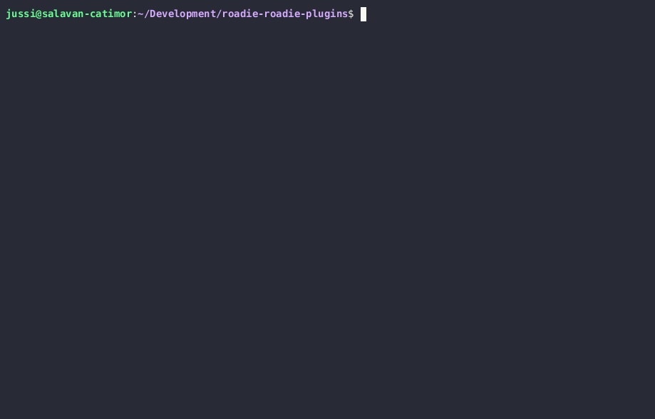

## Overview

Developing plugins to Roadie application can be achieved using a node.js tool called [Roadie CLI](https://www.npmjs.com/package/@roadiehq/roadie-cli). The Roadie CLI (Command Line Interface) is a tool designed to aid in the development, building, and deployment of plugins compatible with your Roadie instance. It enables developers to rebuild and repackage standard Backstage plugins for instant deployment to Roadie.

Additionally, Roadie provides a [Scaffolder Template](https://github.com/roadie-demo/scaffolder-examples/blob/main/roadie-plugin/template.yaml) which can be used to initialize a monorepo structure Roadie has found useful when developing and building these plugins. The Scaffolder template provides an entry point to create a monorepo which can host the custom plugin code. This can be used as the first step to Roadie plugin development and can be built on by creating subsequent plugins using the same patterns within the same monorepo.

This page outlines the technicalities behind Roadie CLI. If you want to see step-by-step examples how to use the tool, take a look at [the getting started page.](/docs/custom-plugins/getting-started/)

## Development process

Roadie plugins can be developed standalone or against a live Roadie instance which has been configured to enable custom plugin functionality. To get started, you need to install and configure [Roadie CLI](https://www.npmjs.com/package/@roadiehq/roadie-cli) (either manually, or using the Scaffolder template mentioned above).

During the development phase, constructed plugins can be registered to the Roadie application to help the construction and development process in a real environment. This enables the developer to implement and test their solutions against more relevant data structures and integrations. To see how to register your plugin and created components to Roadie, take a look at the [documentation regarding plugin registration](/docs/custom-plugins/plugin-registration/)

## Getting Started with Roadie CLI



Before using the Roadie CLI, make sure you have Node.js and NPM/Yarn installed on your system.

To install the Roadie CLI globally as a Node.js-compatible tool, you can use either NPM or Yarn:

```bash
npm install -g @roadiehq/roadie-cli
```

OR

```bash
yarn global add @roadiehq/roadie-cli
```

## Commands

The Roadie CLI provides the following commands for developing:

### `plugin:dev [options]`

Runs a plugin in development mode with the specified options.

## Developing with Roadie CLI

To develop a Backstage plugin using the Roadie CLI, follow these steps:

1. Create a Backstage plugin using the Backstage CLI or any other suitable method.
2. Install the Roadie CLI using the installation instructions mentioned above.
3. Run the Roadie CLI in development mode against the plugin you have created, specifying the location of the plugin folder, output directory, and the HTTP port to use for the local server.

Example:

```bash
roadie plugin:dev --location ~/Development/my-roadie-plugins/my-custom-plugin-folder/ --output ~/Development/temp --port 7046
```

### Available options for `plugin:dev` command:

| Option        | Name     | Description                                                                                  | Example                                                                                |
| ------------- | -------- | -------------------------------------------------------------------------------------------- | -------------------------------------------------------------------------------------- |
| --location -l | Location | (Required) The absolute path to the folder where your plugin resides                         | `-l $PWD/my-plugin` / `-l /home/myname/`Development/roadie-plugins/my-plugin           |
| --port -p     | Port     | (Required) HTTP Port to use for the local server to serve files from                         | `-p 8765`                                                                              |
| --output -o   | Output   | The absolute path to the folder where you want to generate the Roadie compatible plugin code | `-o $PWD/my-plugin/dist` / `-o /home/myname/Development/roadie-plugins/my-plugin/dist` |

---

⚠️ When developing and iterating plugins that have already been registered to the application, you need to version the plugin identifier and possible API identifiers. Backstage application does not allow multiple plugins with the same id to be registered at the same time.

---
