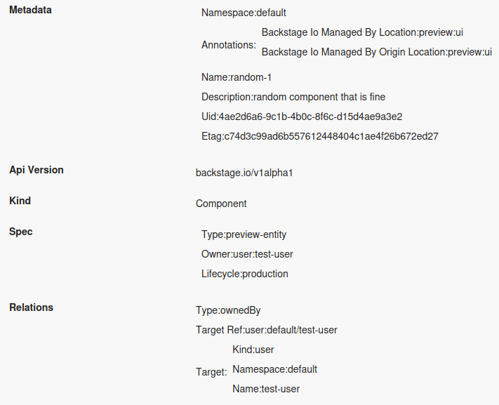
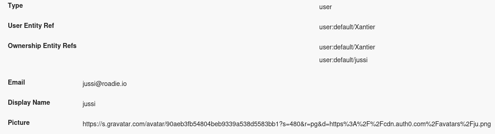

## Using the scaffolded monorepo structure


1. Register [the provided scaffolder template](https://github.com/RoadieHQ/software-templates/blob/main/scaffolder-templates/roadie-plugin/template.yaml) in your Roadie application
2. Run the scaffolder template to generate a Roadie compatible monorepo to build your Backstage plugins
3. Clone and install dependencies in the generated monorepo
    1. This can be done following the instructions provided in the repository README.md file
4. Run the develop script as instructed in the readme
5. Register your plugin and components on your Roadie instance.
    1. Navigate to [`https://<your-tenant>.roadie.so/administration/federated-plugins`](https://roadie.roadie.so/administration/federated-plugins)
    2. Insert values provided on the CLI tool output when running the develop script


## Using the Roadie CLI directly

If you have an already existing plugin that you want to convert to Roadie compatible version, you can take these steps.

1. Install Roadie CLI as a command line tool `npm install -g @roadiehq/roadie-cli` or `yarn add global @roadiehq/roadie-cli` (depending on your tool of choice)
2. Run the Roadie CLI with wanted parameters to build you Roadie compatible plugin
3. Register your plugin and components on your Roadie instance.
    1. Navigate to [`https://<your-tenant>.roadie.so/administration/federated-plugins`](https://roadie.roadie.so/administration/federated-plugins)
    2. Insert values provided on the CLI tool output when running the develop script


## Using common APIs

Backstage and Roadie provide many in-built custom APIs which are useful when developing your custom plugins. Below is a list of most used ones with examples on how to get started with them and what they provide. For more information about the utility API structure and architecture, take a look at [Backstage documentation around the area](https://backstage.io/docs/api/utility-apis)

### useEntity

`useEntity` [React hook](https://react.dev/reference/react) provides the ability for plugin developers to easily get the Entity information when developing plugins to Roadie. The hook can be called within Roadie plugins that are exposed within the *Entity pages*, namely `Card` and `Content` component types.

The hook returns an object with an `entity` property, which contains the whole entity definition. This is useful for cases where you would for example need to identify and locate an annotation from the entity, so you can use the annotation value in subsequent requests to third party services.

An example usage to retrieve and display all entity information in a 'dump-like' fashion:

```tsx
import React, { useEffect } from "react";
import { StructuredMetadataTable } from "@backstage/core-components";
import { useEntity } from "@backstage/plugin-catalog-react";

export const MyPluginContentComponent = () => {
    const { entity } = useEntity();
    return <StructuredMetadataTable metadata={entity} />;
}
```

The code above would produce a view like this:

### useApi

`useApi` is a generic hook which provides the ability to retrieve implementations of already registered APIs in the frontend application. See below for actual APIs available in Roadie application that you can use to your advantage when developing a plugin.  

#### discoveryApi

`discoveryApi` provides connectivity to the Roadie backend APIs. The API can be used to identify the correct endpoints to call when, for example, integrating with third party services via the Roadie proxy.

```tsx
import React, { useCallback } from "react";
import { useEntity } from "@backstage/plugin-catalog-react";
import { discoveryApiRef, useApi } from "@backstage/core-plugin-api";
import { StructuredMetadataTable } from "@backstage/core-components";

export const MyComponent = () => {
   const discoveryApi = useApi(discoveryApiRef);
   const { entity } = useEntity();
   const [myEndPointInfo, setMyEndpointInfo] = useState<object | undefined>();

   const btnClicked = useCallback(async () => {
      const proxyUrl = await discoveryApi.getBaseUrl('proxy');
      const url = `${proxyUrl}/my-proxy`;
      const uid = entity.metadata.uid;
      const res = await fetch(`${url}/get-info/${uid!}`);
      setMyEndpointInfo(await res.json())
   }, [discoveryApi]);

   return <div>
      <Button onClick={btnClicked}>Get info from my endpoint</Button>
      {myEndPointInfo && <StructuredMetadataTable metadata={myEndPointInfo}/>}
   </div>
};
```

#### identityApi

`identifyApi` provides information about the currently logged in user. This API can be used to target individuals or decorate requests with relevant user information.

```tsx
import React from "react";
import useAsync from "react-use/lib/useAsync";
import { BackstageUserIdentity, ProfileInfo, identityApiRef, useApi } from "@backstage/core-plugin-api";
import { StructuredMetadataTable } from "@backstage/core-components";

export const MyPluginContentComponent = () => {
   const identityApi = useApi(identityApiRef);

   const [userInfo, setUserInfo] = useState<BackstageUserIdentity | undefined>();
   const [profileInfo, setProfileInfo] = useState<ProfileInfo | undefined>();

   useAsync(async () => {
      const userInfo = await identityApi.getBackstageIdentity();
      const profileInfo = await identityApi.getProfileInfo();
      setUserInfo(userInfo);
      setProfileInfo(profileInfo);
   }, [identityApi])

   return <div>
      {userInfo && <StructuredMetadataTable metadata={userInfo} />}
      {profileInfo && <StructuredMetadataTable metadata={profileInfo} />}
   </div>
}
```


#### errorApi

`errorApi` provides the ability to inform the user about errorenous states or actions. This API is a thin wrapper around the more generic `alertApi` which can be used for other kinds of notifications.

```tsx
import React from 'react';
import { useApi, errorApiRef } from '@backstage/core-plugin-api';

export const MyComponent = () => {
  const errorApi = useApi(errorApiRef);

  // Signal to the app that something went wrong, and display the error to the user.
  const handleError = error => {
    errorApi.post(error);
  };

  // the rest of the component ...
};
```

#### alertApi

`alertApi` provides the possibility to display notifications to the user in a form of a UI toast message. These notifications can be of multiple different variants, like `error`, `info`, `warning`.

```tsx
import React from 'react';
import { alertApiRef, useApi } from '@backstage/core-plugin-api';

export const MyComponent = () => {
   const alertApi = useApi(alertApiRef);

   // Display a notification to the user that something good has happened
   const notifySuccess = () => {
      alertApi.post({
         message: 'New climate neutral aviation fuel has been invented!',
         severity: 'success',
         display: 'transient',
      });
   };

   // the rest of the component ...
};
```

#### analyticsApi

`analyticsApi` can be used to trigger analytics events to the application. These events are stored by Roadie in our analytics provider. If you need access to see further visibility of your analytics triggered events, contact Roadie via usual support channels.

```tsx
import React, { useCallback } from 'react';
import { analyticsApi, useApi } from '@backstage/core-plugin-api';
import { Button } from "@material-ui/core";

export const MyComponent = () => {
   const analyticsApi = useApi(analyticsApiRef);

   const btnClicked = useCallback(() => {
      analyticsApi.captureEvent({
         attributes: {component: "MyComponent"},
         subject: "test-subject",
         value: 1,
         action: "button-click",
         context: {
            extension: "my-custom-plugin",
            pluginId: "my-custom-plugin",
            routeRef: "myPluginRouteRef",
         },
      });
   }, [analyticsApi]);

   return <div><Button onClick={btnClicked}>Click me!</Button></div>
};

```

### Proxying request via the backend

The simplest way to store and use credentials to third party endpoints is to use the proxy within your Roadie application. You can configure proxies to target any endpoints available on the internet, and you can assign Roadie managed secrets to authenticate against these endpoints when your custom plugin contacts them. To have a closer look how proxies work and how you can use them to your advantage, take a look at the [more in-depth documentation on proxies](/docs/custom-plugins/connectivity/proxy/)

### Proxying requests via the Broker

To gain access to resources running inside your internal infrastructure, the best approach is to use the [Broker connection](/docs/integrations/broker/). To have a more in depth view of what kind of setup would be needed for brokering via plugins, take a look at the [end to end example of setting up a plugin with broker connectivity.](/docs/custom-plugins/connectivity/broker/)