This document will outline step-by-step instructions on how to develop, build, deploy and register custom plugins to your Roadie instance. We will go through few different approaches targeted to teams starting from scratch or teams that have already built plugins and want to move them to use the Roadie custom plugin system.

## Using the scaffolded monorepo structure

Using the scaffolder template provided by Roadie is a good way to get started developing plugins for Roadie application. The template creates a new GitHub repository with all the needed commands and dependencies. It also includes an example plugin with few components, which are displaying possible approaches to use wider Backstage and Roadie features within your plugins.

An instructional video of this same process can be found from the bottom of the section.

#### 1. Register the Roadie Plugins monorepo scaffolder template into your application

Navigate to your Roadie instance scaffolder and register a new template. Click on 'Import' in the Roadie sidebar.
Paste the URL below into the URL field.

```plain
https://github.com/roadie-demo/scaffolder-examples/blob/main/roadie-plugin/template.yaml
```

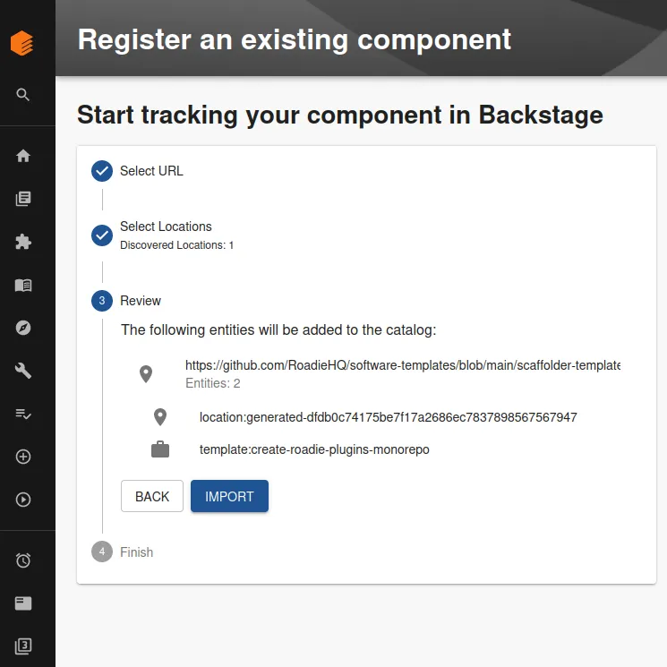

#### 2. Scaffold your Roadie plugins monorepo

Click on 'Templates' in the Roadie sidebar. Identify the scaffolder template you just added. It should be named something like 'Create Roadie Plugins Monorepo'. Choose this template and start filling out the templating steps.
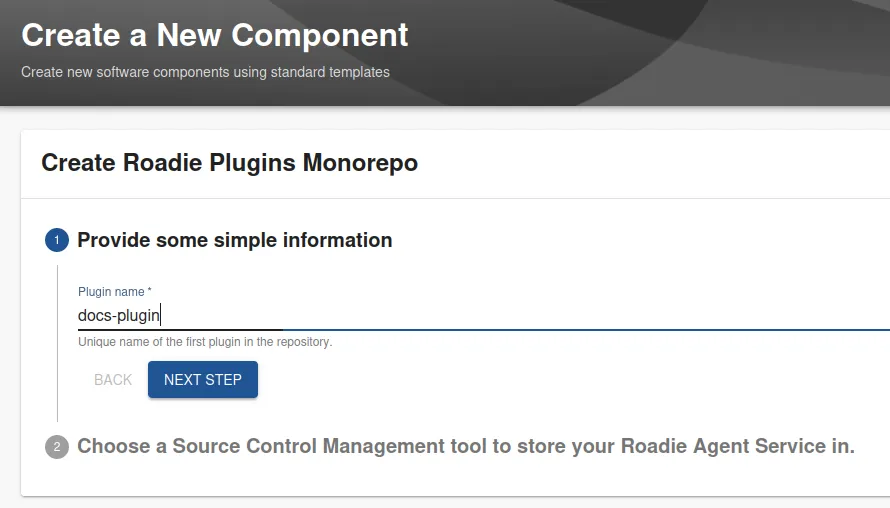

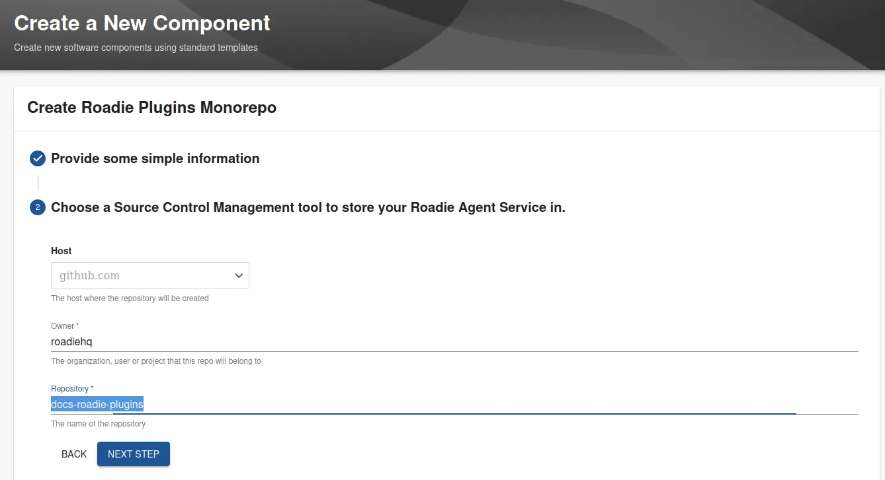


This scaffolder template will construct a new repository you can use to develop, build and deploy your Roadie plugins from. It contains an example plugin with few different example components, as well as handy scripts to help with the plugin development process.


#### 3. Start working on the monorepo

When scaffolder has finished, you should have a link to the generated monorepo as well as a link to documentation pointing to the Roadie CLI.

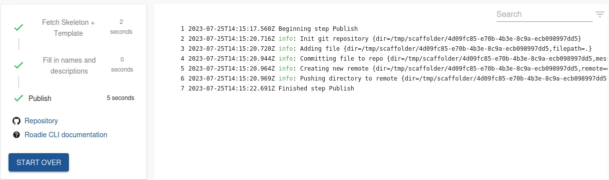

We can now navigate to the monorepo and clone that repository to our local machine 
* `git clone <the-url-from-the-repository>`.

The folder structure of the monorepo looks like the following:

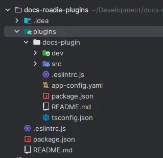


On the top level of the repository we have a npm workspace enabling `package.json` file. The purpose of this configuration file is mostly just identify which plugin folder should be considered to be part of the monorepo. 

Within the `plugins` folder we have a new plugin, the one we just created and chose a name for. It has example code, helpful build scripts and a configuration files needed to run the whole plugin either locally or against a live Roadie instance. 

Within the `src` folder of the plugin we have few different components that are exposed as _plugin components_ from the plugin. They are registered into the plugin withing `src/plugins.ts` file and finally exported to be usable in `src/index.ts` file. 

`README.md` on both the root of the monorepo and within the plugin folder itself contains instructions how to start developing the plugin.

#### 4. Develop your plugin

When we have navigated the available files and are happy with how they look, we can spin up a development server and start developing our plugin against a live Roadie instance. 

First we need to install needed dependencies. We will run `npm i` from the root of the monorepo. This may take some time depending on your internet connection.

After needed dependencies are installed we can spin up a development server in watch mode `npm run develop:watch --workspace=<your-plugin-name>`

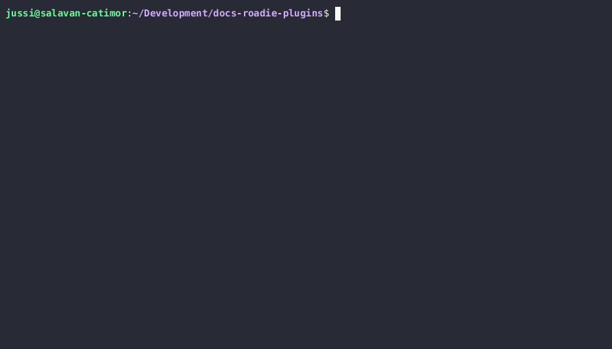


#### 5. Register your plugin to Roadie

With the Roadie CLI running in dev (and watch) mode, the plugin ready to be registered to Roadie. 

Navigate to `Administration` -> `Custom Plugins` and click `Add new plugin` on the bottom.

The output of our script told us some good information about which values we should input to the form in the plugin registration page. Let's do just that:
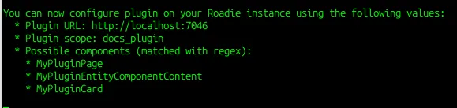

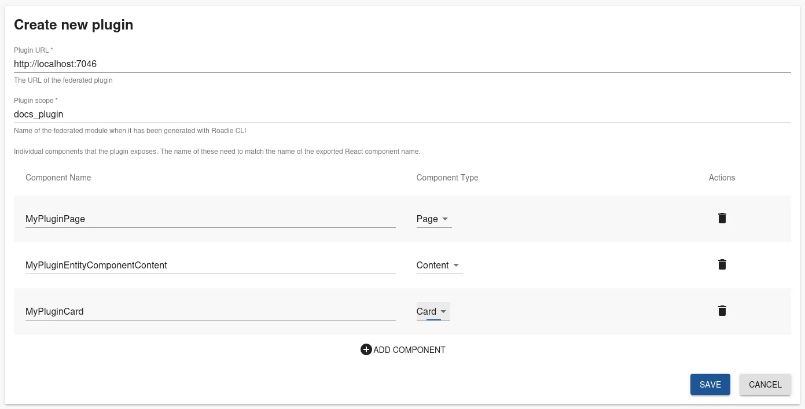

So we can go ahead and add the needed values directly into the form. The type of the component depends on how we have registered it into the plugin itself within the codebase.

A good rule of thumb usually is that if it is a '`RoutableExtension`' it is going to be either Content or Page, if it is a '`ComponentExtension`' it is going to be a Card.

After we have clicked save, the plugin is ready to be used in the application.


#### 6. Configure your plugin component to be used

The plugin is now registered from your `localhost` and can be added to the application UI using the instruction defined in the [Updating the UI documentation](/docs/details/updating-the-ui/). While you can use the standard page, card or content components served from localhost in the main application side, that might not be the best user experience for other users of your Roadie instance. The plugin served from localhost is only visible to you!

We will set up the `Content` component type in this case by using our [preview entities](/docs/details/previewing-changes/) functionality within the app. This way we can develop it further in peace before [deploying a production ready version of it](/docs/custom-plugins/deploying/).

Navigate to `Tools` -> `Entity Preview` and either create a complete new preview entity, or click into an existing one. 
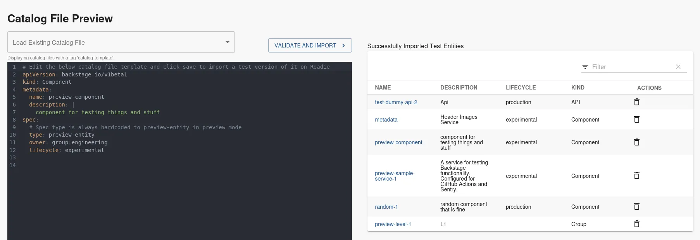

In our case we want to add the Content component to our preview-entity to be an API kind, so we will click `test-dummy-api-2` link on the right hand table which we already had available. Note that this component might not exist on your Roadie instance. 

Within the API catalog page, we can add our `Content` plugin in as a new tab. We'll click the `+` icon on the tab bar and input our plugin name and the wanted tab title.

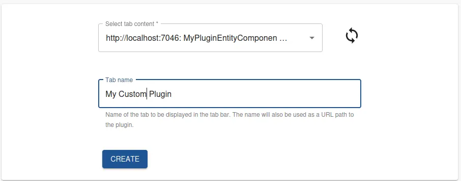


When we click save, we should be seeing our newly developed plugin in our new tab.


**Since we are running our development server in `watch` mode, any changes to the codebase will be immediately available on the live instance. (After reload, so warm-loading, not hot-loading)**

ℹ️ &nbsp; Note that you may need to refresh the page to have the needed plugin code available to you after registering and adding the plugin into the application. This needs to be done only once and not needed for other users, only the user who is registering and adding the plugins

ℹ️ &nbsp; If you are seeing 404s and errors on the network tab indicating that the javascript files for your plugin are not found, make sure that your development server is running and the plugin registration is pointing to the correct URL.

ℹ️ &nbsp; Plugin registration can only happen one at a time from a single URL. When developing locally it is useful to use different ports of the local dev server (one dev on `localhost:7046`, another one on `localhost:7046`). When using production ready, deployed plugins, the URL should be prefixed with different paths

#### Demo 

You can see a demo of this approach in a quick video below.

`vimeo: https://vimeo.com/848732073`

## Using the Roadie CLI directly


If you have an already existing plugin that you want to convert to Roadie compatible version, you can use the Roadie CLI directly. We'll start this example by creating a standard Backstage plugin using the Backstage CLI.

#### 1. Find a place for the plugins

Either navigate to the directory where your already existing plugins are, or create a new directory for your plugins 

#### 2. Initialize a new Backstage plugin using the Backstage CLI

Navigate to the directory you created and run `npx @backstage/cli new plugin`. This command will install [Backstage CLI](https://backstage.io/docs/local-dev/cli-commands/) and generate a new plugin. It may take some time (2-5 minutes) depending on your internet connection speed. The tool will ask you few questions, pick a 'Backstage plugin' and name your plugin how you want. 

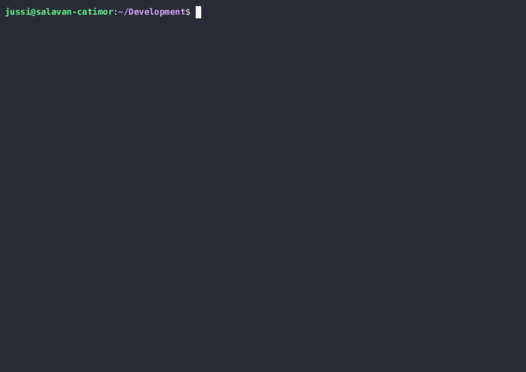

The created directory structure would be something like the following picture:

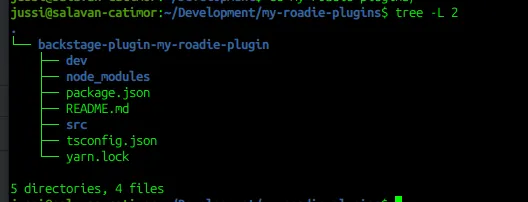


#### 3. Install Roadie CLI

Roadie CLI is the tool to use which builds your application into a format that is Roadie compatible. It is possible to install Roadie CLI either as a global tool or as a dependency in the project itself. 

_a. Add roadie-cli as a devDependency_

To add Roadie CLI as a dependency to the project, modify the `package.json` file within your plugin directory. You want to add the following line as a `devDependency` in the file.
```json
"@roadiehq/roadie-cli": "^1.0.2",
```

After that you can run install command by typing `yarn` in that same directory.

To actually use the CLI through your plugin package.json files, you can add the following useful scripts into the `scripts` block in `package.json`:
```
"develop": "roadie plugin:dev -l $PWD/ --output $PWD/out --port 7046",
"build": "roadie plugin:build -l $PWD/ --output $PWD/out --host",
"build:upload:awsS3": "roadie plugin:build --withUpload -l $PWD/ --output $PWD/out --host",
```

Additionally, if you want to add an automatic file watching which would rebuild the plugin on all changes, you can install `"@aoberoi/chokidar-cli": "^2.0.0"` dev dependency and add the following script to your package.json scripts.
```
"develop:watch": "chokidar \"./src/**\" -c \"npm run develop\" -d 1000 --initial",
```

After these modifications, you can run Roadie CLI using commands like:
`yarn develop`, `yarn develop:watch` and `yarn build`

_b. Install Roadie CLI globally_

You can also install Roadie CLI globally which is useful if you want to build plugins from multiple various folders. You can do this by running either  `npm install -g @roadiehq/roadie-cli` or `yarn add global @roadiehq/roadie-cli` (depending on your tool of choice). 

Now you can run the `roadie` command to develop, build and deploy the plugins you want.

#### 4. Package and start developing your plugin

For this and next steps we will use the Roadie CLI directly. To see how to use the NPM scripts, take a look at the steps in the example using Roadie Custom Plugin Monorepo scaffolder template. We run the command `roadie plugin:dev` with needed configuration flags to construct the plugin. In this case the input we give is:
`roadie plugin:dev --location $PWD/backstage-plugin-my-roadie-plugin/ --output $PWD/backstage-plugin-my-roadie-plugin/out/`

The `location` indicating the folder where the plugin resides, and the `output` indicating where we want to save the produced output files. Note that we leave the `port` value as default, and opt to use `7046`.


This dev mode starts up a builtin webserver which will keep running until stopped (ctrl + C). You can use this webserver directly to register and configure your plugin to your Roadie instance.

#### 5. Register your plugin to Roadie

With the Roadie CLI running in dev mode, we are already serving our custom plugin in a compatible format to Roadie. We can move to the registration step of the plugin. 

Navigate to `Administration` -> `Custom Plugins` and click `Add new plugin` on the bottom.

The CLI produces a helpful output which will give you few indications which values to add to the form. In our case the CLI produced the following output:
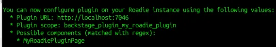

So we can go ahead and add the needed values directly into the form. The type of the component depends on how we have registered it into the plugin itself within the codebase. 

A good rule of thumb usually is that if it is a '`RoutableExtension`' it is going to be either Content or Page, if it is a '`ComponentExtension`' it is going to be a Card.   

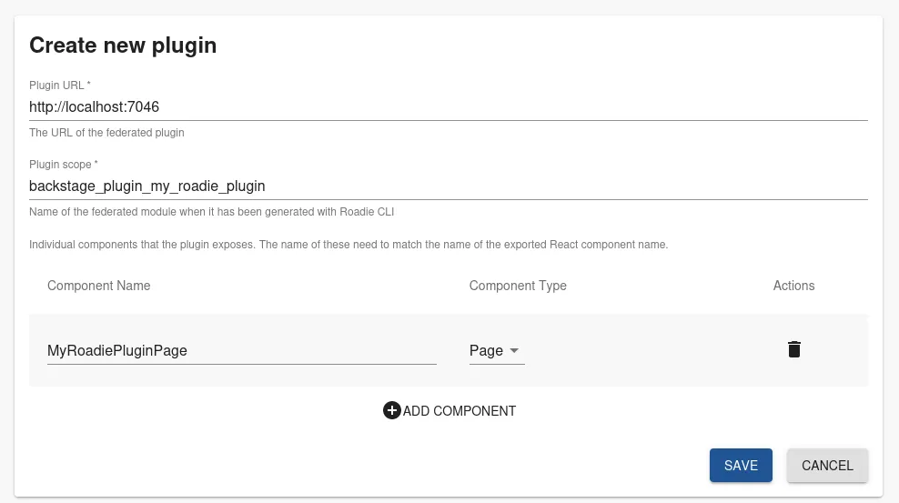

After we have clicked save, the plugin is ready to be used in the application.


#### 6. Configure your plugin component to be used

The plugin is now registered from your `localhost` and can be added to the application UI using the instruction defined in the [Updating the UI documentation](/docs/details/updating-the-ui/). While you can use the standard page or content components served from localhost in the main application side, that might not be the best user experience for other users of your Roadie instance. The plugin served from localhost is only visible to you!

We will set up this `Page` component using a [Sandbox mode](/docs/details/sandbox-mode/), so we can develop it further before [deploying a production ready version of it](/docs/custom-plugins/deploying/). 

Navigate to `Administration` -> `Sandbox` and click 'New Sandbox Page'. Within the form we will try to find the _plugin component_ we have just registered into the application. We give it a name and save it. When we click on the new sandbox page we have just added, we should see the default Backstage plugin welcome screen.

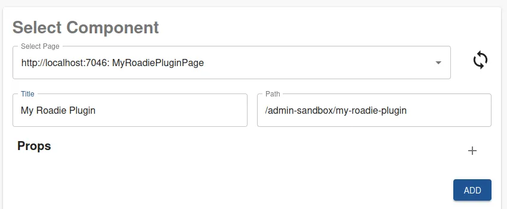

ℹ️ &nbsp; Note that you may need to refresh the page to have the needed plugin code available to you after registering and adding the plugin into the application. This needs to be done only once and not needed for other users, only the user who is registering and adding the plugins

ℹ️ &nbsp; If you are seeing 404s and errors on the network tab indicating that the javascript files for your plugin are not found, make sure that your development server is running and the plugin registration is pointing to the correct URL.

ℹ️ &nbsp; Plugin registration can only happen one at a time from a single URL. When developing locally it is useful to use different ports of the local dev server (one dev on `localhost:7046`, another one on `localhost:7046`). When using production ready, deployed plugins, the URL should be prefixed with different paths


#### Demo

You can see a demo of this approach in a quick video below.

`vimeo: https://vimeo.com/848745735`

## Next Steps

Getting started with plugin development is easy but where to go from here? 

* If you want to iterate on your plugin, learn how [to add functionality to your plugin using common APIs and patterns](/docs/custom-plugins/available-apis/).
* If you want to publish your plugin so others can use it, you can do so [by following the deployment documentation](/docs/custom-plugins/deploying/)
* If you want to secure connections from your plugin to third party service, [the easiest way to achieve it is with proxies](/docs/custom-plugins/connectivity/proxy/).
* If you are wondering how to connect safely to your internal infrastructure, [it is possible with a broker integration](/docs/integrations/broker/). There is also [a step-by-step example](/docs/custom-plugins/connectivity/broker/) how one would iterate on building a broker enabled plugin.
