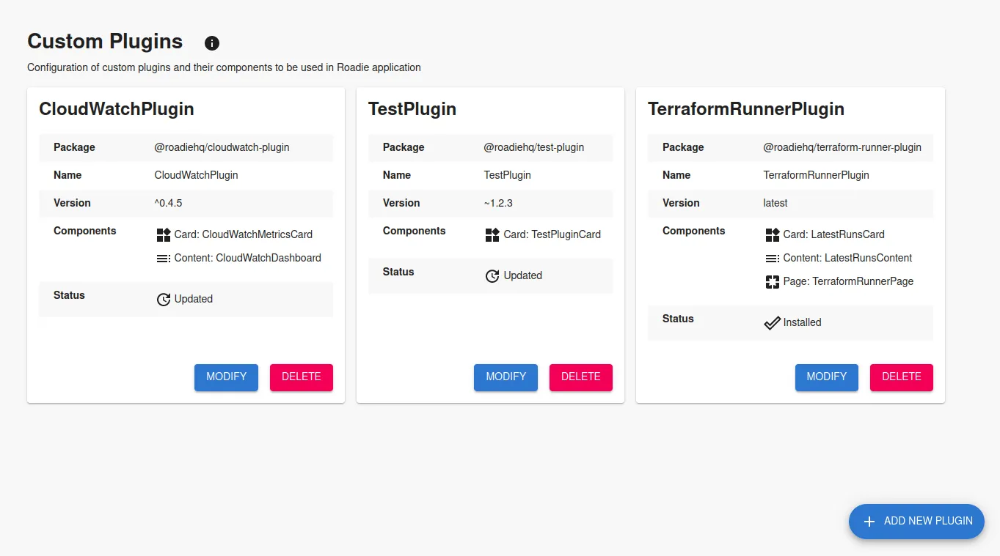
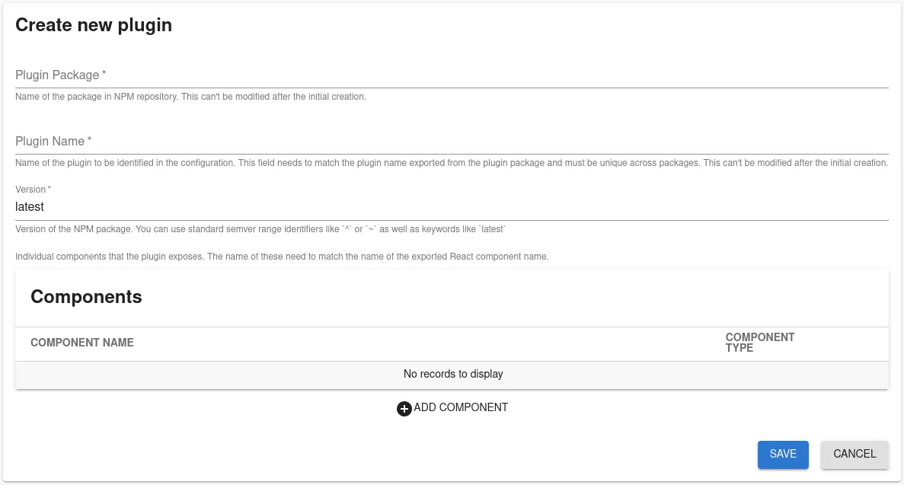
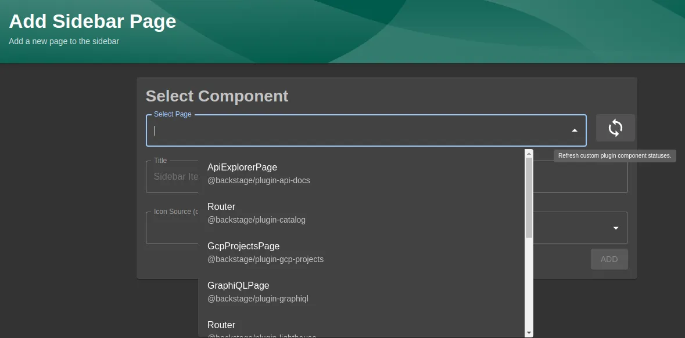

---

⚠️ We are soon deprecating legacy custom plugins pipeline. Take a look [at the documentation for current custom plugin method](/docs/custom-plugins/overview/) instead

---

## Introduction

Roadie supports all standard Backstage frontend plugin types that can be built using instructions defined in [Backstage documentation][backstage-plugin-documentation]. Your plugins can be published via npm or yarn, like publishing a normal package. We will provide you functionality to automatically add custom plugins from repositories to your Roadie instance.

If you would like to use our private hosted repository for your Roadie plugins, complete with automatic update workflow, you can follow instructions on [setting up private secure Artifactory for Roadie plugins.](/docs/custom-plugins/legacy/artifactory/)

## Prerequisites

Contact us to have the custom plugins feature enabled for your Roadie instance.

## Configuring a plugin for your Roadie instance

### Step 1. Create plugin definition in Roadie

You can navigate to h<gatsbyhack>tt</gatsbyhack>ps://your-company.roadie.so/administration/custom-plugins where you will find a collection of cards detailing custom plugins configured for the Roadie instance.

### Form

You can create a new custom plugin definition by clicking "Add New Plugin" floating button.

The required values are as follows:

##### **Package name**

Package field corresponds to the name of the NPM package. This can be a public NPM package hosted in npmjs.com or a private package securely hosted in Roadie Artifactory. If the package is hosted in Roadie Artifactory, the name of the package needs to start with `@<your-company>-roadie/`.

##### **Plugin name**

The name of the plugin. This field **needs to match the exported name of a component from the plugin entrypoint**. This will be used when adding components from the plugin to Roadie as Cards, Tabs or Pages.

##### **Plugin version**

Semantic versioning definition for the plugin to use. This can be defined with standard NPM semantic versioning range identifiers like `^` or `~`, as well as keywords like `latest`.

##### **Components**

List of components that the plugin exposes. These are defined as a type and name pair. The type is a piece of metadata which determines where the component can be inserted in the UI (e.g. Card, Page etc). The name needs to match the component name in code that is exported from the plugin package.

### Step 2. Installing

Custom plugins are installed when the application is rebuilt. This rebuilding phase and plugin installation happens on an external workflow. This workflow is triggered automatically when a new NPM package is published to private, secure Roadie Artifactory. To publish your plugin follow [these instructions](/docs/custom-plugins/legacy/artifactory/)

Application update process happens automatically after the workflow is triggered and has run successfully.

After the application has been updated you will have your custom plugins ready to be used in your Roadie instance. To synchronize the packaged application code and components that are set up to be used, you can refresh component statuses manually from the UI. This refresh functionality located next to the component list displayed when you are adding them to Roadie either as a Page, Tab or as a Card for to entity dashboard tabs.

## Additional information

Components from custom plugins are available in the list of dynamic
UI components with their current status within the application. To
refresh the status of these components from custom plugins you can
click the refresh icon next to the component selection dropdown. Below is a listing of component statuses that are displayed in the drop down list

### Component statuses

#### Pending

Plugin and its components have been configured in the application
but they are not yet usable. This status will be changed when the
application is rebuilt.

#### Pending Deletion

Component or plugin has been marked as deleted in the configuration.
All components and their related configuration will be removed in
the next refresh event.

#### Available

Component has been successfully installed in the application and can
be used as part of the UI.

### Notifications and logs

Build notifications are sent onto a Slack channel where you can see the time that the build took, as well as possible versions of the plugins that have been installed to your Roadie instance.

## Next Steps

- If you haven't already [publish your plugin](/docs/custom-plugins/legacy/artifactory/) to our artifactory.
- After a successful installation you will be able to [add components](/docs/details/updating-the-ui) from your custom plugin into the Roadie instance. Components can be added as Cards, Tabs or Pages into component pages or to the sidebar.

[backstage-plugin-documentation]: https://backstage.io/docs/plugins/create-a-plugin
