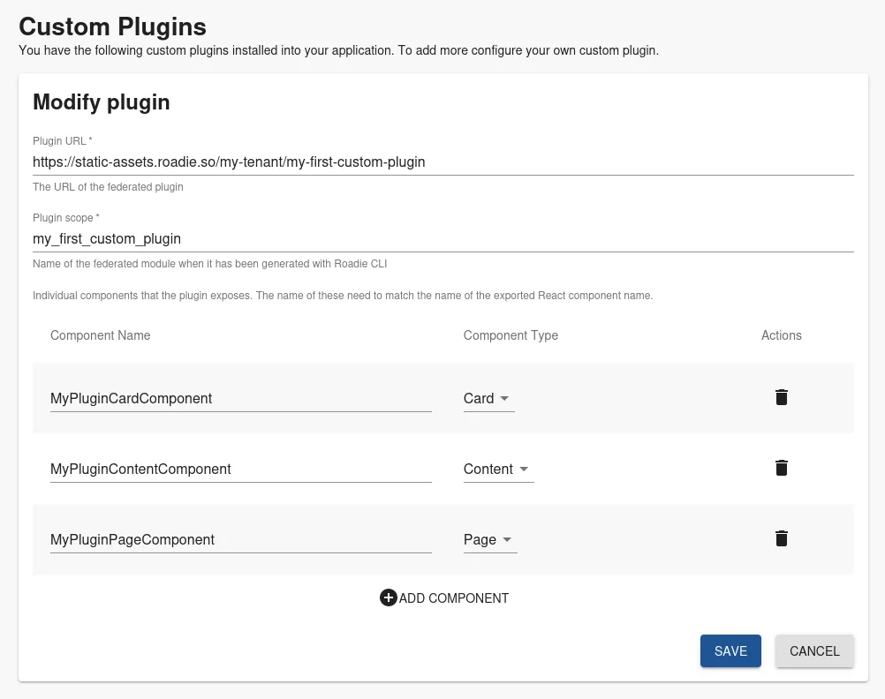
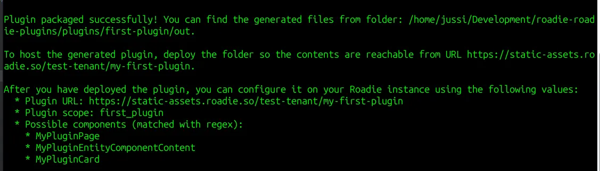

## Introduction

The Roadie CLI builds and packages plugins into a format that is immediately applicable to be registered on your Roadie instance. The CLI provides instructional output on a best-guess basis to help you with plugin registration. 

The components registered on the ‘Custom Plugins’ page are immediately available to be used (after reloading the page). To register plugins to the application you can in most cases use the instructions and output provided by Roadie CLI. 

## Registration Steps

1. Identify the URL where your plugin will be hosted.
   * In development mode this will usually be `http://localhost:7043`
   * If you are hosting the plugin on Roadie infrastructure, the URL will be similar to `https://static-assets.roadie.so/<tenant-name>/<your-plugin-name>`
2. Identify the 'scope' of the plugin. Scope is the name of the plugin normalized to a registration compatible form
3. Identify the components that your plugin exposes
   * These are usually the 'Component' or 'Routable' extensions that are registered in to the plugin
   * These are the exports that are exposed from your plugin entrypoint file, usually `index.ts`
4. Register the plugin on Custom Plugins page
   * Fill out the needed fields with the information gathered above



5. Update your Roadie instance with UI components available from the plugin
   * To add components you can follow the documentation [on how to update the UI](/docs/details/updating-the-ui/).
   * For development purposes it might be a good idea to use either [Sandbox mode](/docs/details/sandbox-mode/) (for Page plugin components) or [Preview entities](/docs/details/previewing-changes/) (for Card/Content components) while developing to have the least effect on other users of the system.

## Identifying correct values

Roadie CLI provides generated instructions on which values a particular build is exposing. 
Example command:

```bash
roadie plugin:build -l $PWD/ --output $PWD/out --host https://static-assets.roadie.so/test-tenant/my_first_plugin
```

Within this command we build a plugin from the folder we currently are (`$PWD`) and produces the output to `$PWD/out` folder. The URL of the plugin is defined as `https://static-assets.roadie.so/test-tenant/my_first_plugin`. 
The output of this build command is the following:


This output can be in most cases directly copied to your Roadie instance and used to register your plugin. 

---

⚠️ Note that the URL where the plugin is hosted _needs_ to match the URL that is defined during the build process.

---