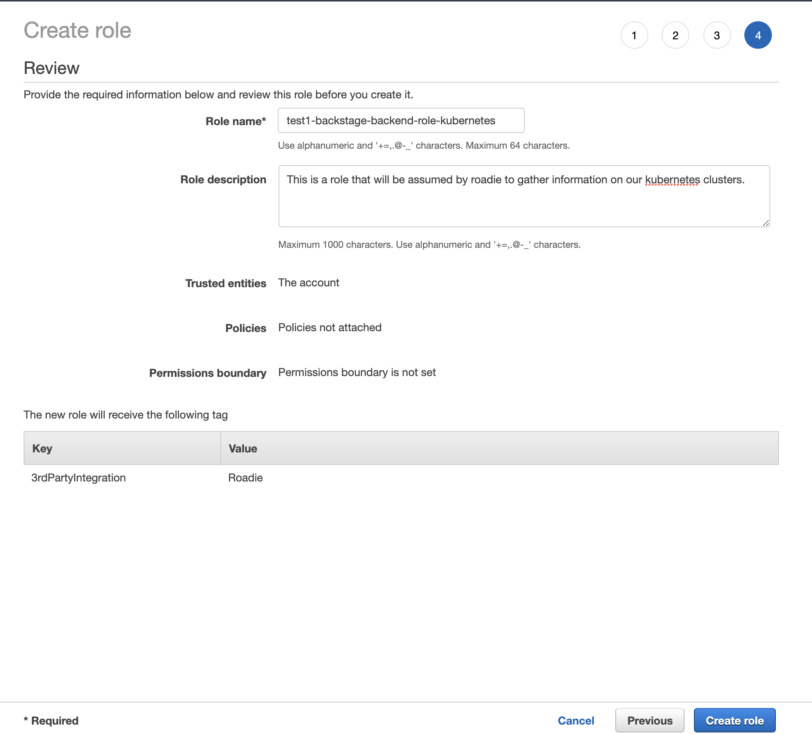
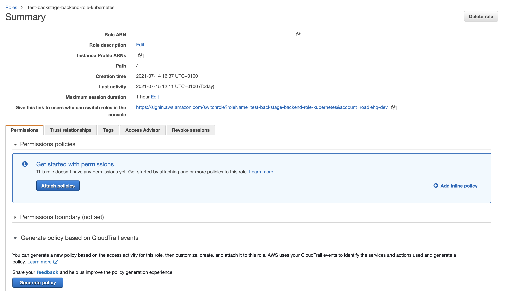

## Prerequisites

* The roadie account ID.
* The roadie backend role arn.
* (optional) An aws permissions policy name to associate with the role. 

## Introduction

You may want Roadie to be able to access AWS services such as EKS or S3 in your account. In order to do this you must 
provide us with an identity in your account which we can assume. We use roles for this purpose. This document will describe 
how to create such a role.

To learn more about the AWS concepts used below, you can read the following AWS documentation pages:

* [Assuming Role](https://docs.aws.amazon.com/STS/latest/APIReference/API_AssumeRole.html)
* [Cross Account Federation](https://docs.aws.amazon.com/IAM/latest/UserGuide/id_roles_common-scenarios_third-party.html)
* [Trust relationship](https://aws.amazon.com/en/blogs/security/how-to-use-trust-policies-with-iam-roles/)

## Step 1: Creating the cross account federation role

1. Sign into your AWS console and navigate to the [IAM service](https://console.aws.amazon.com/iam/home#/home).

2. Click on ”Role” link (this should be on the left handside of your screen).

3. Click on the ”Create Role” button.

4. Click on ”Another AWS Account” and add the account number on on the Kubernetes configuration page (in Roadie) and then click on ”Next: permissions”.


5. Click the checkbox beside "Require External ID" and enter some value. Make a note of this value as you'll need it later.

6. Attach any desired policies and click on ”Next”.  
   Note: You may not need to add any policies at this stage.
   Optional: Add a tag, Key: `3rdPartyIntegration` Value: `Roadie`

7. Click ”Next”

8. Enter a value for ”Role Name” (e.g. ”your-company-name-roadie-read-only-role”)

9. For the ”Role description” enter a description such as:

```
This is a role that will be assumed by Roadie to access AWS resources in this account.
```

10. 

11. It should look like this



10. Click ”Create role”. Your cross federation role is now created.

## Step 2: Restrict the new role trust relationships to Roadie only

1. Search for IAM in the services box and then click on ”Roles” on the left handside tab.

2. Search for your newly created role (e.g. ”your-company-name-roadie-read-only-role”) and click on it.

You should see a page like this



3. Click on ”Trust Relationships”, then ”Edit relationship” and add the text below filling in the values:

``` json
{
  "Version": "2012-10-17",
  "Statement": [
    {
      "Effect": "Allow",
      "Principal": {
        "AWS": [
          "<ROADIE ACCOUNT ID>"
        ]
      },
      "Action": "sts:AssumeRole",
      "Condition": {
        "StringEquals": {
          "sts:ExternalId": "<EXTERNAL ID AS CONFIGURED ABOVE>"
        },
        "StringLike": {
          "aws:PrincipalArn": [
            "<ROADIE BACKEND ROLE ARN>"
          ]
        }
      }
    }
  ]
}
```

4. Save the changes.
