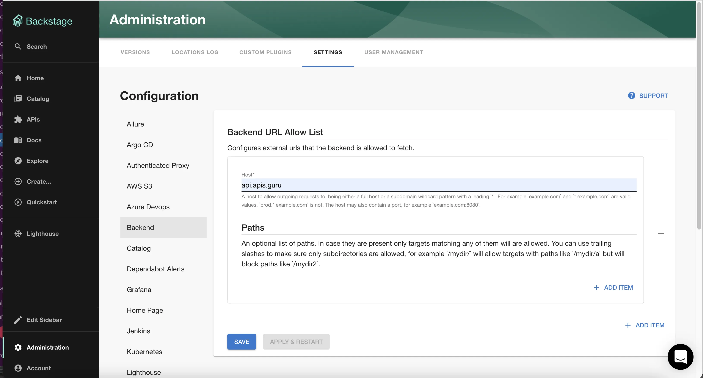

## Introduction

The Backstage backend restricts what resources can be fetched by default.
This guide describes how to configure this list. This would allow you to do something like
fetch a public API definition in a catalog info file.

By default only _.example.com and _.mozilla.org are allowed.

## Configuration

Navigate to `administration/backend` in Roadie you should be able to click "add item" then enter the hostname of
the resource you want to access in the host field and click "Save" then "Apply & restart".

If you want to restrict access further you can add a list of paths and only resources under those paths will be allowed.

## See Also

- [FetchUrlReader](https://backstage.io/docs/reference/backend-common.fetchurlreader#properties)
- [Substitutions In The Descriptor Format](https://backstage.io/docs/features/software-catalog/descriptor-format#substitutions-in-the-descriptor-format)
