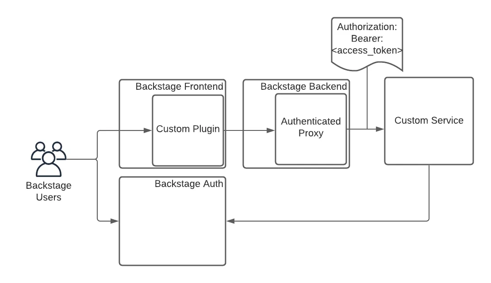
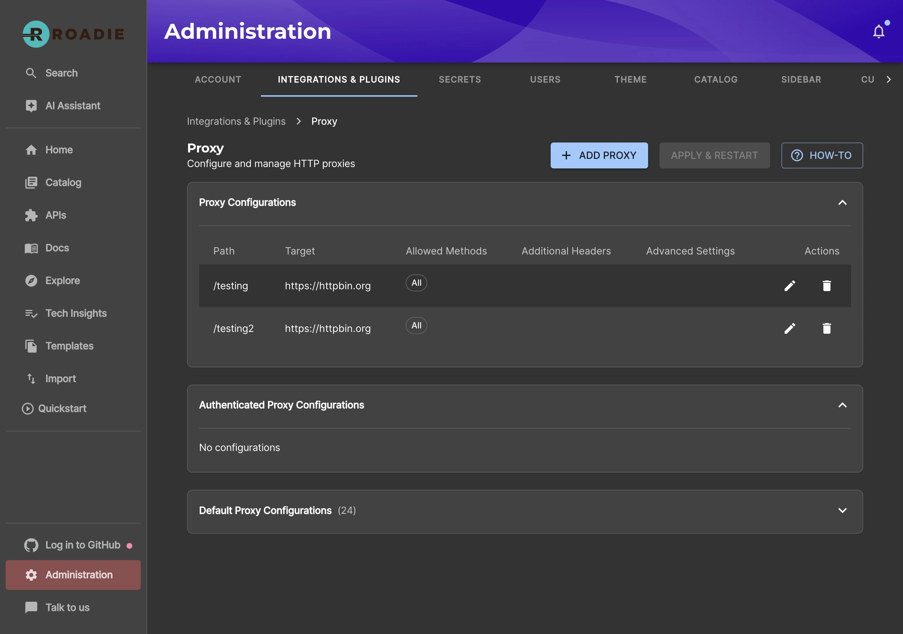
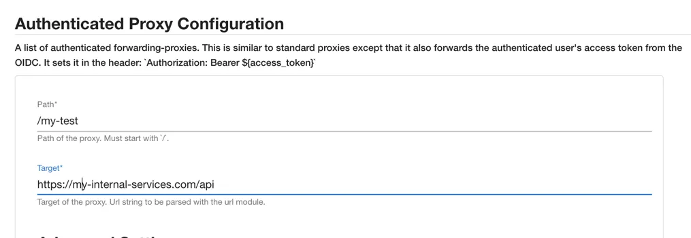
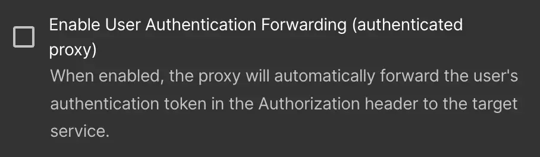

# Create a new Authenticated Proxy

Roadie provides a custom proxy service that can be configured to pass an access token for authentication by the service it is configured to send to.

This gives a custom plugin a way to interact with your own service. That service can authenticate the incoming requests from Roadie.



### Setup

#### Step 1. Configure the Proxy

You can navigate to /administration/settings/authenticatedProxy. Click add item to add a new proxy.



Enter a Path (e.g. `/my-api`) and a target API (e.g. `https://my-api.com/api`) as follows:



Click the "Enable User Authentication Forwarding" checkbox to create an authenticated proxy.



Click save and Apply and Restart and wait for the restart. It can take up to about two minutes for the change to be applied.

#### Step 2 Calling the API

You can call this API from the Roadie window context in a browser via a Custom Roadie plugin:

```javascript
fetch('/api/authenticated-proxy/my-api')
```

#### Step 3 Authenticate the Request

The API configured in the Authenticated proxy target will receive a token in the authorization header containing an access token. This token can be sent to the Roadie Authentication system to retrieve an id representing the logged in Roadie user.

```bash
curl --request GET \
  --url 'https://auth.roadie.io/userinfo' \
  --header 'Authorization: Bearer {ACCESS_TOKEN}' \
  --header 'Content-Type: application/json'
```

This will return the identity as follows:

```json
{
  "sub": "248289761003",
  "name": "John Doe",
  ...
  "updated_at": "1556845729"
}
```
