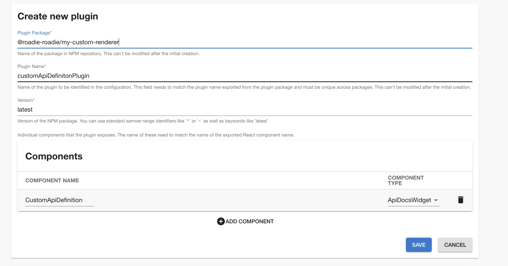
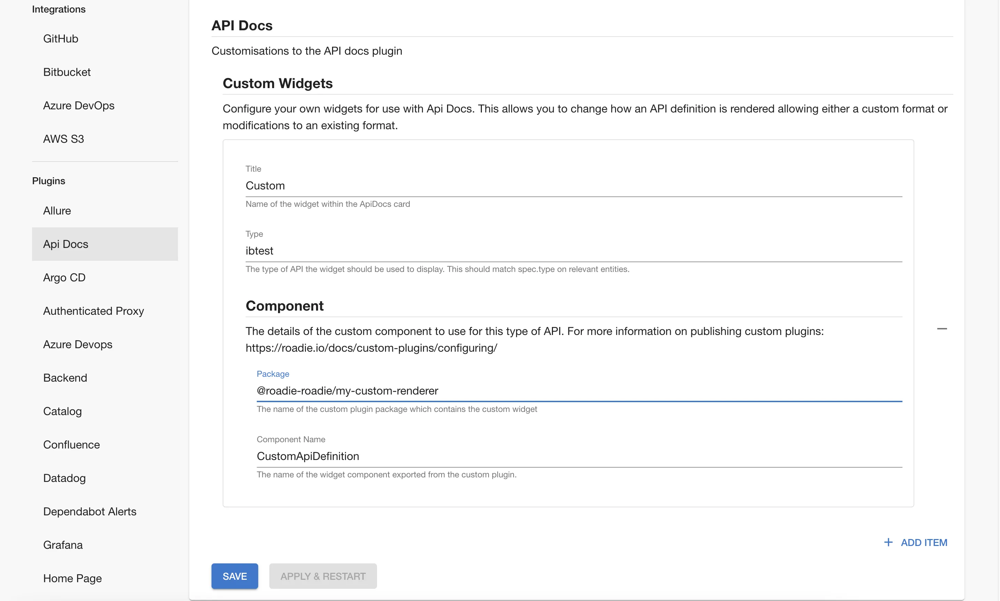

## Introduction

The API docs plugin supports user supplied renderers for API definitions. This page explains how you can configure such
a renderer in roadie.

## Prerequisites

- You must have custom plugins enabled for your tenant. Contact Roadie to enquire about this.

## Step 1: Write a custom renderer

A [custom API docs renderer](https://www.npmjs.com/package/@backstage/plugin-api-docs#custom-api-renderings) is a React
component which takes the API definition as a prop and renders it.

For example, the simplest custom renderer which just prefixes the definition would be something like this:

```typescript
import React from 'react';
import { Typography } from '@material-ui/core';

export const CustomApiDefinition = ({ definition }: { definition: string }) => (
  <Typography>Custom format: {definition}</Typography>
);
```

Ensure that the component is exported from the plugin:

```typescript
// src/index.ts
export { customApiDefinitionPlugin, CustomApiDefinition } from './plugin';
```

## Step 2: Configure your custom plugin

Navigate to the custom plugins page `/administration/custom-plugins` and click "Add new plugin". Then enter your plugin's
details.

- The plugin package should match the name in your plugin's package.json matching this convention `@<tenant-name>-roadie/<your plugin>`.
- The plugin name should be the name of the exported plugin variable (e.g. customApiDefinitionPlugin above)

Then click "Add Component" and set the type to ApiDocsWidget and the name to the name of the exported custom renderer
(e.g. CustomApiDefinition) and click "Save".



## Step 3: Publish your custom plugin

Read [the docs on custom plugins](/docs/custom-plugins/overview/) then build your package and publish to artifactory.

In a nutshell:

```
yarn tsc && yarn build && yarn version && yarn publish
```

## Step 4: Configure the renderer in settings

It is necessary to configure the type of entity the custom renderer applies to in settings at `/administration/settings/api-docs`.

First click "add item" then enter the custom renderer information.

- The type should match the `spec.type` field on API entities this should be used to render.
- The title is showed as the name of the format in the API docs card.
- The component is then specified and this should match the custom component registered in step #2
  (Caveat: it can take some time for a custom component to become available for use)


