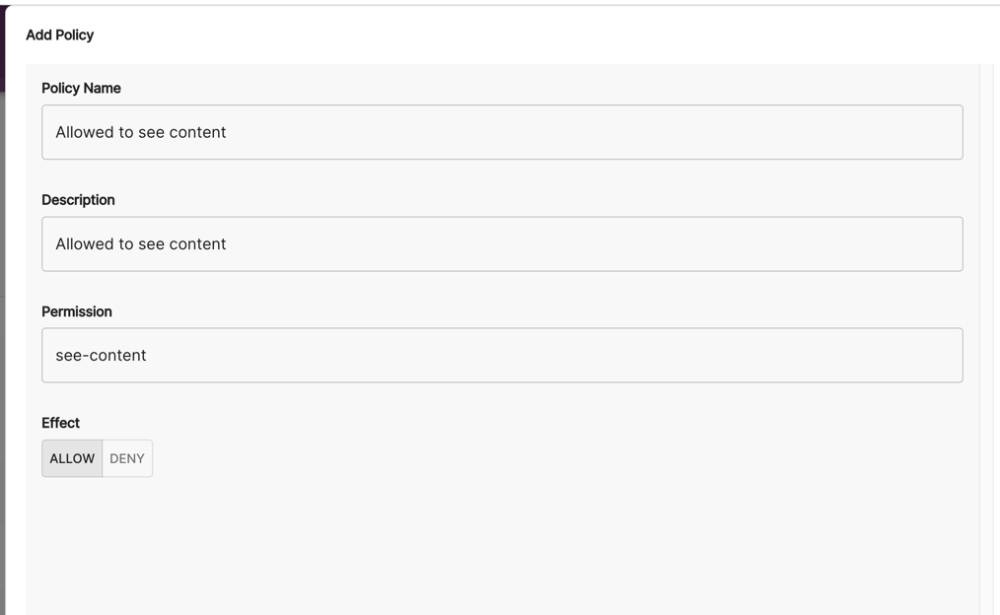

## Introduction

**This feature is part of a paid add-on. If you want access, please contact our support or sales teams.**

You can choose to make use of custom permissions in Roadie as part of a custom plugin. This tutorial assumes you have already created and published a [custom plugin](/docs/custom-plugins/overview/).

In order to make use of a custom permission:

1. Add `@backstage/plugin-permission-react` and `@backstage/plugin-permission-common` to the plugin's `package.json` file.

2. Add the following code to a React component.

```tsx
import React from 'react';
...
import { RequirePermission } from '@backstage/plugin-permission-react';
import { createPermission } from '@backstage/plugin-permission-common';

const permission = createPermission({
  name: 'see-content',
  attributes: {
    action: "read"
  }
});

export const ExampleComponent = () => (
  ...
  <RequirePermission permission={permission} errorPage={(
    <Typography variant="body1">
      Not allowed to see-content.
    </Typography>
  )}>
    <Typography variant="body1">
        Allowed to see content
    </Typography>
  </RequirePermission>
  ...
);
```

3. In the Roadie UI, click Administration > Settings > User Management > Policies and "Add Policy". Give the policy a name and description and set the permission to "see-content" as defined by the name in the code above and save.



4. Assign the Policy to a role.
