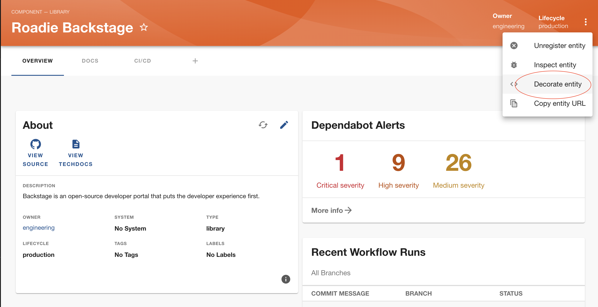
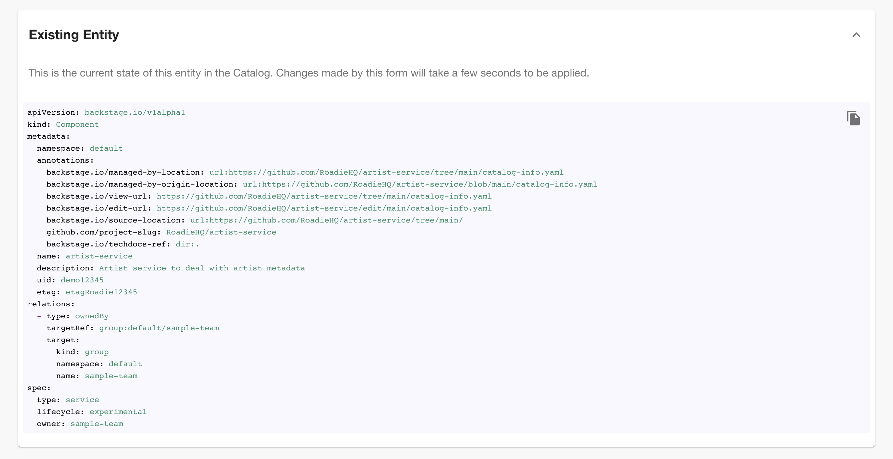
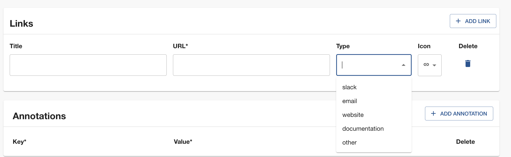
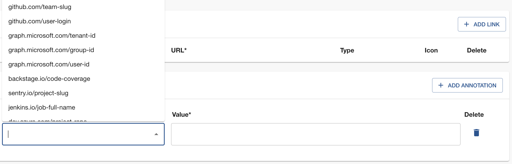
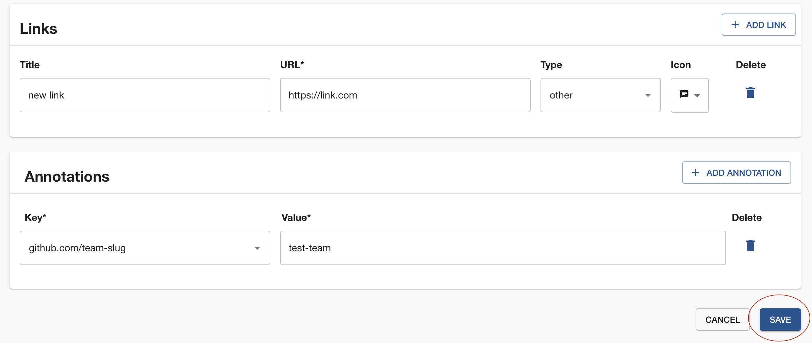

Components within the software catalog are structured around [metadata YAML files](https://backstage.io/docs/features/software-catalog/descriptor-format/) alongside the code, which are then collected and presented in Backstage for visualization. The source of truth for the components are mentioned YAML files, stored in source control such as GitHub, GitHub Enterprise, GitLab, Bitbucket, and others. 

Because the process of adding components to the catalog can be achieved through manual registration, creating new components within Backstage, or integrating with an external source, the catalog may often comprise components with different sources of data. Consequently, modifying these components can be challenging, as it involves making changes in multiple locations.

Idea behind component decorator is to provide an easy way to modify components in one place, through Backstage, and enhance usability for components used accross organization.

## Decorating components

In order to access the decorator page, navigate to component page and select 'Decorate entity' from kebab menu at top right corner:

This will navigate you to the page where you can decorate your component with links and annotations, without a need to manually edit YAML files in your version control system. All of this is done via UI, in specifically designated sections.

A visual representation of the YAML structure of the component, is shown in Existing Entity section of the page.

Adding links is done via 'Add link' button in 'Links' section. 

New link properties need to follow [link properties types](https://backstage.io/docs/features/software-catalog/descriptor-format#links-optional). Usually semantics of the type field are undefined, but we have added few predefined options you can select from a dropdown list.

Adding annotations is done via 'Add annotation' button in 'Annotations' section.

New annotation properties need to follow [annotation properties types](https://backstage.io/docs/features/software-catalog/descriptor-format#annotations-optional). 

You will find all existing annotations used in components across the catalog in a dropdown list.

When you are happy with added annotations and/or links simply click 'Save' button and you will shortly see you changes.

<b> Please note, all of the changes are kept and displayed in your Backstage instance, but YAML files in version control system remain intact. </b>