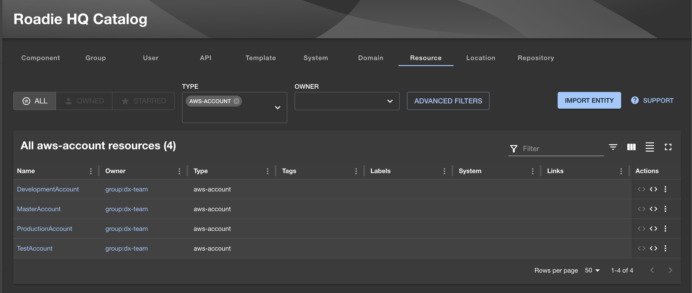

# Catalog your AWS accounts

In this tutorial we are going to show you how to ingest your organization's AWS accounts into your Roadie catalog as Resource entities. For this we will use Roadie's Entity Push API. You can check out the API docs [here](/docs/api/catalog/) in the Roadie Provider section.

## Authentication

First to be able to use the Roadie entity push API we will need to get an authentication token. You can generate your own token by going to the `Administration` -> `Account` (`/administration/account`) page. Here go to the `Roadie API Access` section. Give a name to your token and press the `GENERATE TOKEN` button.
Make sure you copy your token and put it in a secure place.
You can test out your token by hitting the api. For example:

```bash
curl \
  -X GET \
  -H 'Accept: application/json' \
  -H "Authorization: bearer ${ROADIE_API_TOKEN}" \
  https://api.roadie.so/api/catalog/entities
```

## Fetch your AWS accounts

Using the AWS CLI make sure you have it setup and configured. You can read more [here](https://docs.aws.amazon.com/cli/v1/userguide/cli-chap-welcome.html)

```bash
aws organizations list-accounts
```

<details>
<summary>Errors</summary>

If you encounter the following error make sure you have the proper permissions configured for yourself and check if you are using your correct AWS_PROFILE

`An error occurred (AccessDeniedException) when calling the ListAccounts operation: You don't have permissions to access this resource.`

</details>

This will result in a response like

```json
{
  "Accounts": [
    {
      "Arn": "arn:aws:organizations::111111111111:account/o-exampleorgid/111111111111",
      "JoinedMethod": "INVITED",
      "JoinedTimestamp": 1481830215.45,
      "Id": "111111111111",
      "Name": "Master Account",
      "Email": "bill@example.com",
      "Status": "ACTIVE"
    },
    {
      "Arn": "arn:aws:organizations::111111111111:account/o-exampleorgid/222222222222",
      "JoinedMethod": "INVITED",
      "JoinedTimestamp": 1481835741.044,
      "Id": "222222222222",
      "Name": "Production Account",
      "Email": "alice@example.com",
      "Status": "ACTIVE"
    },
    {
      "Arn": "arn:aws:organizations::111111111111:account/o-exampleorgid/333333333333",
      "JoinedMethod": "INVITED",
      "JoinedTimestamp": 1481835795.536,
      "Id": "333333333333",
      "Name": "Development Account",
      "Email": "juan@example.com",
      "Status": "ACTIVE"
    },
    {
      "Arn": "arn:aws:organizations::111111111111:account/o-exampleorgid/444444444444",
      "JoinedMethod": "INVITED",
      "JoinedTimestamp": 1481835812.143,
      "Id": "444444444444",
      "Name": "Test Account",
      "Email": "anika@example.com",
      "Status": "ACTIVE"
    }
  ]
}
```

Now you can use either this list directly and send the data into the Roadie catalog via your preferred way, using plain curl or any programming language you prefer. In the next section I'll show you a full example with nodejs

### Listing the accounts and sending the entities to Roadie

- We will use the official AWS javascript SDK. Make sure you have it available in your system
- Make sure you have your `ROADIE_API_TOKEN` available in your shell
- Make sure you are authenticated towards your AWS.
- Make sure you are using your correct `AWS_PROFILE`

We are going to fetch the available AWS accounts then pick the data we want to put on the Resource entities and finally send these into Roadie. We are going to use the `PUT /api/catalog/roadie-entities/sets/${setId}` endpoint. Provide a set id something descriptive. This provides the ability to issue subsequent requests towards the same set id and it will update all of the entities provided in the request body. This performs a full mutation, every entity in the set will be replaced by the new incoming entities in the new requests.

If you would like to remove some of the entities provided in these set you will need to issue a new request without the entity you want to delete, so the whole set will be replaced by the new array of entities you send to Roadie.

```bash
npm i @aws-sdk/client-organizations
```

In this example I'll use the native node:https package, this can be substituted by your preferred way of making an http request. (axios, node-fetch, etc..)

```js
const https = require('node:https');
const { OrganizationsClient, ListAccountsCommand } = require('@aws-sdk/client-organizations');

const client = new OrganizationsClient();

const command = new ListAccountsCommand({});
const response = client.send(command);

response.then((r) => {
  const accounts = r.Accounts;

  if (!accounts) {
    throw new Error('No AWS Accounts found');
  }

  const templateResourceEntity = ({ name, arn }) => ({
    apiVersion: 'backstage.io/v1alpha1',
    kind: 'Resource',
    metadata: {
      name,
      description: 'AWS accounts',
      annotations: {
        'aws-account/arn': arn,
      },
    },
    spec: {
      owner: 'dx-team',
      type: 'aws-account',
    },
  });

  const entities = accounts.map((a) => templateResourceEntity({ name: a.Name, arn: a.Arn }));

  for (entity of entities) {
    const body = JSON.stringify(entity);
    const req = https.request(
      {
        hostname: 'api.roadie.so',
        port: 443,
        path: '/api/catalog/roadie-entities/sets/aws-accounts',
        method: 'PUT',
        headers: {
          'Content-Type': 'application/json',
          'Content-Length': Buffer.byteLength(body),
          Authorization: `bearer ${process.env.ROADIE_API_TOKEN}`,
        },
      },
      (res) => {
        res.on('data', (chunk) => {
          console.log(chunk);
        });
      }
    );
    req.on('error', (e) => {
      console.log(e);
    });
    req.write(body);

    req.end();
  }
});
```

You will see the following response body on a successfull request:

```json
{
  "id": "a438bfd2-ff4c-4c82-bcec-c18115e6779b",
  "entity": {
    "kind": "Resource",
    "spec": { "type": "aws-account", "owner": "dx-team" },
    "metadata": {
      "name": "Development Account",
      "annotations": {
        "aws-account/arn": "arn:aws:organizations::111111111111:account/o-exampleorgid/333333333333",
        "backstage.io/managed-by-location": "roadie-api:/api/catalog/roadie-entities/entities/by-ref/resource%3Adefault%2Fdevelopment%20account",
        "backstage.io/managed-by-origin-location": "roadie-api:/api/catalog/roadie-entities/entities"
      },
      "description": "AWS accounts"
    },
    "apiVersion": "backstage.io/v1alpha1"
  },
  "entityRef": "resource:default/development account",
  "rawData": "resource:default/development account",
  "set": null,
  "updatedBy": "user:default/bob",
  "source": "api-entity",
  "updatedAt": "2024-02-15T13:31:20.718+00:00"
}
```

Go to your catalog page (`Catalog` -> `Resource`) and you will immedietly see these `Resource` entities in your catalog.


## Keep it syncing

To continuesly update your catalog with the changes in your AWS accounts you will need to run this script on a schedule. I advise you to use your organization's best practice to run these scheduled jobs.

Regardless how it will run you will need to be sure that environment has the correct tokens to be able to fetch from your organization's AWS and to be able to push to your Roadie api. Do not forget to configure your `ROADIE_API_TOKEN` and your `AWS_PROFILE`
