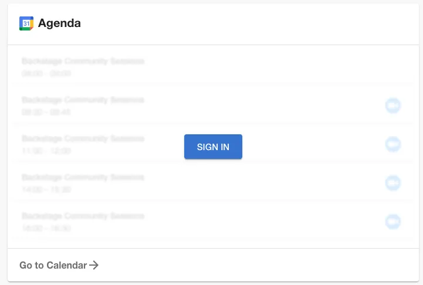
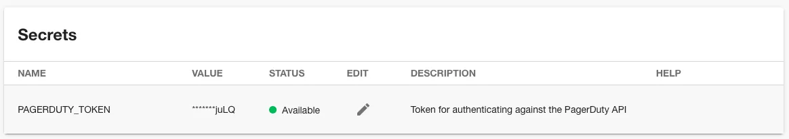
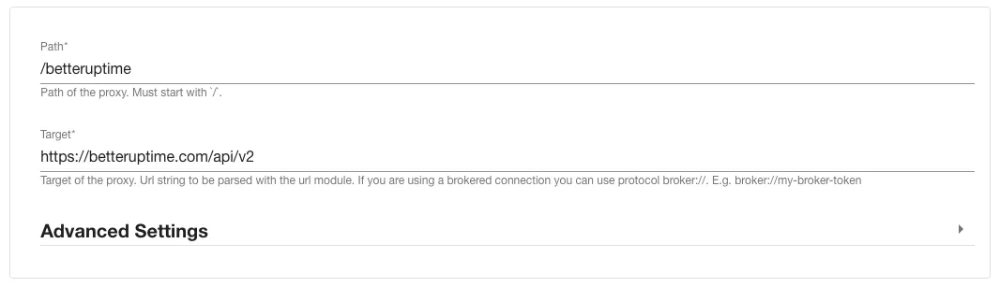
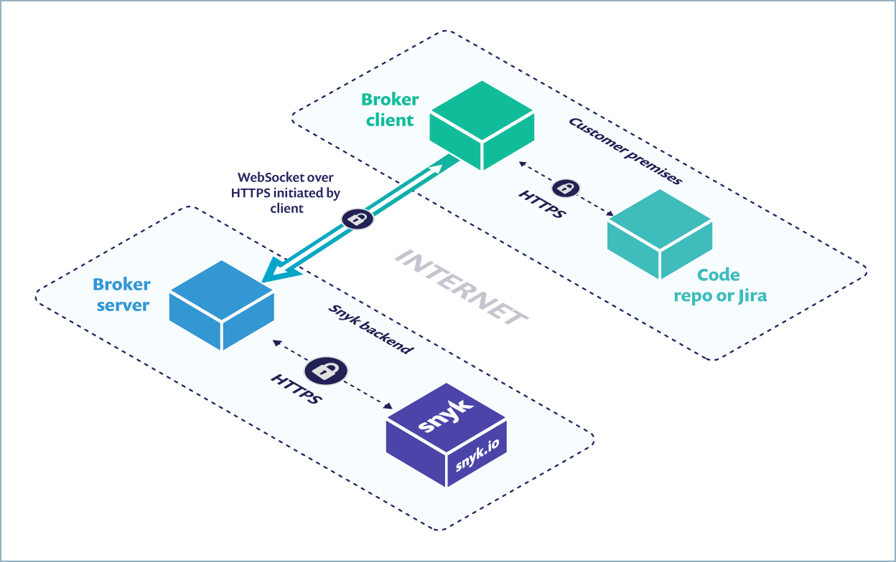
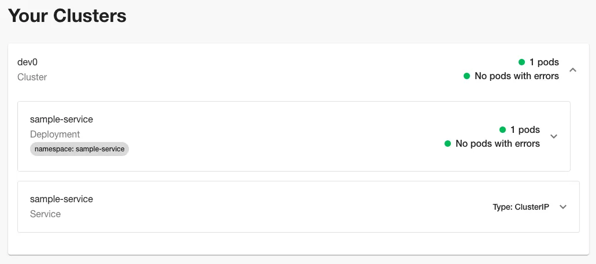
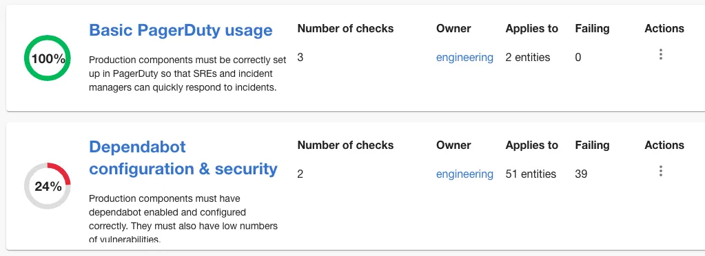
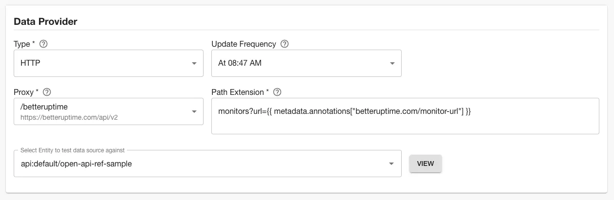
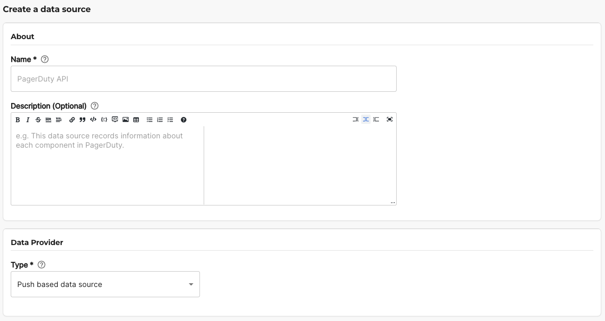

## Introduction

In order to add the most value, Backstage requires connections into most of the software used in your delivery pipeline.

Roadie is a SaaS provider of Backstage, so we’ve invested deeply into providing simple and secure ways to connect our platform to your tools, regardless of where they are hosted.

There are multiple ways to establish connections, including Oauth2, proxying, and by using a broker service. This article explains each option, and lays out the situations in which each would be used.

## Connecting to SaaS software

Many Backstage plugins connect from Roadie to a third-party SaaS solution (think of PagerDuty or Datadog) to display data inside the Backstage developer portal.

The two best ways to establish a connection are Oauth2 and proxying.

### Option 1: Oauth2

With Oauth2, the user makes a direct connection from the plugin running in their browser, to the APIs of the SaaS solution.

For example, the [Google Calendar plugin](/docs/integrations/gcalendar/) uses an Oauth2 connection to communicate with the Google APIs. A user who has not authenticated will see a prompt asking them to sign in.

Clicking “SIGN IN” will open a dialog box which asks the user which Google account they want to sign in with. Once the user accepts the prompts, the authentication handshake is completed, and their calendar appears inside Roadie.

This connection is between Google and the user’s browser directly. No information about the user’s calendar is shared with Roadie during this process.

### Option 2: The Proxy

The proxy runs on the Roadie backend. It accepts incoming requests, modifies them — usually to add authentication headers — and forwards them on to a third-party SaaS API.

The proxy code lives in the [proxy-backend plugin](https://github.com/backstage/backstage/tree/master/plugins/proxy-backend) in the Backstage OSS project. Under the hood, Backstage delegates proxying responsibilities to the popular and battle-tested [http-proxy-middleware](https://github.com/chimurai/http-proxy-middleware) package.

The [Backstage PagerDuty plugin](/docs/integrations/pagerduty/) is an example of a plugin which relies on the proxy to connect to the PagerDuty APIs.

Roadie users must obtain an API token for the PagerDuty APIs. They then store this token in Roadie’s secrets page. These tokens are stored in AWS’s Parameter Store product, encrypted with a per-tenant KMS key.

Once the API token secret is set, the proxy will automatically add it to API requests that the PagerDuty plugin sends.

Roadie comes with more than 15 pre-configured proxies, including ones for PagerDuty, CircleCI and Jira. Additionally, Roadie customers can create their own proxies for other third-party products or even for their own bespoke APIs. Here’s an example of a proxy I created for the monitoring tool BetterUptime.

By using proxies, Roadie can securely connect to any token authenticated API which is publicly accessible on the internet.

## Connecting to internal software

Of course, not all tools are SaaS. Some run on-prem within the customer’s network. This is a common setup for security tools like SonarQube, and for infrastructure solutions like Kubernetes. Other infrastructure might be hosted by AWS or Google Cloud, within the customers AWS or Google account.

Regardless of the setup, Roadie can also securely connect to software that runs inside the customer’s network or their cloud account.

### Option 1: Internet Public APIs

Some bespoke customer APIs are exposed on the public internet. If this is the case, the API functions just like a SaaS solution, and the methods discussed above (Oauth2 and proxying) will work.

If it is not possible to expose the bespoke API to the entire public internet, it may be possible to open it up to Roadie IP addresses only. That way, connections can only be made from a specific small set of originating IPs. Our docs contain the [list of originating IPs and hostnames we use](/docs/details/allowlisting-roadie-traffic/). You can likely work with your IT team to allow traffic from these origins.

### Option 2: The broker

For APIs which are only available on the customer’s internal network, we use a broker service to connect securely.

The broker is a Node.js service that you run inside your infrastructure to provide a secure tunnel for Roadie traffic. It was originally created by dev-first security company, **[Snyk](https://docs.snyk.io/features/snyk-broker/broker-introduction)**. The code is open-source. We are actively using it with existing customers for Kubernetes API access and other Backstage and Roadie plugins. You don’t need to be a Snyk user to use the broker.

_Image credit: snyk.com_

The benefits of the broker include:

- You can allow list what Roadie can access using a config file. By default, Roadie has no access to any internal APIs.
- Any tokens for the internal endpoints stay in the customer infrastructure. They are not shared with Roadie.
- The broker maintains an audit log of what we access.
- The connection is established outbound from the customer side. We cannot re-establish the connection on our own if the customer kills it.

You can read more about the [broker in the Snyk docs](https://docs.snyk.io/snyk-admin/snyk-broker). Roadie also publishes specific documentation for [configuring and using the broker](/docs/integrations/broker/).

### Option 3: AWS Roles

The [Backstage Kubernetes plugin](/docs/integrations/kubernetes/) can help teams answer questions like “how many pods of my service are running in each cluster and are they healthy?”.

It can use a cross-account AWS role to securely connect to Elastic Kubernetes Service (EKS) clusters. The cross-account AWS role is the approach recommended by AWS for this type of access

To learn how to set up a cross-account role, [see our documentation](/docs/integrations/kubernetes/#aws-eks).

## What about custom plugins?

Roadie allows Growth Plan customers to [write their own native Backstage frontend plugins](/docs/custom-plugins/overview/) and use them on our platform. These plugins frequently need to connect back to the customer network in order to load data from internal systems.

If the customer’s systems are exposed on the public internet and protected by either Oauth2 or token authentication, then the Oauth2 and proxy methodologies discussed above will work for securely loading data.

If the customer’s systems are not exposed on the public internet, then the broker can be used to connect to them from within the customer’s internal networks.

## What about Tech Insights?

[Tech Insights](/docs/tech-insights/introduction/) is Roadie’s scorecarding product. It allows customers to create maturity scorecards and apply them to software which is cataloged in Backstage.

In order to be most valuable, Tech Insights must connect to the APIs of both third-party SaaS software, source code management tools like GitHub, and internal customer APIs.

The primary methods it uses to do this are the proxy, and the broker. In future, we will also support customers who wish to push Tech Insights data directly to the Roadie API.

### Option 1: The proxy for public APIs

Tech Insights works in conjunction with the proxy to upgrade requests with authentication tokens and other settings. For example, this Tech Insights data source uses the BetterUptime proxy mentioned above to send token-authenticated requests to the BetterUptime API.

All of the preconfigured Roadie proxies can be used with Tech Insights, as well as any customer-created proxies.

### Option 2: The broker for private APIs

The proxy works well for connecting Tech Insights to APIs which are available on the public internet, but it cannot connect to private, internal APIs.

For this, we use the broker to securely send Tech Insights requests into customer networks to communicate with private APIs.

This way, customers get all of the reporting and automation power of Tech Insights, without exposing APIs externally.

### Option 3: Push to the API

Of course, sometimes you want to collect or compute data internally, before sending it to Roadie’s scorecarding product for display.

For example, you may wish to compute whether or not SLOs are being met by each service. That would require calculating based your own definition of what it means to meet an SLO. This type of computation is better done under the full control of the customer.

To support this, the "Push based data source" provides you with an API endpoint you can use to push data into Tech Insights.

# Bonus: How your tools connect to Roadie

Of course, getting data into Roadie is only half the battle. Once Roadie has a catalog of your software, it can be useful to send this data into other tools, like deployment or reporting tools.

To support this, we provide all Growth Plan customers with [API access](/docs/api/authorization/).

# The bottom line

Roadie may be SaaS software, but by providing a number of secure connection points and options, we can replicate the experience and richness of self-hosted Backstage, without you needing to deploy it internally.
