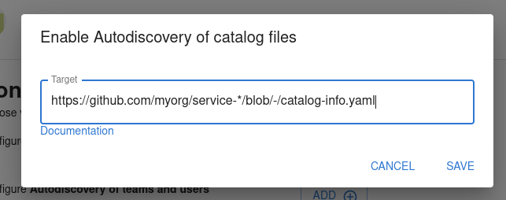
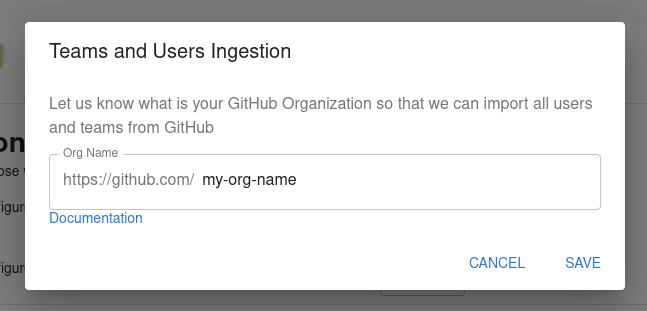
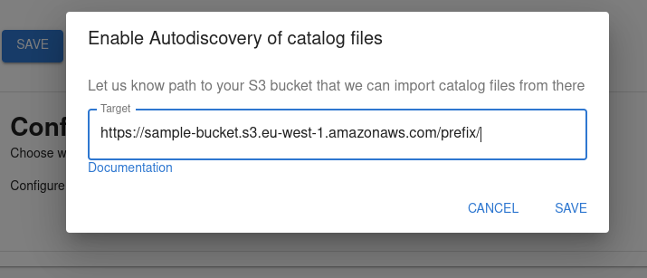
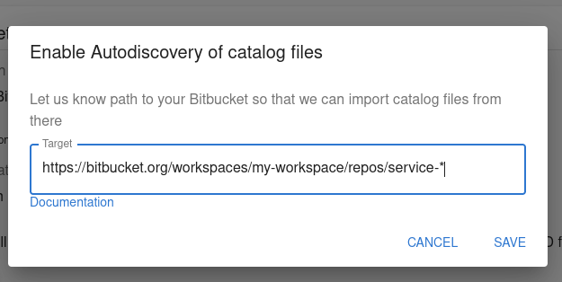
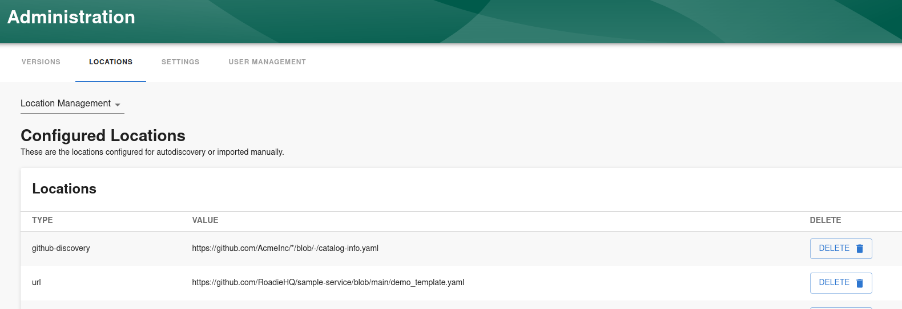

## Introduction

The Backstage catalog uses location entities to point to external sources which define entities.
The catalog backend will periodically retrieve information about each location and check for any updates to the entities
defined there.

Autodiscovery is the mechanism to define patterns pointing to filenames in URLs that should be queried for entity files.

For more information about locations and troubleshooting Catalog ingestion issues you can take a look at the [catalog troubleshooting documentation](/docs/details/troubleshooting-the-catalog)

## Setting up autodiscovery

Roadie supports autodiscovery for integrations configured in the application. The configuration of an autodiscovery entry can be done at the same time as integration is configured to start automatic polling of entities. You can navigate to `https://<your-tenant>.roadie.so/administration/settings/` to find configuration options for each supported autodiscovery target

### GitHub Autodiscovery and Organization Autodiscovery

GitHub integration for Roadie provides two autodiscovery targets, entities and teams/groups. 

The GitHub *autodiscovery* integration can be configured to automatically discover catalog entities from a provided configured path pointing to GitHub. 

More information about possible patterns and examples of URLs can be found from the [Backstage GitHub Discovery documentation.](https://backstage.io/docs/integrations/github/discovery#configuration)

The GitHub *organization* integration provides the possibility to automatically import GitHub users and teams/groups from an organization. You can configure this discovery type by providing the name of the GitHub organization. Note that the GitHub app needs to be installed for that organization and needs to have permissions to access user info.

### AWS S3 Autodiscovery

AWS S3 autodiscovery can be configured to download catalog files from an S3 bucket. For this to be functionality the [integration configuration for AWS S3](/docs/integrations/aws-s3) must be done. S3 autodiscovery does not support wildcard path, it must point to a specific prefix of an S3 bucket.

### Bitbucket Autodiscovery

Bitbucket autodiscovery works similarly to GitHub discovery. It can be configured to use glob patterns to find individual files with a specific file name pattern. To get a working autodiscovery with Bitbucket, a configuration of Bitbucket Integration must be defined. Documentation on how to set up the integration can be found from [here](https://backstage.io/docs/integrations/bitbucket/discovery).

More information about possible patterns and examples of URLs can be found from the [Backstage Bitbucket Integration documentation.](https://backstage.io/docs/integrations/bitbucket/discovery)

## Managing Locations

A list of all configured locations is located in URL `https://<your-tenant>.roadie.so/administration/locations/management`. 

The list contains an entry for all locations added as an autodiscovery configuration within each integration, as well as locations imported using the Catalog Import functionality within  `https://<your-tenant>.roadie.so/catalog-import`. 

Note that deleting a location via the administration UI (either at the location management page or at the individual integration page) does not automatically remove individual entities that have been found from that location. If the desired effect is to remove all items from a particular location, it is better to find that location via the catalog and[ unregister it from there.](/docs/details/unregister-components)

## Further reading

1. The [official Integrations documentation](https://backstage.io/docs/integrations/).
