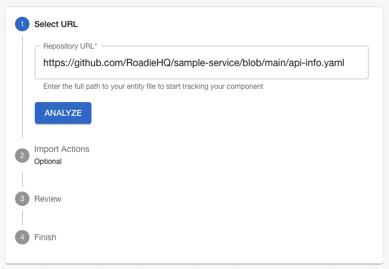
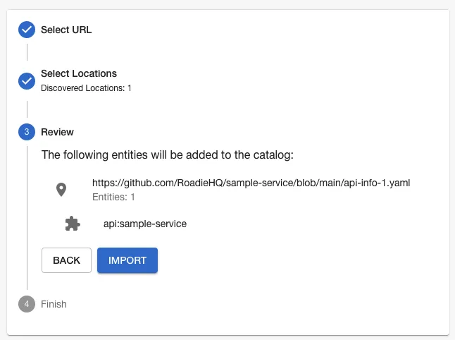
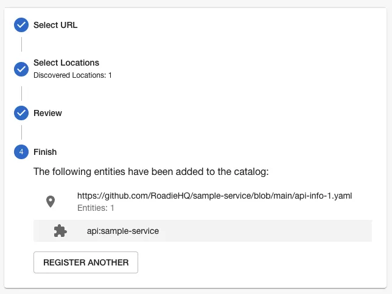
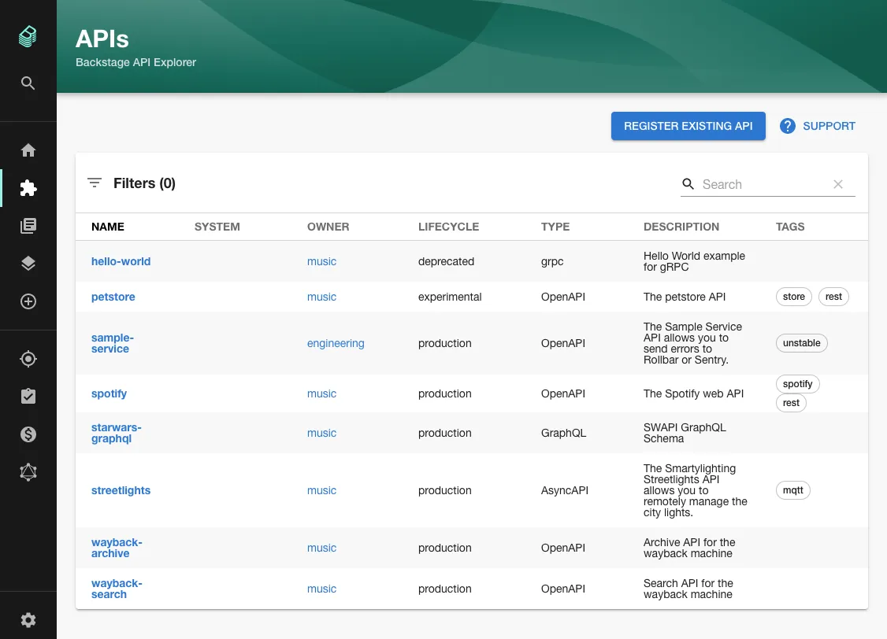
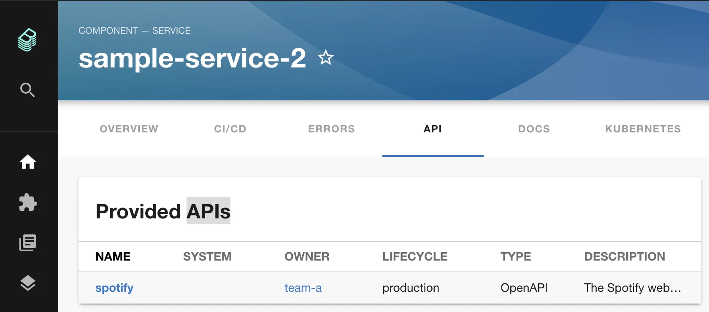
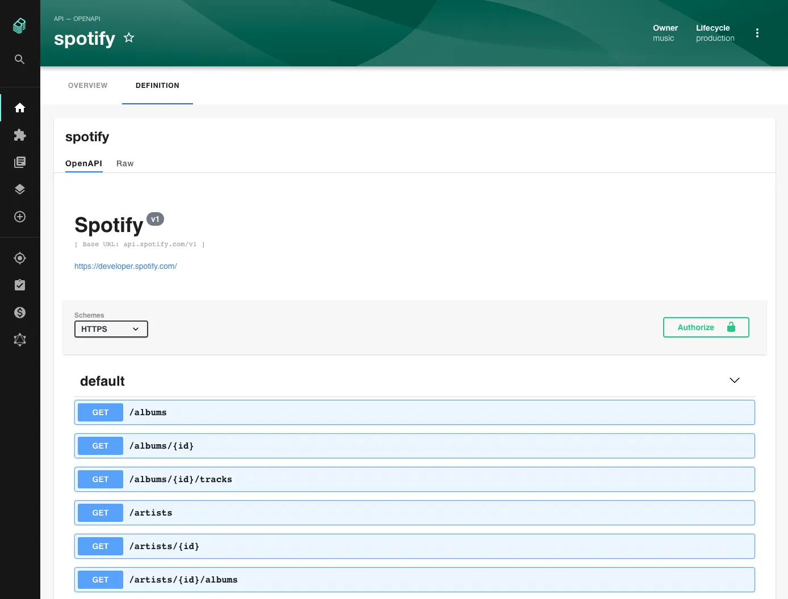

> **_NOTE:_** To fully utilize the unfurling of all of your $ref's in your openapi specs please replace your old `$text`resolver usages inside your API kinds with the type openapi to the new `$openapi` or `$asyncapi` resolver

<details>
<summary>Diff</summary>

```diff
apiVersion: backstage.io/v1alpha1
kind: API
metadata:
  name: apis-guru
  description: The apis.guru REST API
spec:
  type: openapi
  lifecycle: production
  owner: user:guest
  definition:
-    $text: https://api.apis.guru/v2/openapi.yaml
+    $openapi: https://api.apis.guru/v2/openapi.yaml
```

If your OpenAPI specs are located in the same repository as the catalog metadata file, you also need to additionally tell the `$openapi` resolver the basepath where to find files from. You can do that by adding an annotation like below:

```yaml
annotations:
  openapi/ref-basepath: ./
```

</details>

NB: You can also use `$openapi` or `$asyncapi` as the resolver - they are aliases for the same parser.

## Introduction

The Open API spec support of Backstage allows users to look up and read the OpenAPI specs of services in the catalog.

Creating Open API specs is outside the scope of this documentation. Please see the [Swagger OpenAPI Getting Started Guide](https://swagger.io/tools/open-source/getting-started/) for more information on writing OpenAPI specs.

## Pre-requisites

Before starting this guide, please...

1.  Prepare an OpenAPI spec to use. Alternatively, you can use one of the [APIs listed on APIs Guru](https://apis.guru/browse-apis/). In the examples below, we will use the [APIs Guru's openapi spec](https://api.apis.guru/v2/openapi.yaml). Make sure you add `*.apis.guru` to your [allowlist](/docs/details/backend-reading-allow-list).
2.  Understand how entities are added to Backstage via YAML definitions. Please read the [Adding Components Guide](/docs/getting-started/adding-a-catalog-item/) to learn more.
3.  Track a component in Backstage so we can add an API spec to it.

## Adding an OpenAPI spec to a component

### Step 1: Create an API kind

Create a YAML file called `api-info.yaml` in the root of your component, alongside your code. This file will represent your API inside Backstage.

```yaml
apiVersion: backstage.io/v1alpha1
kind: API
metadata:
  name: apis-guru
  description: The apis.guru REST API
spec:
  type: openapi
  lifecycle: production
  owner: user:guest
  definition:
    $openapi: https://api.apis.guru/v2/openapi.yaml
```

The `API` kind can take many of the normal `spec` properties such as `owner` and `lifecycle`.

The `spec.definition.$openapi` property can point to a remote URL or it can be a relative path to the spec next to the API entity i.e. `./avro/internal/SomeEvent.yaml`.

_Note that if you are hosting your OpenAPI specs in GitHub and referencing them with the $openapi property, the link must point to the URL starting with `https://github.com` and not `https://raw.githubusercontent.com`._

If you want to connect towards internal specs via [the broker connection](../../integrations/broker/index.md), you can use the protocol `broker://` to do that. For example:

```
spec:
  definition:
    $text: broker://<my-broker-token>/my-open-api-spec.json
```

### Step 2: Add the API to Backstage

Once this YAML file is committed and available on GitHub, you can make Roadie Backstage aware of it using the catalog importer.

Copy the URL of the YAML spec on GitHub, paste it into the catalog importer at `https://<tenant-name>.roadie.so/import/entity` and click Analyze.



Review the action the importer is going to take, then press Import.



Click the name of the API to view it in Backstage.



You should also be able to view your API in the list of APIs Backstage tracks by clicking the "APIs" item in the sidebar or visiting `/api-docs`.



### Step 3: Link the API to a component

Now that the API is tracked in Backstage, we can associate it with a component.

In the `catalog-info.yaml` file of a component, add the `spec.providesApis` property to
indicate that this component provides the `spotify` API.

```yaml
apiVersion: backstage.io/v1alpha1
kind: Component
metadata:
  name: sample-service-2
  # Other metadata and annotations omitted for brevity.
spec:
  type: service
  owner: my-team
  lifecycle: experimental
  providesApis:
    - spotify
```

The token `spotify` under `spec.providesAPIs` **must** match the `metadata.name` of the `API` we created earlier.

A single component can provide multiple APIs.

Once this step is done correctly, we can visit the API tab of our component in Backstage to see that it provides the Spotify API.



And we can click through to the definition of that API to see the specification.



## Further reading

1. The [official Kind: API documentation](https://backstage.io/docs/features/software-catalog/descriptor-format#kind-api).
