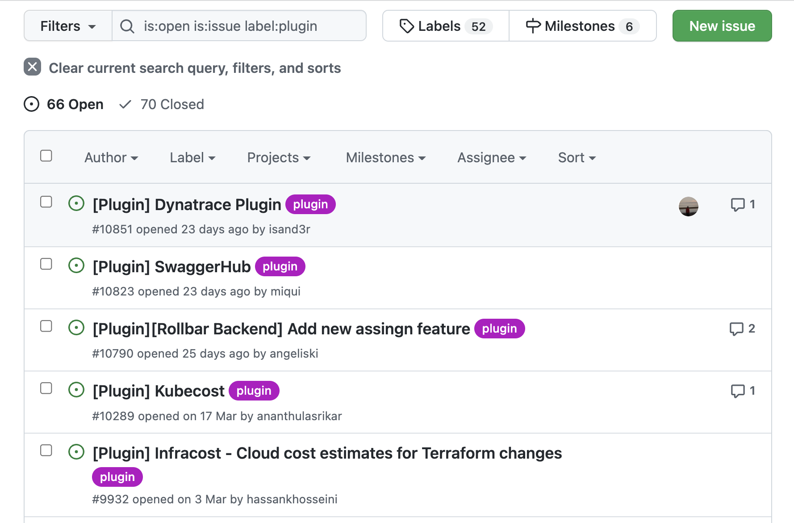

## Introduction

Roadie endeavors to support any Open Source Backstage plugin you might need. This page explains what to do if you don't see a plugin in our [integrations list][roadie-integrations].

## Ensure a plugin exists

The first thing to do is check that a plugin has been created by the community. The official Backstage website contains a canonical [list of open-source plugins][official-list].

If you see a plugin there which is not present on the [Roadie integrations page][roadie-integrations], there's a good chance we can add it for you. Please ask support about this via the in-app chat.

## When no plugin exists

If you're using a tool which doesn't seem to have a community created plugin available, there's a good chance someone else has already requested it.

To add your support to the request, or to request a new plugin from the community, visit the GitHub issues on the Backstage repo and [filter by the Plugins label][filtered-issues].

Remember, Growth Plan customers can [write their own plugins][custom-plugins] and publish them to Roadie.

[roadie-integrations]: /docs/integrations/
[official-list]: https://backstage.io/plugins
[filtered-issues]: https://github.com/backstage/backstage/issues?q=is%3Aopen+is%3Aissue+label%3Aplugin
[custom-plugins]: /docs/custom-plugins/
