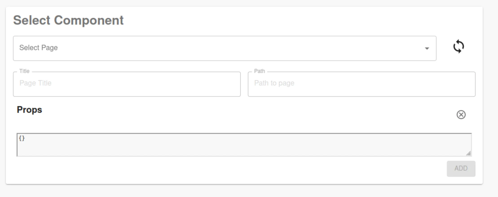
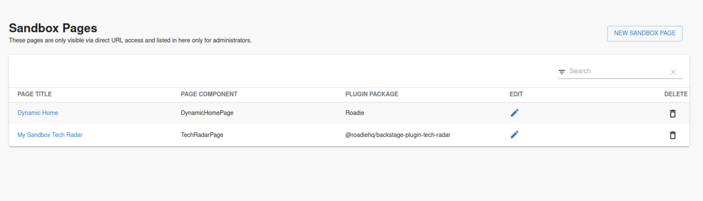

## Introduction

Configuring and setting up pages for the Roadie application sometimes needs to be done in an isolated sandbox mode. There are cases where you don't want to expose the content of a page to the wider organization while it is still being configured. This document describes what the admin sandbox is and how to use it to your advantage.

## Step 1: Visit the Admin Sandbox page

The secrets page is available in your Backstage instance at:

```
https://<tenant-name>.roadie.so/administration/admin-sanbox
```

To navigate to this page, follow these steps:

1. Click the Administration link in the bottom left of the application.


2. Click the Sandbox tab along the top of the Administration page.


## Step 2: Create new sandbox page

1. Click the button saying "New Sandbox Page" on the top right of the Sandbox table


2. Choose your page component and configure its title and path. Sometimes you might need to configure props for the page. You can do that also within this form. In case you have made a mistake, or it is unclear what props are needed, there is an editing possibility later to return and modify these options.



> Note that the path within the sandbox mode is allowing restricted entries only. All paths must start with `/admin-sandbox`.

## Navigate to Sandbox pages and test out their configurations



Sandbox pages are visible to all users by default, if they are able to navigate to the configured URLs. The pages are not linked to from anywhere apart from the Admin Sandbox area, which is only visible to administrators.

> Note that all sandbox pages by default receive an extra prop called `Layout Name`. This should be present _only_ in Sandbox mode and should not be copied to the actual pages

The Sandbox area is purely for testing purposes, meaning that the actual final sidebar pages will need to be created manually after the correct configuration patterns have been found in the sandbox.

Similar functionality for entity pages within catalog exist in the form of [Entity Preview page](/docs/catalog/previewing-changes/), which you can use to test out entity plugin configurations, cards, annotations and tabs
